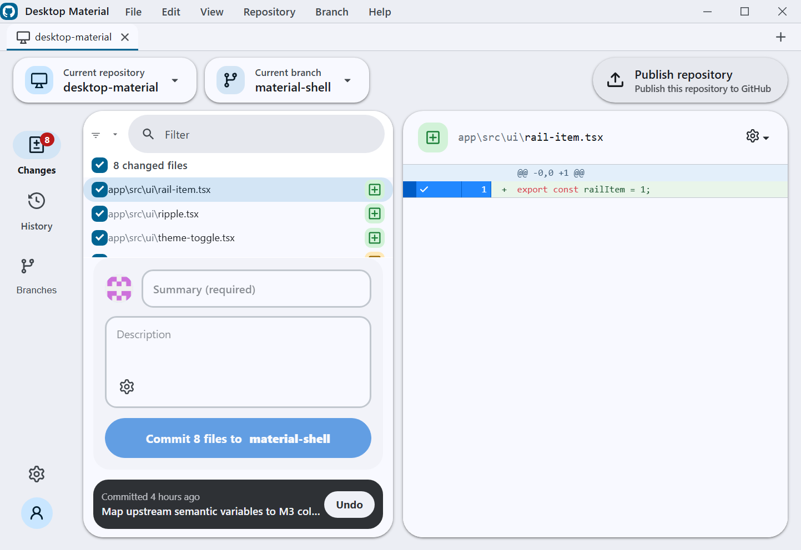
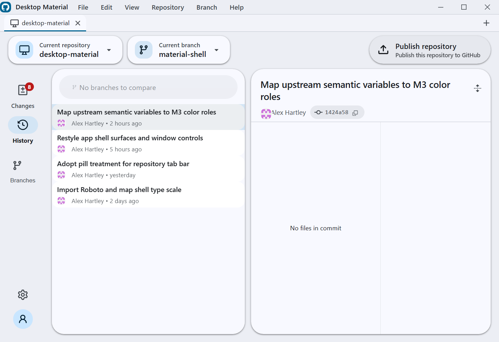
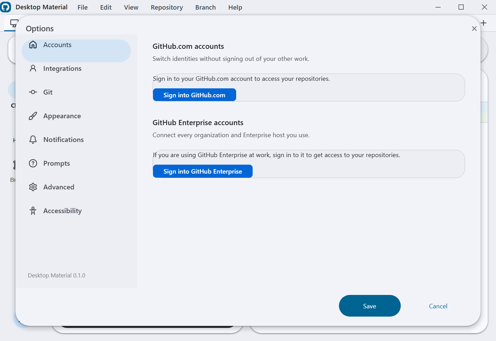
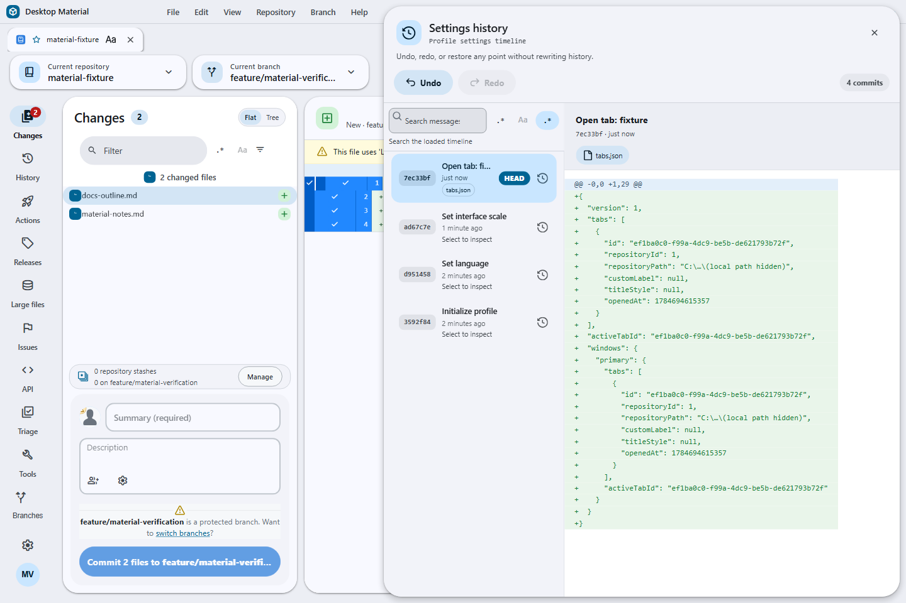
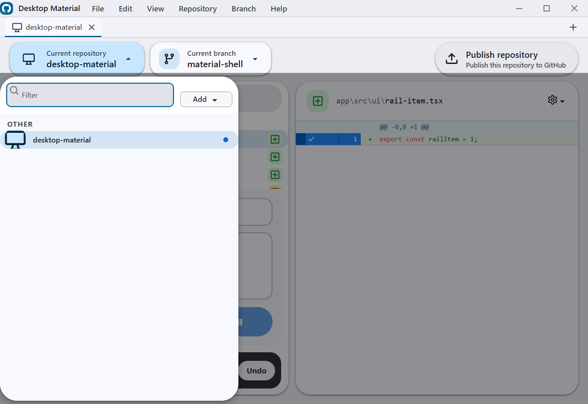
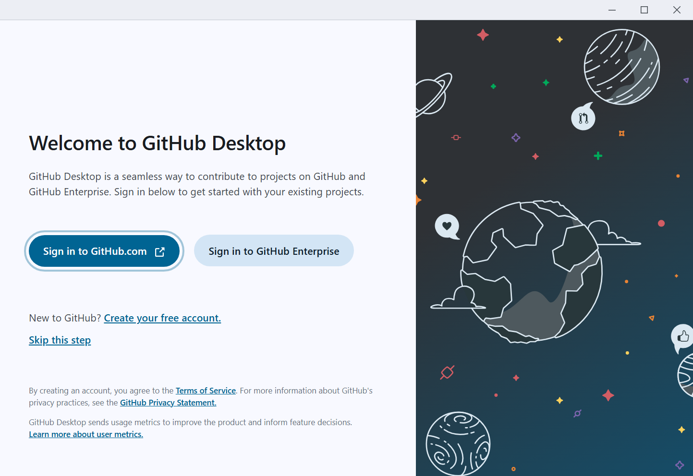

# Desktop Material

Desktop Material is an independent Material Design 3 (M3 Expressive) remake of [GitHub Desktop](https://github.com/desktop/desktop). It rebuilds the entire application shell around Material Design 3 while keeping GitHub Desktop's full Git workflow and the same underlying stack: [TypeScript](https://www.typescriptlang.org), [React](https://react.dev), [Electron](https://www.electronjs.org), and [Sass](https://sass-lang.com). This project is in active development.




## Shipped today

These features are implemented and live on `main`.

**Material Design 3 Expressive shell**
- App-bar branding with an inline pill menu
- Left icon navigation rail — Changes (with a badge), History, Branches, Settings, and the account avatar
- A floating pill toolbar with repository and branch chips and a sync pill that shows an ahead badge
- Floating, radius-24 elevated workspace cards with an animated light/dark theme
- Full MD3 workspace surfaces: tri-state selection checkboxes, tonal status chips, token-based diff colors, an inverse-surface undo banner, and a redesigned welcome flow and blank slate

**Repository tabs**
- Browser-like repository tabs, per-account and bound to repos, with inline rename
- Per-tab title styling: bold/italic/underline, size, color, font family, alignment

**Multi-account**
- Multiple accounts including multiple identities per host; per-account tabs, repos, and settings

**Versioned settings & history**
- Per-account settings stored in a local git repo — every settings/tabs change auto-commits. Open **Edit → Settings History…** (`Ctrl+Alt+Z`) for a non-modal timeline with lazy diffs, undo, redo, and restore; each history action adds an audit commit instead of rewriting history

**Non-modal dialog framework**
- Dialogs float without blocking the app, drag by their headers, cascade, and can be brought to front — the app stays fully interactive behind an open dialog
- Preferences rebuilt as an MD3 940×660 dialog with a left rail, an Active chip, and a pill footer
- Repository and branch pickers are MD3 side sheets; the clone dialog is restyled to match

## On the roadmap

These are planned milestones — **not yet implemented**. They are tracked in [`PLAN.md`](PLAN.md).

- **Notification centre** — a bell and side panel backed by its own local git repo, with unread badges and mark read/unread/delete
- **Regex-powered search everywhere** — filter chips, a regex-mode toggle, and a full regex builder (anchors, classes, quantifiers, groups, alternation, lookaround, all six flags, live tester) on every search bar
- **Multi-clone** — select many repos with checkboxes, org filter chips, parallel or one-by-one cloning, plus export/import of repo lists (URLs only)
- **Automation** — one-click commit & push with a Copilot-written message; scheduled auto commit & push and auto pull (global default plus per-repo override); merge-all branches/worktrees with Copilot conflict resolution
- **GitHub Actions panel** — workflow runs, status/branch/event filters, re-run / re-run-failed, job steps, an in-app log viewer, and a `workflow_dispatch` dialog
- **Built-in agent server** — an MCP server plus a local HTTP/CLI fallback for AI-agent control
- **Gitignore manager** — per-repo `.gitignore` editing with template auto-suggest
- **One-click Build & Run** — detect the project, install dependencies, and run it in one action
- **GitHub organization support** — browse and clone full org repo lists, and publish into an org
- **Dynamic UI scaling** — a 50–200% slider plus auto-fit to window
- **Self-hosted GitLab sign-in** (endpoint plus personal access token) and GitLab/Bitbucket integration
- **Desktop-plus parity** — commit search, commit graph, multiple stashes, repo pinning/grouping, pull-all, and more

## Screenshots

| | |
|---|---|
|  |  |
| **Changes** — icon rail, pill toolbar, floating card, tri-state checkboxes | **History** — MD3 commit rows and commit detail |
|  |  |
| **Preferences** — MD3 dialog with a left rail, Active chip, and pill footer | **Settings history** — Git-backed timeline, diff, Undo, Redo, restore-to-point |
|  |  |
| **Repositories** — MD3 side sheet | **Branches** — MD3 side sheet |
|  |  |
| **Welcome** — redesigned first-run flow | **Per-tab title styling** — bold, italic, size, color, and font per tab |

## Building

Full instructions live in [`docs/contributing/setup.md`](docs/contributing/setup.md). In short, with Node 24.15.0:

```
yarn && yarn build:dev && yarn start
```

## Project site & docs

- Project site: https://codingmachineedge.github.io/desktop-material/
- Wiki: https://github.com/codingmachineedge/desktop-material/wiki

## Credits & License

Desktop Material is built on [GitHub Desktop](https://github.com/desktop/desktop) (MIT), with feature-parity references from [desktop-plus](https://github.com/say25/desktop-plus) (MIT). Thanks to both projects and their contributors.

**[MIT](LICENSE)**

The MIT license grant is not for GitHub's trademarks, which include the logo designs. GitHub reserves all trademark and copyright rights in and to all GitHub trademarks. GitHub's logos include, for instance, the stylized Invertocat designs that include "logo" in the file title in the following folder: [logos](app/static/logos).

GitHub® and its stylized versions and the Invertocat mark are GitHub's Trademarks or registered Trademarks. When using GitHub's logos, be sure to follow the GitHub [logo guidelines](https://github.com/logos).
