**Overview** · [Install](docs/readme-tabs/install.md) · [Features](docs/readme-tabs/features.md) · [Complete list](docs/readme-tabs/complete-feature-list.md) · [Screenshots](docs/readme-tabs/screenshots.md) · [Roadmap & receipts](docs/readme-tabs/roadmap-and-receipts.md) · [Development](docs/readme-tabs/development.md)

**總覽** · [安裝](docs/readme-tabs/install.md) · [功能](docs/readme-tabs/features.md) · [完整清單](docs/readme-tabs/complete-feature-list.md) · [截圖](docs/readme-tabs/screenshots.md) · [路線圖同憑證](docs/readme-tabs/roadmap-and-receipts.md) · [開發](docs/readme-tabs/development.md)

<sub>Tabbed README — GitHub can't run scripts, so each tab above is a separate page.</sub>

<sub>分頁式 README — GitHub 唔行得 script，所以上面每個分頁都係獨立一版。</sub>

# Desktop Material

## Current status / 目前狀態

Snapshot recorded from the current main evidence on **August 13, 2026**:

- `main` and `origin/main` point to [`5cb2281643b788b0038412072b939b4ee9a6e635`](https://github.com/Ding-Ding-Projects/desktop-material/commit/5cb2281643b788b0038412072b939b4ee9a6e635).
- The latest published Windows release is [`v4.0.119101`](https://github.com/Ding-Ding-Projects/desktop-material/releases/tag/v4.0.119101), published at `2026-08-13T23:02:56Z` for that exact commit. It has six downloadable assets: `GitHub.Desktop-x64.zip`, `GitHubDesktop-4.0.119101-full.nupkg`, `GitHubDesktop-4.0.119101-x64-full.nupkg`, `GitHubDesktopSetup-x64.exe`, `GitHubDesktopSetup-x64.msi`, and `RELEASES`.
- GitHub currently has one open issue: [#190 — Reconcile current roadmap and release receipts](https://github.com/Ding-Ding-Projects/desktop-material/issues/190). It tracks this documentation correction; it is not a product-feature backlog.
- Current workflow evidence is [CI Windows run 31747636431](https://github.com/Ding-Ding-Projects/desktop-material/actions/runs/31747636431), [CI Linux run 31747636425](https://github.com/Ding-Ding-Projects/desktop-material/actions/runs/31747636425), [Cheap LFS run 31747636429](https://github.com/Ding-Ding-Projects/desktop-material/actions/runs/31747636429), and [release workflow run 31750286839](https://github.com/Ding-Ding-Projects/desktop-material/actions/runs/31750286839); all four completed successfully for this release evidence.

This README update adds no application, test, or capture evidence. The dated records below preserve the evidence boundary at each historical checkpoint; they are historical receipts, not the current tracker or release state.

**目前狀態快照 — 2026 年 8 月 13 日：**

- `main` 同 `origin/main` 而家指向 [`5cb2281643b788b0038412072b939b4ee9a6e635`](https://github.com/Ding-Ding-Projects/desktop-material/commit/5cb2281643b788b0038412072b939b4ee9a6e635)。
- [`v4.0.119101`](https://github.com/Ding-Ding-Projects/desktop-material/releases/tag/v4.0.119101) 係最新已發佈嘅 Windows Release，喺 `2026-08-13T23:02:56Z` 為呢個 exact commit 發佈。佢有六個可下載資產：`GitHub.Desktop-x64.zip`、`GitHubDesktop-4.0.119101-full.nupkg`、`GitHubDesktop-4.0.119101-x64-full.nupkg`、`GitHubDesktopSetup-x64.exe`、`GitHubDesktopSetup-x64.msi` 同 `RELEASES`。
- GitHub 而家有一個 open issue：[#190 — Reconcile current roadmap and release receipts](https://github.com/Ding-Ding-Projects/desktop-material/issues/190)。佢係今次文件修正嘅追蹤項目，唔係產品功能待辦清單。
- 目前 workflow 證據包括：[CI Windows 執行 `31747636431`](https://github.com/Ding-Ding-Projects/desktop-material/actions/runs/31747636431)、[CI Linux 執行 `31747636425`](https://github.com/Ding-Ding-Projects/desktop-material/actions/runs/31747636425)、[Cheap LFS 執行 `31747636429`](https://github.com/Ding-Ding-Projects/desktop-material/actions/runs/31747636429) 同 [Release workflow 執行 `31750286839`](https://github.com/Ding-Ding-Projects/desktop-material/actions/runs/31750286839)；四個執行都已經為今次 Release 證據成功完成。

呢次 README 更新冇新增應用程式、測試或者擷取證據。下面有日期嘅紀錄保留每個歷史檢查點當時嘅證據界線；佢哋係歷史收據，唔係目前 tracker 或 Release 狀態。

## What it is / 產品簡介

Desktop Material is an independent Material Design 3 (M3 Expressive) remake of [GitHub Desktop](https://github.com/desktop/desktop). Its controls and dialogs are Material Design 3, on the application chrome the repository owner chose and restored on 2026-08-15; the shell itself is frozen and is not rewritten without an explicit request (see [AGENTS.md](AGENTS.md)). It keeps GitHub Desktop's full Git workflow and the same underlying stack: [TypeScript](https://www.typescriptlang.org), [React](https://react.dev), [Electron](https://www.electronjs.org), and [Sass](https://sass-lang.com). This project is in active development.

Desktop Material 係 [GitHub Desktop](https://github.com/desktop/desktop) 嘅獨立 Material Design 3（M3 Expressive）重製版。佢啲控制項同對話框係 Material Design 3，行喺 2026-08-15 還原返嘅應用程式外殼上面；個外殼已經凍結，冇明確要求就唔會重寫（睇 [AGENTS.md](AGENTS.md)）。佢保留 GitHub Desktop 完整嘅 Git 工作流程同一樣嘅底層技術棧：[TypeScript](https://www.typescriptlang.org)、[React](https://react.dev)、[Electron](https://www.electronjs.org) 同 [Sass](https://sass-lang.com)。呢個項目仲喺積極開發中。

**Repository transfer:** from the Repository menu, list context menu, Command Palette, or **Repository settings → Remote**, choose another signed-in GitHub account or organization and keep the repository name or enter a custom one. **Full history** publishes every local branch and tag; **Clean state** publishes the current files as one root commit while retaining a local recovery ref. `origin` changes only after destination verification, and the source remote remains reachable as `upstream` when needed. See the [repository transfer guide](docs/features/repository-management/repository-transfer.md).

**儲存庫轉移：** 喺 Repository 選單、清單右鍵選單、命令面板或者**儲存庫設定 → Remote**，揀另一個已登入嘅 GitHub 帳戶或者組織，可以保留儲存庫名或者自己入一個。**Full history** 會發佈每一條本機分支同標籤；**Clean state** 將目前檔案發佈成一個 root commit，同時保留本機復原 ref。`origin` 要等目的地驗證咗先會轉，需要嘅話原本嘅 remote 仍然以 `upstream` 存在。睇 [儲存庫轉移指南](docs/features/repository-management/repository-transfer.md)。

**Multi-remote fetch:** a repository with one configured remote keeps the familiar **Fetch `<remote>`** action. When more than one remote is configured, the toolbar says **Fetch all remotes** and fetches every configured remote in a stable current-first order. See the [multi-remote fetch sync guide](docs/features/repository-management/multi-remote-fetch-sync.md).

**多 remote 抓取：** 只設定咗一個 remote 嘅儲存庫，繼續用熟悉嘅 **Fetch `<remote>`** 操作。當設定咗多過一個 remote，工具列會變成 **Fetch all remotes**，並且以穩定嘅「目前優先」次序抓取每一個已設定 remote。睇 [多 remote 抓取同步指南](docs/features/repository-management/multi-remote-fetch-sync.md)。

**Platform support:** Desktop Material ships a Windows Electron desktop application. Windows keeps the x64 installer/portable ZIP, x64/arm64 build validation, packaged x64 E2E, and the automated release payload. The retained [Linux-first terminal application](docs/features/linux-tui/README.md) is a historical prototype with separate manual verification; it is deliberately excluded from standard CI and automated release gating.

**平台支援：** Desktop Material 出嘅係 Windows Electron 桌面應用程式。Windows 保留 x64 安裝程式／可攜 ZIP、x64／arm64 建置驗證、已打包 x64 E2E 同自動發佈負載。保留低嘅 [Linux 優先終端機應用程式](docs/features/linux-tui/README.md) 係歷史原型，有獨立嘅人手驗證，並且刻意排除喺標準 CI 同自動發佈把關之外。

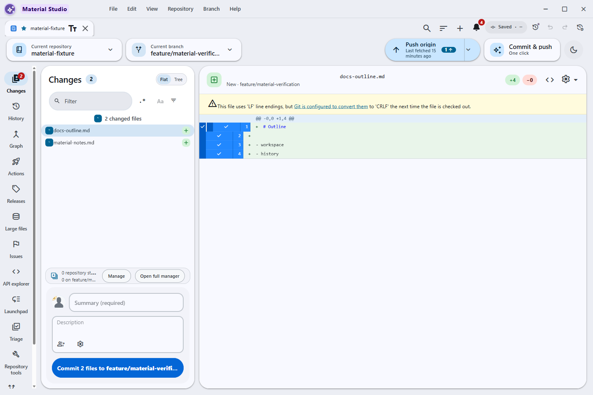

<details>
<summary><strong>Historical development receipts — dated evidence only, not current status / 歷史開發收據 — 只係有日期證據，唔係目前狀態</strong></summary>

The entries below are retained for traceability. They are historical records, not an active work queue; use the current status above and the linked release receipt for present-day evidence.

下面啲紀錄保留低係為咗追溯。佢哋係歷史紀錄，唔係目前工作清單；目前證據請以上面嘅狀態同已連結嘅 Release 收據為準。

**Material Design 3 shell — August 11, 2026 (historical evidence boundary):** the application chrome is
now the MD3 shell from `design/History MD3.dc.html`: eight destinations
behind a navigation drawer, a 56px application header carrying the global
search field, and a content pane whose header holds the repository and branch
breadcrumbs, the fetch and push controls and the pane menu. Its eleven search
fields each keep their own query **and** their own regex mode, and a pattern
built in the regex builder is written into the field that opened it. **Nothing
was removed:** the repository tab strip is unchanged and still shown by
default, and the classic toolbar is kept behind **Settings → Appearance →
Show the classic toolbar**, which also ships **on**. Every destination still
renders the real repository workspace, so every capability is exactly where it
was. Typecheck, ESLint and Prettier are clean; the feature-preservation ledger
and the design-contract conformance suite are green. Installer, remote CI and
release evidence for this change were **not claimed at that August 11
checkpoint**. See the
[MD3 shell feature guide](docs/features/design-system/md3-shell.md).

**Material Design 3 外殼 — 2026 年 8 月 11 日（歷史證據界線）：** 應用程式框架而家係照住 `design/History MD3.dc.html` 重寫嘅 MD3 外殼：側邊導航加八個目的地、56px 頂部列連全域搜尋欄，內容窗嘅標題列拎住儲存庫同分支麵包屑、fetch／push 同選單。十一個搜尋欄各有各嘅字**同埋**各有各嘅 regex 掣，喺邊個欄開 regex builder，套用個 pattern 就寫返落嗰個欄。**一樣嘢都冇拆：** 儲存庫分頁列原封不動、預設照顯示，經典工具列收喺**設定 → 外觀 → 顯示經典工具列**後面，而且都係預設開。每個目的地仲係 render 緊真嘅儲存庫工作區，所以每一樣功能都仲喺原本嗰個位。Typecheck、ESLint、Prettier 全部乾淨，功能保存清單同設計合約一致性測試都綠。喺當時 8 月 11 日檢查點，安裝程式、遠端 CI 同發佈證據**未有**，唔會當有。詳情睇 [MD3 外殼功能指南](docs/features/design-system/md3-shell.md)。

**Windows closeout — August 9, 2026 (historical snapshot):** School mode is now a real
Appearance setting: it can be renamed, uses a local salted credential for
unlock, forces English, hides language/playfulness controls and search rows,
and suppresses the dim-sum surprise while active. The exact implementation is
in the [School mode feature guide](docs/features/design-system/school-mode.md).
(This banner originally said the palette opened with **Ctrl+Shift+P**. It does
not: the shortcut collision with the file browser was resolved in favour of
the palette, so **Ctrl+Shift+F** opens the command palette and is what the
application menu registers.)

**Windows 收尾 — 2026 年 8 月 9 日（歷史快照）：** School mode 而家係一個真正嘅外觀設定：改得名、用本機加鹽憑證解鎖、強制英文、收埋語言同玩味控制項同相關搜尋列，開住嗰陣亦唔會出點心彩蛋。實作詳情睇 [School mode 功能指南](docs/features/design-system/school-mode.md)。（呢段原本寫命令面板用 **Ctrl+Shift+P**，其實唔係：同檔案瀏覽器爭快捷鍵嗰件事已經判咗畀面板，所以開命令面板係 **Ctrl+Shift+F**，亦都係應用程式選單真正註冊嗰個。）

**Self-hosted runner risk confirmation — August 9, 2026:** the Windows
Actions runner setup form now audits all assigned labels—including
`self-hosted`—before creating runner files or registration, and limits users
to 20 custom labels. A completed known unsafe preflight can be reviewed in
the form, but the renderer cannot authorize it: the main process reruns the
audit and requires a Windows-owned confirmation bound to the current setup
evidence. That volatile decision never reaches disk and is never reused by
later Start or scheduled monitoring. Focused runner verification passes
**94/94**, the root TypeScript check, and the complete desktop suite
(**1,008/1,008** files; **8,494** tests) pass with no React
unmounted-state-update warnings. The pinned Node 24.15.0 production build
produced an unpackaged Windows application directory; installer verification,
remote CI, and release evidence were still pending at that August 9 handoff
boundary.
See the [self-hosted runner manager guide](docs/features/integrations/self-hosted-runner-manager.md).

**自架 runner 風險確認 — 2026 年 8 月 9 日：** Windows Actions runner 設定表格而家會喺建立 runner 檔案或者註冊之前，審核所有指派標籤（包括 `self-hosted`），並且限制用戶最多 20 個自訂標籤。已完成嘅「已知不安全」預檢可以喺表格入面覆核，但係 renderer 授權唔到：主行程會重新審核一次，並且要求一個綁住今次設定證據嘅 Windows 原生確認。嗰個易變決定永遠唔會落磁碟，之後嘅 Start 或者排程監察亦唔會重用。聚焦 runner 驗證 **94/94** 通過，root TypeScript 檢查同完整 desktop 測試（**1,008/1,008** 個檔案；**8,494** 個測試）全部通過，冇 React unmounted-state-update 警告。用 pinned Node 24.15.0 嘅生產建置整咗一個未打包嘅 Windows 應用程式目錄；喺當時 8 月 9 日 handoff 界線，安裝程式驗證、遠端 CI 同發佈證據仍然待辦。睇 [自架 runner 管理指南](docs/features/integrations/self-hosted-runner-manager.md)。

**GitHub Actions and OAuth repair — August 8, 2026:** the Windows Actions
view now uses a searchable rich account picker, audits public repositories
instead of blanket-blocking them, fills the run-list row when no detail is
open, and keeps release notes outside the Release details dropdown. GitHub
sign-in follows the upstream Desktop OAuth request shape and omits the
unregistered custom `redirect_uri`. Focused source verification passes
**130/130**; at that August 8 checkpoint, remote CI and release evidence had
not yet been observed for the integrated `main` commit.

**GitHub Actions 同 OAuth 修復 — 2026 年 8 月 8 日：** Windows Actions 檢視而家用可搜尋嘅豐富帳戶選擇器，會審核公開儲存庫而唔係一刀切封鎖，冇開詳情嗰陣會填滿執行清單嗰行，亦會將發佈說明放喺 Release 詳情下拉之外。GitHub 登入跟返上游 Desktop 嘅 OAuth 請求形狀，唔再帶未註冊嘅自訂 `redirect_uri`。聚焦原始碼驗證 **130/130** 通過；喺當時 8 月 8 日檢查點，遠端 CI 同發佈證據仲未觀察到整合咗嘅 `main` commit。

**Stash recovery manager:** the Windows app now keeps every Git stash entry
without a Desktop entry-count cap and provides a separate searchable dialog
for exact-identity recovery and export to a directory, ZIP, or configurable
7z archive. See [stash export and recovery](docs/features/repository-management/stash-export.md).

**Stash 復原管理員：** Windows app 而家保留每一個 Git stash 項目，冇咗 Desktop 原本嘅數量上限，並且提供一個獨立、可搜尋嘅對話框做精確身分復原，同埋匯出去資料夾、ZIP 或者可設定嘅 7z 封存檔。睇 [stash 匯出同復原](docs/features/repository-management/stash-export.md)。

**Actions job-log recovery — August 5, 2026:** a completed GitHub Actions job
can briefly report `HTTP 404` while its log archive is being prepared. The
Windows viewer now retries that API response with bounded 250/750/1,500 ms
waits, refreshes the signed redirect each time, and offers **Retry** plus
**Open on GitHub** when the provider still has not produced the archive. The
built-app recovery proof is documented in the [Actions workflow manager
guide](docs/features/integrations/actions-workflow-manager.md).

**Actions 工作紀錄復原 — 2026 年 8 月 5 日：** 一個已完成嘅 GitHub Actions job 喺準備緊 log 封存嗰陣，可能會短暫回 `HTTP 404`。Windows 檢視器而家會用 250/750/1,500 毫秒嘅有界等待重試，每次都刷新已簽署嘅轉址，如果供應方仲未整好封存，就提供**重試**同**喺 GitHub 開啟**。已建置 app 嘅復原證明記錄喺 [Actions 工作流程管理指南](docs/features/integrations/actions-workflow-manager.md)。

**Windows startup renderer repair — August 6, 2026:** the Node-oriented
Copilot SDK is now packaged as an external instead of being concatenated into
the browser renderer. The build rejects both renderer bundles if the
undefined `__webpack_module__` binding returns, preventing the packaged app
from opening as a blank white window. The exact Windows artifact now reaches
the first-run surface in a hidden-desktop capture; see the [renderer startup
bundle safety guide](docs/features/quality-and-reliability/renderer-startup-bundle-safety.md).

**Windows 啟動 renderer 修復 — 2026 年 8 月 6 日：** 針對 Node 嘅 Copilot SDK 而家以 external 方式打包，唔會再併入瀏覽器 renderer。如果未定義嘅 `__webpack_module__` 綁定返嚟，建置會直接拒絕兩個 renderer bundle，避免打包好嘅 app 開出一個白色空白視窗。真實 Windows 產物而家喺隱藏桌面擷取入面去到首次執行畫面；睇 [renderer 啟動 bundle 安全指南](docs/features/quality-and-reliability/renderer-startup-bundle-safety.md)。

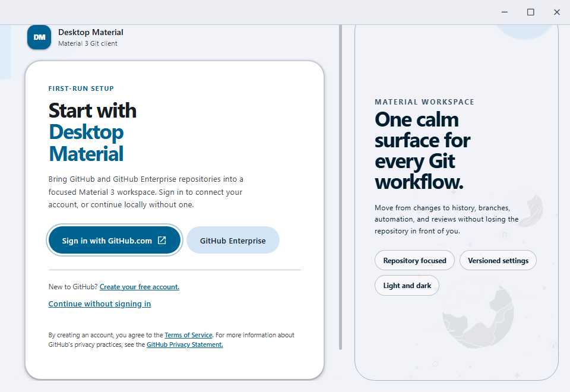


**Full-width History Graph page — August 5, 2026:** the repository rail now
gives the ancestry graph its own **Graph** page, so Branch / Tag, Graph, and
Commit Message columns can use the full workspace width while retaining the
existing scope, search, lane, selection, and commit actions. Focused source
verification passes **85/85**; a fresh built-app capture of this page is
still pending the required hidden-desktop verification route.

**全寬 History Graph 版面 — 2026 年 8 月 5 日：** 儲存庫側欄而家俾祖先圖自己一版 **Graph**，等分支／標籤、Graph 同 Commit 訊息三欄用得晒成個工作區闊度，同時保留原有嘅範圍、搜尋、線道、選取同 commit 操作。聚焦原始碼驗證 **85/85** 通過；呢一版嘅新建置 app 擷取仲要等隱藏桌面驗證路線。

**Dirty branch switching:** when a branch has uncommitted work, choose
**Leave my changes here** to open Add worktree with the destination branch
prefilled while leaving the current worktree and its files untouched. See the
[branch-switcher workflow](docs/features/identity-and-workspace/branch-switcher-workflows.md)
and its [runtime capture](docs/verification/dirty-worktree-worktree-option-20260805/dirty-worktree-switch-dialog.png).

**有未提交改動嗰陣切分支：** 當一條分支仲有未提交嘅工作，揀**留低我嘅改動**就會開 Add worktree 並且預先填好目的分支，同時唔郁目前 worktree 同佢啲檔案。睇 [分支切換工作流程](docs/features/identity-and-workspace/branch-switcher-workflows.md) 同佢嘅 [執行期擷取](docs/verification/dirty-worktree-worktree-option-20260805/dirty-worktree-switch-dialog.png)。

**Local repair and background progress — July 30, 2026:** conflict and failed
CI surfaces launch bounded Codex/OpenCode tasks; long work has hideable
elapsed/ETA progress; Cheap LFS restore details collapse; and every action is
directly searchable and executable from the command palette.

**本機修復同背景進度 — 2026 年 7 月 30 日：** 衝突同 CI 失敗嘅畫面可以啟動有界嘅 Codex／OpenCode 工作；長時間嘅工作有得收埋嘅已用時間／ETA 進度；Cheap LFS 還原詳情摺得埋；而且每一個操作都可以喺命令面板直接搵到同執行。

**Repository workflow refinements — July 30, 2026:** the repository sheet
folds its filters behind one state-preserving disclosure, History hover cards
show exact and relative time, and command rows support stable per-repository
appearance. Automatic Cheap LFS discovery now ignores ineligible ordinary Git
metadata such as `.gitmodules`; explicitly selected unsafe paths remain
rejected.

**儲存庫工作流程改良 — 2026 年 7 月 30 日：** 儲存庫面板將篩選器收埋喺一個會保留狀態嘅摺疊控制項後面，History 懸停卡片同時顯示精確同相對時間，命令列支援每個儲存庫穩定嘅外觀。自動 Cheap LFS 探索而家會略過唔合資格嘅普通 Git metadata（例如 `.gitmodules`）；明確揀咗嘅不安全路徑一樣照拒絕。

**Publish organization picker sizing — July 30, 2026 (implementation
pushed; final hosted proof pending):** Publish repository no longer squeezes its Organization
choices into a native select. The replacement is an explicit-None,
searchable listbox with persisted fuzzy, substring, and bounded-regex modes,
the full Regex Builder, complete keyboard operation, and stale-account
response protection. Its 128–176 CSS px list keeps scrolling contained and
long names ellipsized; shared select wrappers can now shrink inside narrow
dialogs. The accepted built-app frame is 1440×960 (133,919 bytes, SHA-256
`7db03d5db789d19e1ad49de66bd79abb62e46c7909eda9de08878aac367033d8`).
A 390×844 physical receipt also proves a visible, bottom-reachable list with
no horizontal overflow and None selected. The promoted gallery will contain
exactly **86 current Windows scenes** (66 canonical plus 20 specialist).
Local tests and the exact production build are green. Implementation commit
`63c1ec08c4f24f85d87f21d98851dcd5784c7800` is proven on `origin/main`;
this follow-up publishes the retained receipt and regenerated parity input
that its first hosted matrix found missing. Final hosted CI and
installer-release proof remain pending.

**Publish 組織選擇器尺寸 — 2026 年 7 月 30 日（實作已推送；最終線上證明待辦）：** Publish repository 唔再將組織選項塞入原生 select。取而代之係一個明確有 None、可搜尋嘅 listbox，支援持久化嘅模糊、子字串同有界 regex 模式、完整 Regex Builder、完整鍵盤操作，同埋過時帳戶回應保護。佢 128–176 CSS px 嘅清單令捲動困喺入面、長名字省略號處理；共用嘅 select 外殼而家喺窄對話框入面縮得。接受嘅已建置 app 畫面係 1440×960（133,919 bytes，SHA-256 `7db03d5db789d19e1ad49de66bd79abb62e46c7909eda9de08878aac367033d8`）。另一張 390×844 實體憑證亦都證明清單見得到、去到底、冇水平溢出，而且揀住 None。推廣嘅相簿會啱啱好有 **86 個目前 Windows 場景**（66 個標準加 20 個專門）。本機測試同精確生產建置都係綠色。實作 commit `63c1ec08c4f24f85d87f21d98851dcd5784c7800` 喺 `origin/main` 上獲證；今次跟進發佈嘅係第一次線上矩陣搵唔到嘅保留憑證同重新產生嘅 parity 輸入。最終線上 CI 同安裝程式發佈證明仍然待辦。

<details>
<summary><strong>Open the August 11 packaged Windows gallery</strong></summary>

These frames were captured from the packaged application at commit
`eb894d4218670f0e9fd1516dff964edd76e1824c` on an isolated off-screen Windows
desktop. The capture pass produced 56 fresh scene-level frames. Twelve optional
scenes remained gaps, and the aggregate canonical check did not pass because
the current Settings surface no longer exposes the `Appearance` tab expected by
the older capture driver. Only successfully rendered scene frames and clearly
labelled manual captures were promoted; failed specialist outputs were not.

呢批畫面係由 commit `eb894d4218670f0e9fd1516dff964edd76e1824c` 嘅已打包應用程式，喺隔離嘅離屏 Windows 桌面實際擷取。今次有 56 個場景成功更新；另外 12 個可選場景仍然係缺口，而整體 canonical 檢查亦因為目前 Settings 畫面已經冇舊擷取器預期嘅 `Appearance` 分頁而未通過。以下只收錄成功渲染嘅場景同清楚標明嘅人手擷取，失敗嘅 specialist 輸出冇被換入去。

| First run | Changes | History |
| --- | --- | --- |
|  | 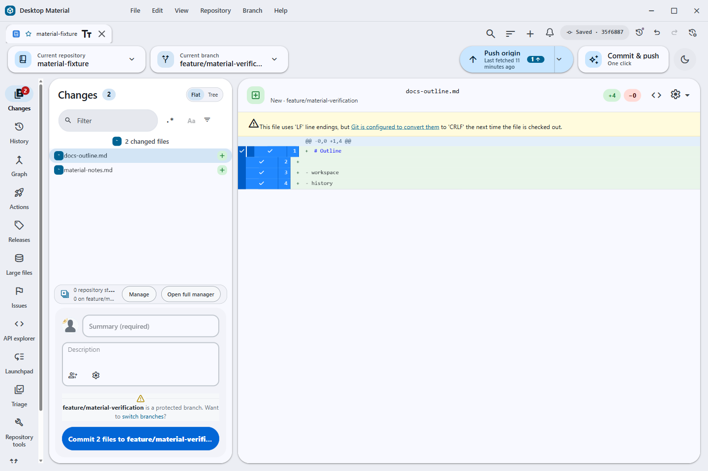 | 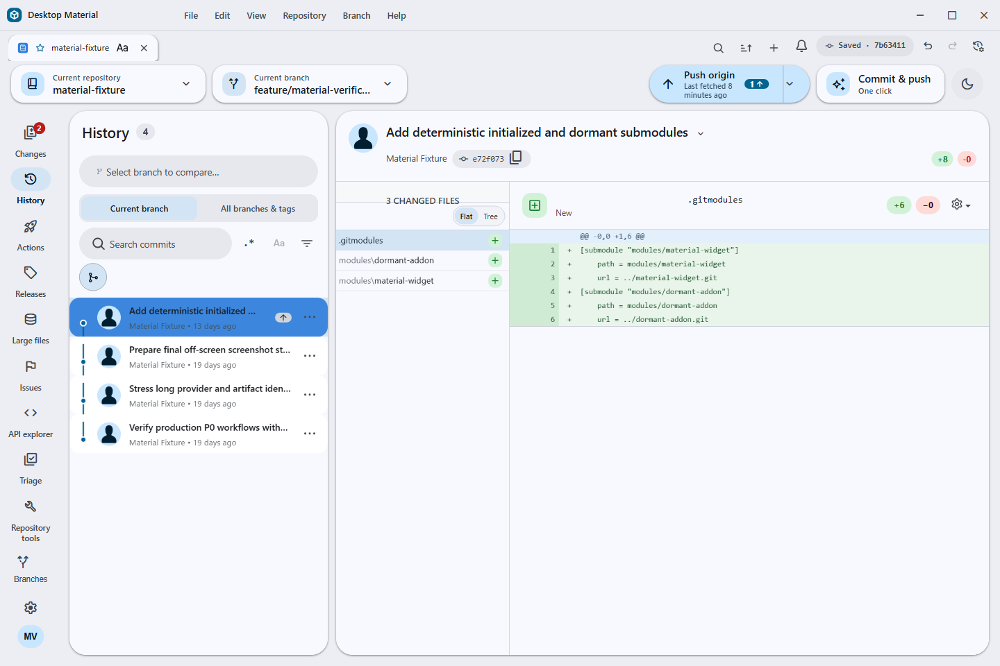 |

| Branches | Actions | Notifications |
| --- | --- | --- |
| 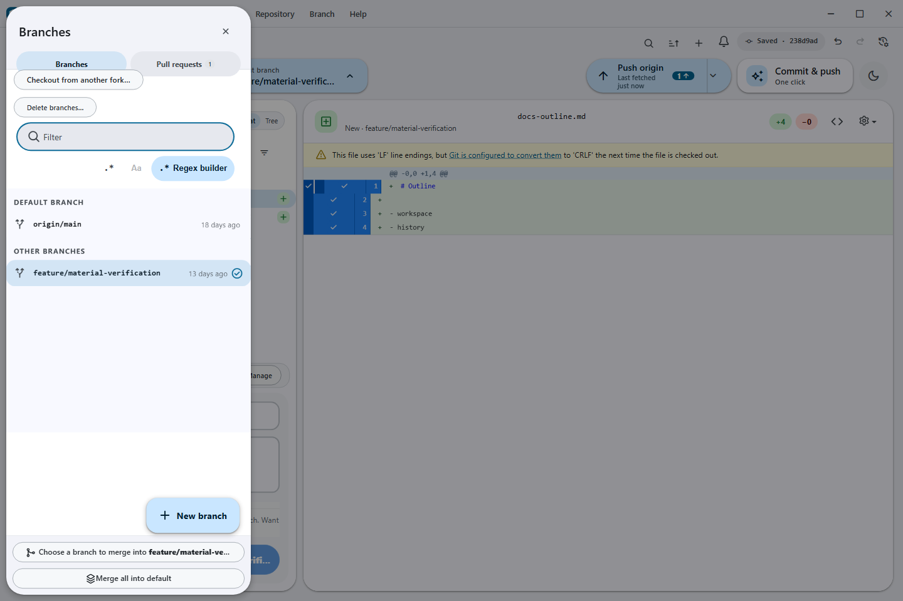 | 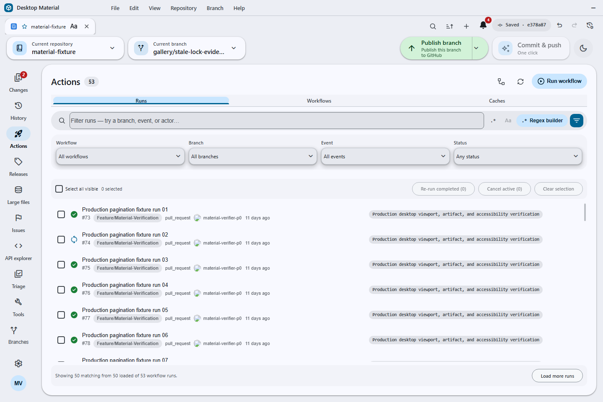 | 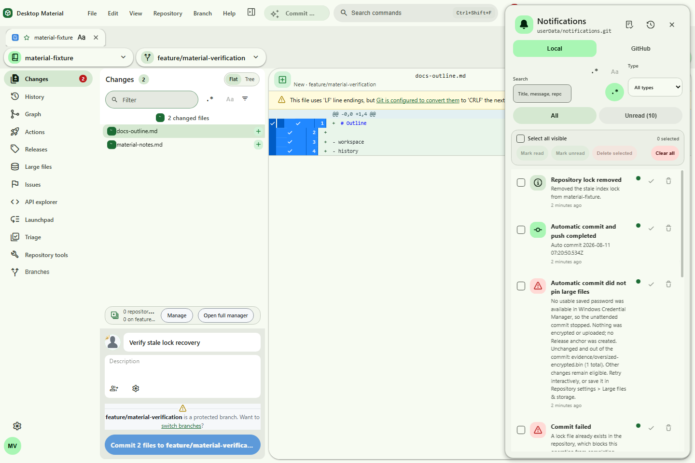 |

| Settings accounts | Command palette | Agents |
| --- | --- | --- |
| 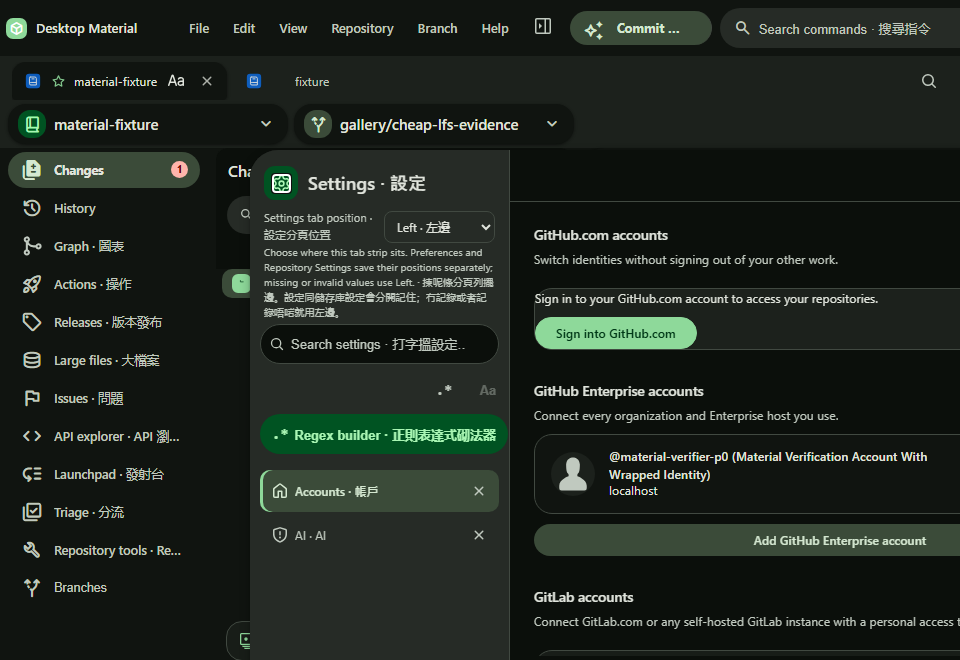 | 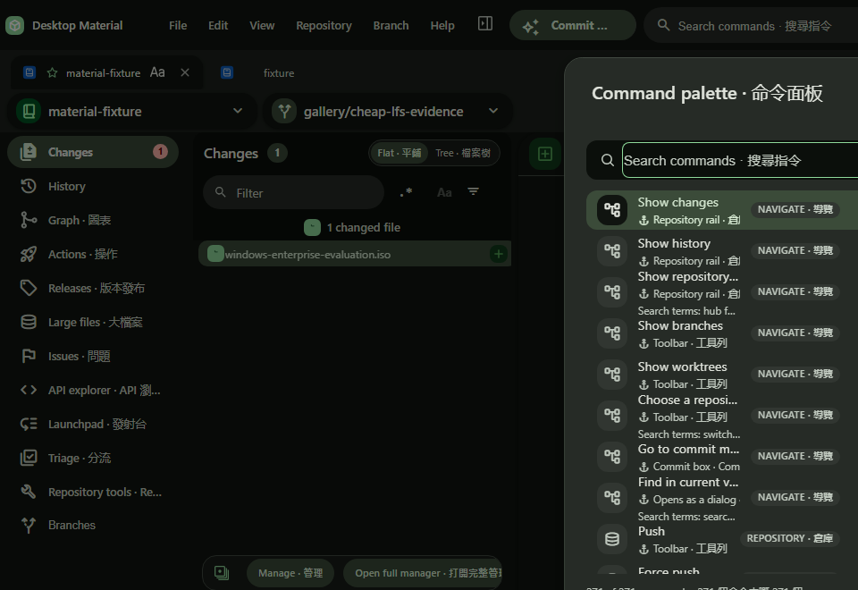 | 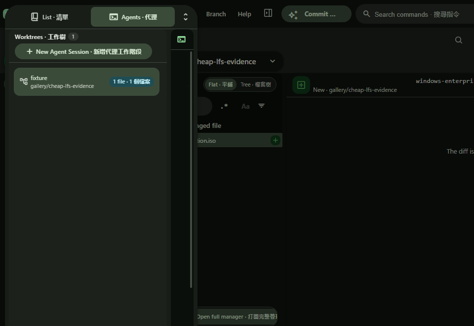 |

| Repositories | Releases | Narrow layout |
| --- | --- | --- |
| 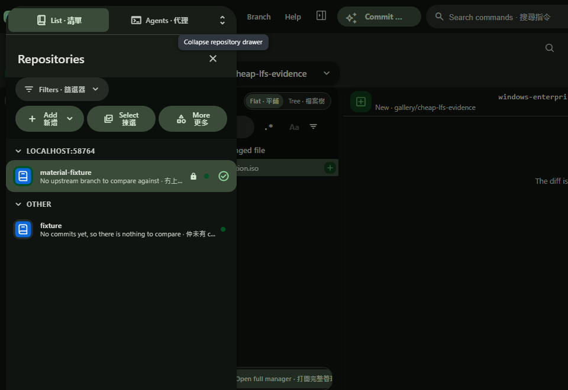 | 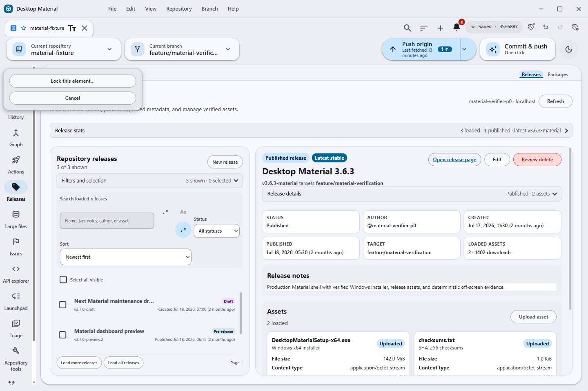 | 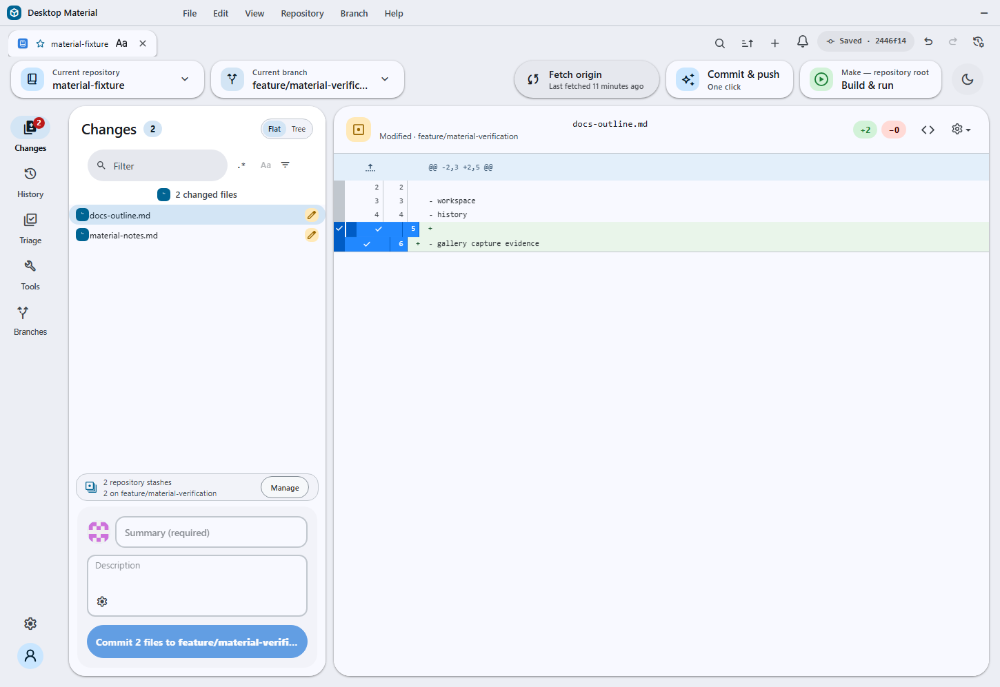 |

| Cheap LFS candidates | Appearance editor | Error recovery |
| --- | --- | --- |
| 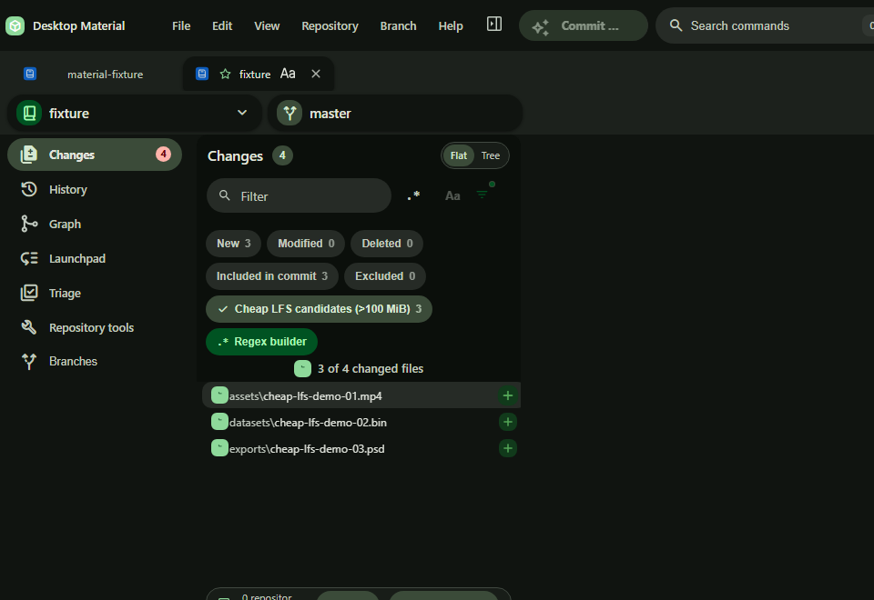 | 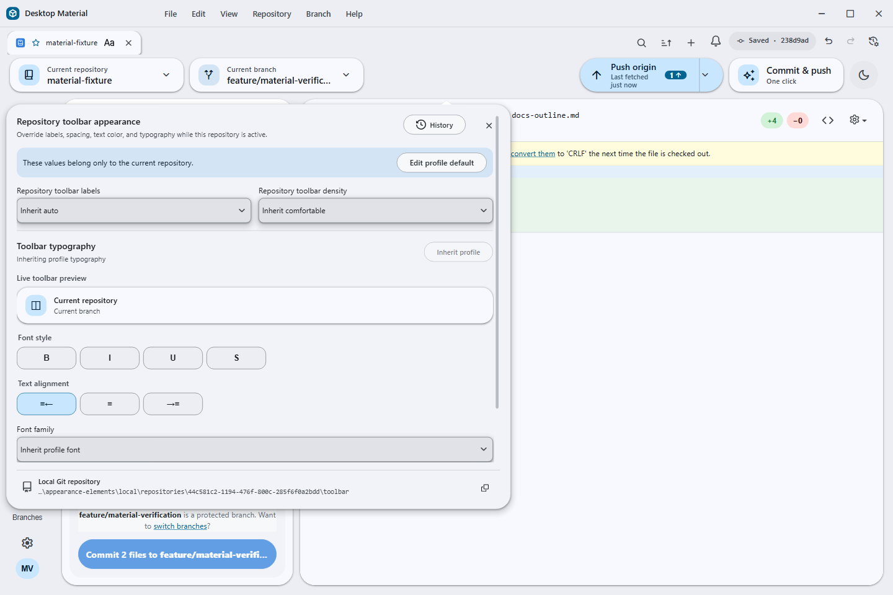 | 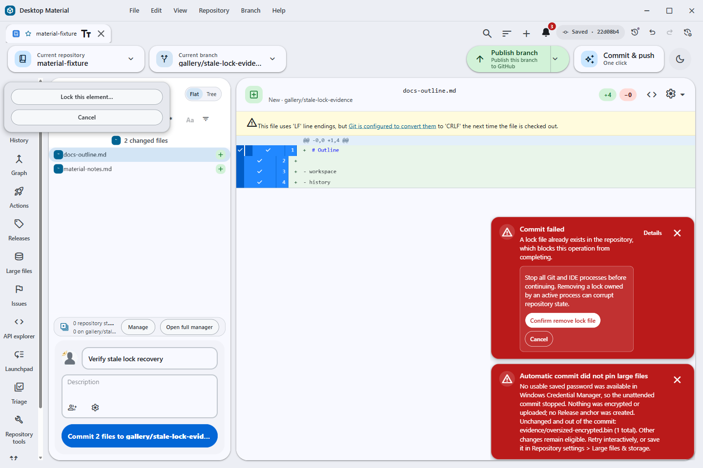 |

</details>


**The site is one Material Design 3 component — August 3, 2026:** the
[project site](https://ding-ding-projects.github.io/desktop-material/) is
rebuilt as six pages behind a browser-style tab strip — Overview, Cheap LFS,
Cheap LFS vs Git LFS, Docs hub, the regex-builder article, and Docs search —
with the three language modes, both playfulness sliders, the regex builder on
every search bar, all four tab searches, the anchored per-element appearance
editor, the notification centre, and export all working rather than described.
It loads nothing from another host: React and four font families are served
from the site itself, with the icon and Hong Kong Chinese faces cut to only
the characters the pages use. The two previous standalone Cheap LFS addresses
redirect, and the 249 rendered Markdown articles keep publishing under
[`/docs/`](https://ding-ding-projects.github.io/desktop-material/docs/). How
it is built, changed, and verified is in
[its own article](docs/features/design-system/material-design-3-site.md).

**個網站本身就係一個 Material Design 3 元件 — 2026 年 8 月 3 日：** [項目網站](https://ding-ding-projects.github.io/desktop-material/) 重建成瀏覽器式分頁列後面嘅六版 — Overview、Cheap LFS、Cheap LFS vs Git LFS、Docs hub、regex builder 文章同 Docs search — 三種語言模式、兩個玩味滑桿、每個搜尋列上嘅 regex builder、全部四個分頁搜尋、錨定嘅逐元素外觀編輯器、通知中心同匯出，全部係真係行得而唔係寫喺度。佢唔會由第二個 host 載任何嘢：React 同四款字體都由網站自己提供，圖示同香港中文字體只切出頁面用到嘅字。之前兩個獨立 Cheap LFS 網址會轉址，249 篇已渲染 Markdown 文章繼續喺 [`/docs/`](https://ding-ding-projects.github.io/desktop-material/docs/) 發佈。點樣建、點樣改、點樣驗證，寫喺 [佢自己嗰篇文](docs/features/design-system/material-design-3-site.md)。

**Cheap LFS hook bypass and central diagnostics — July 29, 2026:** the
app-authored cloud-compression workflow commit now runs against an owned,
empty hooks directory, so a broken Git LFS post-commit hook cannot falsely
fail it; normal user commits keep every configured hook. Desktop clients can
also choose local, central, or dual logging through launch configuration.
The authenticated, double-redacted
[diagnostic service](docs/features/quality-and-reliability/central-diagnostic-logging.md)
is live on the private Docker host with searchable agent APIs, operator-picked
storage, bounded retention, and a browser dashboard.

**Cheap LFS 略過 hook 同中央診斷 — 2026 年 7 月 29 日：** app 自己寫嘅雲端壓縮工作流程 commit 而家喺一個自己擁有嘅空 hooks 目錄下執行，所以一個壞咗嘅 Git LFS post-commit hook 唔會令佢錯誤失敗；用戶自己嘅 commit 一樣行晒所有已設定 hook。桌面客戶端亦都可以透過啟動設定揀本機、中央或者雙重記錄。經過驗證、雙重遮蔽嘅 [診斷服務](docs/features/quality-and-reliability/central-diagnostic-logging.md) 已經喺私人 Docker 主機上線，有可搜尋嘅 agent API、營運者自選儲存、有界保留期同瀏覽器儀表板。

**July 29 close-out status (historical snapshot):** the active issue-closing wave is
merged locally with the Cheap LFS helper train and the Windows shutdown/profile
persistence corrections, and remains in final verification. Its capture and
publication contracts own exactly **86 current Windows scenes**; five earlier
Linux/Xvfb files remain immutable historical evidence outside that set. The
distinct current-source updater frame is now accepted and published from
runtime source `b069384ad7d8a65d1192ee06859a705fe484c9c8` through promotion
`e3967f1b81ec039624500797dca40a1ab6d98598`; it proves the real
Electron/Squirrel event path with a disclosed verifier-owned inert payload,
not a published updater payload. The complete local regression accounted for
873/873 files and 7,112 tests with zero failures; final-SHA remote CI and each
issue's own runtime-closure evidence remain separate gates. The dated notes
below are preserved chronology, not current blockers or issue states.

**7 月 29 日收尾狀態（歷史快照）：** 進行緊嘅關閉 issue 浪潮已經喺本機同 Cheap LFS 輔助系列同 Windows 關機／設定檔持久化修正合併埋，仍然喺最終驗證階段。佢嘅擷取同發佈契約啱啱好擁有 **86 個目前 Windows 場景**；五個更早嘅 Linux/Xvfb 檔案作為不可變歷史證據留喺嗰個集合以外。獨立嘅目前來源更新器畫面已經由執行期來源 `b069384ad7d8a65d1192ee06859a705fe484c9c8` 經推廣 `e3967f1b81ec039624500797dca40a1ab6d98598` 接受同發佈；佢證明嘅係真正 Electron/Squirrel 事件路徑，配一個已披露、由驗證者擁有嘅惰性負載，唔係一個已發佈嘅更新負載。完整本機回歸涵蓋 873/873 個檔案同 7,112 個測試，零失敗；最終 SHA 嘅遠端 CI 同每個 issue 自己嘅執行期收尾證據係另外嘅關卡。下面啲有日期嘅筆記係保留低嘅時序紀錄，唔係目前嘅阻塞或者 issue 狀態。

**Cheap LFS long-name correction — July 28, 2026:** valid long Windows
filenames now use bounded basename-independent recovery and materialization
sidecars across Release, OCI, and generated clone hydration. Focused
regressions pass **82/82**, including 255-unit tracked names. The separate
Pull warning shown for already-materialized payloads is ordinary Git safety:
back up those verified caches, return them to committed pointers, pull, and
materialize again; do not pack multi-gigabyte caches into a Git stash.
Final-tip build, push, CI, and installer proof remain pending.

**Cheap LFS 長檔名修正 — 2026 年 7 月 28 日：** 合法嘅長 Windows 檔名而家喺 Release、OCI 同產生嘅 clone 補水入面，用有界、唔靠 basename 嘅復原同實體化 sidecar。聚焦回歸 **82/82** 通過，包括 255 單位嘅追蹤檔名。針對已實體化負載另外顯示嘅 Pull 警告係普通 Git 安全提示：備份好嗰啲已驗證快取、還原返做已提交嘅 pointer、pull，然後再實體化一次；唔好將幾 GB 嘅快取塞入 Git stash。最終 tip 嘅建置、推送、CI 同安裝程式證明仍然待辦。

**Standalone Cheap LFS versus Git LFS atlas — July 28, 2026:** the
[separate comparison page](https://ding-ding-projects.github.io/desktop-material/cheap-lfs-vs-git-lfs.html)
maps **72 sourced differences in 12 categories**, with row-level receipts,
provider-first and pre-push graphics, composable text/category/fit filters,
a bounded worker-isolated regex builder, an interactive fit finder, and a
dedicated six-stage `git push` proof. It does not pretend the pointer formats
interoperate, and it gives Git LFS the advantage where standards,
cross-platform support, locking, migration, caching, CI, and automation are
the better fit. The assembled route passed 35/35 installed-Chrome checks at
1440×960 and 390×844; the exact local boundary and post-push publication
status are recorded in the
[dated receipt](docs/verification/cheap-lfs-vs-git-lfs-pages-2026-07-28/README.md).

**獨立 Cheap LFS 對 Git LFS 對照 — 2026 年 7 月 28 日：** [獨立比較頁](https://ding-ding-projects.github.io/desktop-material/cheap-lfs-vs-git-lfs.html) 整理咗 **12 個類別、72 項有出處嘅差異**，附逐行憑證、供應方優先同 pre-push 圖表、可組合嘅文字／類別／適用性篩選、一個有界並且 worker 隔離嘅 regex builder、一個互動式適用性搜尋器，同一個專門嘅六階段 `git push` 證明。佢唔會扮兩種 pointer 格式互通，亦都喺標準、跨平台支援、鎖定、遷移、快取、CI 同自動化呢啲場合明講 Git LFS 更啱。整合好嘅路線喺 1440×960 同 390×844 通過 35/35 個已安裝 Chrome 檢查；精確嘅本機界線同推送後發佈狀態記錄喺 [有日期嘅憑證](docs/verification/cheap-lfs-vs-git-lfs-pages-2026-07-28/README.md)。

**Cheap LFS Pages guide — July 28, 2026:** the
[product guide](https://ding-ding-projects.github.io/desktop-material/cheap-lfs.html)
now pairs a provider-first `git push` walkthrough with a sourced, filterable
30-point Cheap LFS versus Git LFS comparison. It calls out the first-branch
Release-anchor exception, distinguishes provider proof from remote branch
proof, and gives Git LFS the win where its open ecosystem is the better fit.
The Pages-only headless gate passed **46/46** across desktop and 390 px
layouts; see the
[verification receipt](docs/verification/cheap-lfs-pages-revamp-2026-07-28/README.md).

**Cheap LFS Pages 指南 — 2026 年 7 月 28 日：** [產品指南](https://ding-ding-projects.github.io/desktop-material/cheap-lfs.html) 而家將供應方優先嘅 `git push` 逐步教學，配埋一個有出處、可篩選嘅 30 點 Cheap LFS 對 Git LFS 比較。佢明確指出第一條分支嘅 Release 錨點例外，分清楚供應方證明同遠端分支證明，亦都喺 Git LFS 開放生態更啱嘅地方畀佢贏。淨係 Pages 嘅無頭關卡喺桌面同 390 px 版面通過 **46/46**；睇 [驗證憑證](docs/verification/cheap-lfs-pages-revamp-2026-07-28/README.md)。

**Measured responsiveness checkpoint — July 28, 2026:** the exact released
baseline Windows build at `9bdfdb8b25` held every sampled idle frame below
17 ms, but twelve warmed Changes/History switches still took 56–104 ms and
produced six long tasks. The navigation path was emitting an identical
compare-form update after the real section change, forcing a second root
render. Navigation and `AppStore` now suppress that no-op; focused
responsiveness and adjacent lifecycle/lazy-loading coverage passed **42/42**
at that source checkpoint. Exact post-fix release timing remains pending;
this does not replace the close-out gates above.

**量度過嘅反應速度檢查點 — 2026 年 7 月 28 日：** 精確嘅已發佈基準 Windows 建置 `9bdfdb8b25` 令每一個取樣嘅閒置畫格都低過 17 毫秒，但係十二次熱身後嘅 Changes／History 切換仍然用咗 56–104 毫秒，並且產生六個長工作。原來導覽路徑喺真正切換區段之後，仲會發出一個一模一樣嘅 compare 表單更新，逼多咗一次 root render。導覽同 `AppStore` 而家會壓下嗰個無效更新；喺嗰個原始碼檢查點，聚焦反應速度同相鄰嘅生命週期／延遲載入覆蓋通過 **42/42**。修正後嘅精確發佈計時仍然待辦；呢樣嘢唔取代上面嘅收尾關卡。

**Historical local reliability checkpoint — July 28, 2026 (superseded):**
the root renderer now owns
and releases its store/updater/drag/IPC subscriptions, telemetry and update
polling timers, and global document/window handlers. Queued idle and
animation-frame callbacks cannot restart work after unmount. Focused
lifecycle tests passed **4/4** and changed-file ESLint was clean. That
predecessor checkout stopped before compilation because its dependency tree
was absent. This was a checkout-specific historical condition, not the
current build blocker or current verification state.

**歷史本機可靠性檢查點 — 2026 年 7 月 28 日（已被取代）：** root renderer 而家自己擁有同釋放佢嘅 store／updater／拖放／IPC 訂閱、遙測同更新輪詢計時器，以及全域 document／window 處理器。排咗隊嘅 idle 同 animation-frame callback 唔可以喺 unmount 之後再開工。聚焦生命週期測試通過 **4/4**，改動檔案嘅 ESLint 乾淨。嗰個前身 checkout 因為冇依賴樹所以喺編譯之前停低。呢個係 checkout 專有嘅歷史情況，唔係目前嘅建置阻塞或者目前驗證狀態。

**Historical local implementation checkpoint — July 27, 2026
(superseded):** #78 added optional
AES-256-GCM encryption to GitHub Release-backed Cheap LFS payloads. Passwords
are requested once per operation or, only when the user opts in, retrieved
from the Windows credential vault; existing pointer formats remain compatible,
plaintext legacy restores never prompt, and combined authentication/cleanup
failures fail closed. #80 observes asynchronous push, fetch, and pull actions
and keeps an invalid canonical remote visible as a yellow warning with a
**Change remote URL** action. #83 restores independent persisted English and
Cantonese funny-level sliders from 1–5. #81 and #82 are deliberately deferred
to a later continuation. Local evidence is **194/194 focused tests** and
**6768/6768 full tests across 831 files**, with TypeScript and `yarn lint`
clean. #78, #80, and #83 remain open pending real built-app screenshots;
packaged visual evidence and remote CI are not yet claimed.

**歷史本機實作檢查點 — 2026 年 7 月 27 日（已被取代）：** #78 為 GitHub Release 支援嘅 Cheap LFS 負載加入可選 AES-256-GCM 加密。密碼每次操作問一次，或者只喺用戶主動選擇嗰陣先由 Windows 憑證保管庫攞；現有 pointer 格式保持相容，純文字舊還原永遠唔會問，認證同清理同時失敗會 fail closed。#80 觀察非同步嘅 push、fetch 同 pull 操作，並且將無效嘅標準 remote 以黃色警告顯示，附一個**變更 remote URL** 操作。#83 還原獨立持久化嘅英文同廣東話搞笑程度滑桿（1–5）。#81 同 #82 刻意延後到之後嘅接續。本機證據係 **194/194 聚焦測試** 同 **831 個檔案入面 6768/6768 全部測試**，TypeScript 同 `yarn lint` 乾淨。#78、#80 同 #83 仍然開住，等真實已建置 app 截圖；打包後嘅視覺證據同遠端 CI 未算數。

**Historical merged and published checkpoint — July 27, 2026:** Cheap LFS
Release restores then
open one bounded look-ahead lane at the exact 90% download point and expose
detailed overall/file/part progress. Browser-bound links can also use a
secure app-hosted tabbed browser with an explicit system-browser escape.
Private repositories then kept a separate lock badge even when their leading
repository glyph is a fork or custom logo. The final focused gate passed
**760/760**, verifier contracts passed **14/14**, TypeScript was clean, the
exact Windows production build completed successfully, and the real built
app passed isolated off-screen English/bilingual interaction and privacy
inspection. The source was merged and pushed through `2abccae8fd`; Pages and
wiki publication went live. TUI correction commit `f555d374a6` is contained
in `origin/main`; remote run `30317262582` passed its Linux TUI matrix and
Windows TUI core job but failed overall in the unrelated Windows x64 unit
job. Installer run `30318769692` failed and published no Release. Packaged
Windows E2E was verified.
See
[Release-backed Cheap LFS](docs/features/repository-management/release-backed-cheap-lfs.md),
the [app-hosted browser](docs/features/integrations/app-hosted-browser.md),
and the [private-repository lock badge](docs/features/repository-management/private-repository-lock-badge.md).

**歷史已合併同已發佈檢查點 — 2026 年 7 月 27 日：** Cheap LFS Release 還原而家會喺啱啱好 90% 下載點開一條有界嘅預讀線道，並且顯示詳細嘅整體／檔案／分段進度。綁去瀏覽器嘅連結亦都可以用一個安全、app 自寄嘅分頁瀏覽器，並且明確有系統瀏覽器出口。私人儲存庫之後仍然保留獨立嘅鎖標記，就算佢頭嘅儲存庫圖示係 fork 或者自訂標誌。最終聚焦關卡通過 **760/760**，驗證者契約通過 **14/14**，TypeScript 乾淨，精確嘅 Windows 生產建置成功完成，真實已建置 app 通過隔離離屏嘅英文／雙語互動同私隱檢查。原始碼經 `2abccae8fd` 合併同推送；Pages 同 wiki 發佈已上線。TUI 修正 commit `f555d374a6` 已包含喺 `origin/main`；遠端執行 `30317262582` 通過佢嘅 Linux TUI 矩陣同 Windows TUI 核心工作，但係喺無關嘅 Windows x64 單元工作度整體失敗。安裝程式執行 `30318769692` 失敗，冇發佈任何 Release。已打包 Windows E2E 已驗證。睇 [Release 支援嘅 Cheap LFS](docs/features/repository-management/release-backed-cheap-lfs.md)、[app 自寄瀏覽器](docs/features/integrations/app-hosted-browser.md) 同 [私人儲存庫鎖標記](docs/features/repository-management/private-repository-lock-badge.md)。

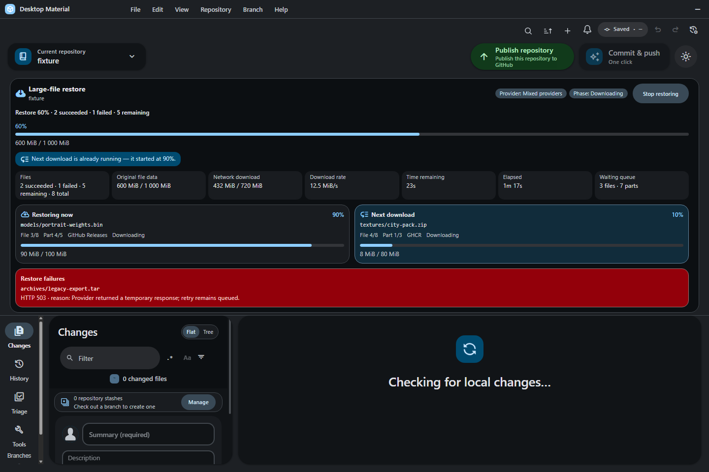

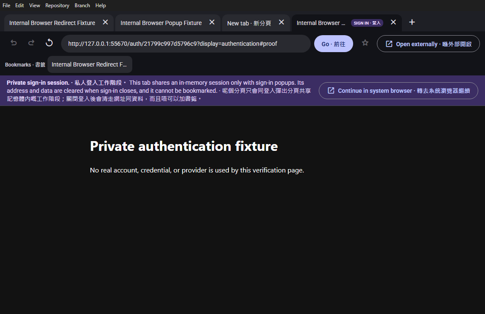

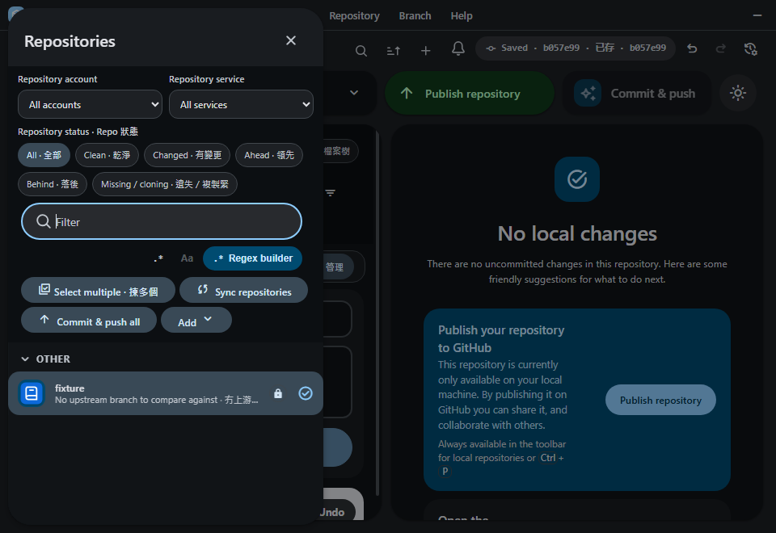


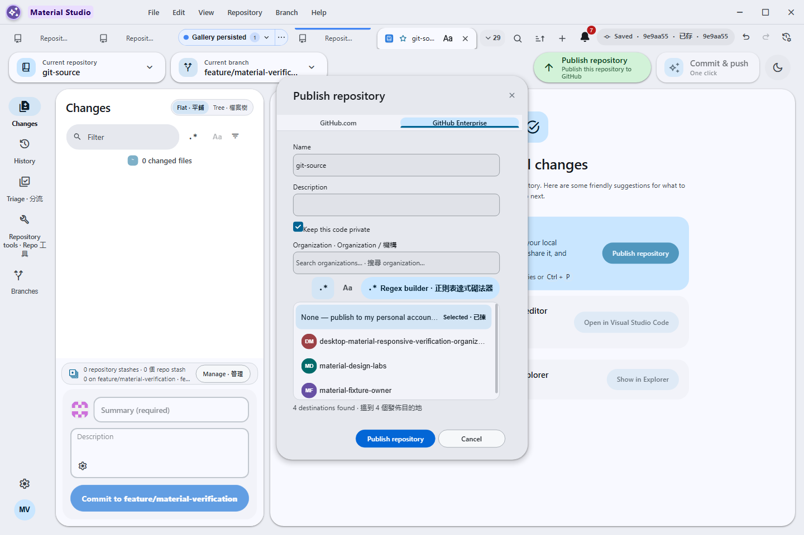

</details>

## Install on Windows / Windows 安裝

Desktop Material's automated releases provide a per-user x64 Windows installer.
Run this one line in Windows PowerShell 5.1 or PowerShell 7; it does not require
an administrator shell:

Desktop Material 嘅自動發佈提供每用戶嘅 x64 Windows 安裝程式。喺 Windows PowerShell 5.1 或者 PowerShell 7 行呢一行就得，唔使管理員 shell：

```powershell
Microsoft.PowerShell.Utility\Invoke-RestMethod 'https://raw.githubusercontent.com/Ding-Ding-Projects/desktop-material/main/script/install-windows.ps1' | Microsoft.PowerShell.Utility\Invoke-Expression
```

For automation, invoke the reviewed script as a script block and choose the
explicit current-user operation:

如果要自動化，將呢個已覆核嘅 script 當 script block 叫，然後揀明確嘅目前用戶操作：

```powershell
$installer = [scriptblock]::Create((Microsoft.PowerShell.Utility\Invoke-RestMethod 'https://raw.githubusercontent.com/Ding-Ding-Projects/desktop-material/main/script/install-windows.ps1'))
& $installer -Operation Install -InstallScope CurrentUser
& $installer -Operation Update -InstallScope CurrentUser
& $installer -Operation Uninstall -InstallScope CurrentUser
```

All three operations are silent, wait for Squirrel, verify the resulting
installed state, and refuse to force-close a running app. See the
[Install tab](docs/readme-tabs/install.md) for the exact scope, exit/failure
contract, asset verification, manual downloads, and updater behavior.

三個操作都係靜默執行、會等 Squirrel、會驗證裝完之後嘅狀態，亦都拒絕強制關閉執行緊嘅 app。精確嘅範圍、離開碼／失敗契約、資產驗證、手動下載同更新器行為，睇 [Install 分頁](docs/readme-tabs/install.md)。

## Historical Linux TUI prototype (unsupported) / Linux TUI 舊原型（不支援）

The commands and behavior below preserve the July 27 prototype record. The TUI
is not a current supported package, runtime, release lane, or compatibility
commitment, and its tests or package status do not block the Windows product.
The repository retains the source and exact acceptance receipts for audit; do
not read this section as a current installation recommendation.

下面嘅命令同行為係保留 7 月 27 日嘅原型紀錄。個 TUI 唔係目前支援嘅套件、執行環境、發佈線道或者相容性承諾，佢嘅測試同套件狀態亦都唔會阻塞 Windows 產品。儲存庫保留原始碼同精確接受憑證俾人審計；唔好將呢一段當成目前嘅安裝建議。

At that historical checkpoint, a trusted checkout could be installed as an
isolated tool and launched with the literal `github` command:

喺嗰個歷史檢查點，一個受信任嘅 checkout 可以裝成獨立工具，再用字面上嘅 `github` 命令啟動：

Linux shell, from a fresh parent directory:

Linux shell，喺一個全新嘅上層資料夾：

<!-- markdownlint-disable MD013 -->

```bash
git clone https://github.com/Ding-Ding-Projects/desktop-material.git && cd desktop-material && uv tool install ./tui && uv tool update-shell
```

Windows PowerShell, from a fresh parent directory:

Windows PowerShell，喺一個全新嘅上層資料夾：

```powershell
git clone https://github.com/Ding-Ding-Projects/desktop-material.git; if ($LASTEXITCODE -ne 0) { throw 'git clone failed' }; Set-Location .\desktop-material; uv tool install .\tui; if ($LASTEXITCODE -ne 0) { throw 'uv tool install failed' }; uv tool update-shell
```

<!-- markdownlint-enable MD013 -->

Both commands require Git and
[uv](https://docs.astral.sh/uv/getting-started/installation/). Close and reopen
the terminal afterward so the updated `PATH` is loaded, then run
`github /path/to/repository` on Linux or
`github C:\path\to\repository` on Windows. The interactive acceptance target
was Linux-first; the Windows Terminal launch path and cross-platform core were
also tested at that checkpoint.

兩條命令都需要 Git 同 [uv](https://docs.astral.sh/uv/getting-started/installation/)。之後閂咗個終端機再開，等更新咗嘅 `PATH` 載入，然後喺 Linux 行 `github /path/to/repository`，喺 Windows 行 `github C:\path\to\repository`。互動接受目標係 Linux 優先；喺嗰個檢查點，Windows Terminal 啟動路徑同跨平台核心亦都測試過。

`github`, `dmt`, and `desktop-material-tui` are identical launchers for this
terminal edition. This alias does not replace GitHub CLI's `gh`. If another
program or shell alias already owns `github`, use `dmt` or
`desktop-material-tui` instead. Noninteractive discovery and status work too:

`github`、`dmt` 同 `desktop-material-tui` 係呢個終端機版本完全相同嘅啟動器。呢個別名唔會取代 GitHub CLI 嘅 `gh`。如果另一個程式或者 shell 別名已經佔咗 `github`，就用 `dmt` 或者 `desktop-material-tui`。非互動嘅探索同狀態一樣得：

```bash
github --help
github status --json
github push --dry-run
github push origin main
github pull --ff-only
github git log --oneline --decorate
```

`github push` runs a native dry-run, then scans safe working candidates and the
publication delta; an unprovable remote base safely falls back to all history
reachable from the pushed source refs. Native Git publishes nothing until that
passes. `github pull` runs native Git first and then restores canonical Cheap
LFS pointers with exact size/SHA-256 verification. The explicit `github git …`
form passes other native Git arguments through without a shell; see the
[wrapper contract](docs/features/linux-tui/cheap-lfs-git-wrapper.md).

`github push` 會先行原生 dry-run，然後掃描安全嘅工作候選同發佈差異；如果證明唔到遠端基底，就安全咁退回到由推送來源 ref 可達嘅全部歷史。喺呢一步通過之前，原生 Git 唔會發佈任何嘢。`github pull` 會先行原生 Git，然後用精確嘅大小／SHA-256 驗證還原標準 Cheap LFS pointer。明確嘅 `github git …` 形式會將其他原生 Git 參數唔經 shell 直接傳過去；睇 [wrapper 契約](docs/features/linux-tui/cheap-lfs-git-wrapper.md)。

The dated browser/wrapper milestone passed the full Windows-hosted TUI suite
(250 passed, 1 Linux-only skip in 182.76 seconds), its 29 focused path/browser
tests, and its 47 focused wrapper tests. Ruff lint/format, strict mypy for the
normal and explicit Linux targets, and package build are also green. A real
Debian/Xvfb/xterm run accepted the packaged Open dialog and fixture-backed
push/pull with an exact restored pointer/cache hash match. All three Windows
aliases resolve from the uv tool directory already on `PATH`, the Linux wheel
smoke reported the same aliases, and disposable cleanup is complete. The
remaining automated-versus-live evidence split is explicit in the
[dated run manifest](docs/verification/linux-tui-path-browser-wrapper-2026-07-27/run-manifest.md).

嗰個有日期嘅瀏覽器／wrapper 里程碑通過咗完整嘅 Windows 主機 TUI 測試套件（250 個通過，1 個 Linux 專有略過，用咗 182.76 秒）、佢 29 個聚焦路徑／瀏覽器測試同 47 個聚焦 wrapper 測試。Ruff lint／format、普通同明確 Linux 目標嘅嚴格 mypy，以及套件建置亦都係綠色。一次真實 Debian/Xvfb/xterm 執行接受咗已打包嘅 Open 對話框，同埋以 fixture 支援嘅 push／pull，還原嘅 pointer／快取雜湊完全吻合。三個 Windows 別名都由已經喺 `PATH` 嘅 uv 工具目錄解析到，Linux wheel 煙霧測試報告一樣嘅別名，用完即棄嘅清理亦都做齊。自動化對真實證據之間仲餘低嘅分別，明確寫喺 [有日期嘅執行清單](docs/verification/linux-tui-path-browser-wrapper-2026-07-27/run-manifest.md)。

For development, run the locked project directly:

如果要開發，直接行鎖定咗嘅項目：

```bash
cd tui
uv sync --locked --extra dev
uv run desktop-material-tui
```

The prototype supported mouse clicks, a folder-only repository browser, safe quoted-path
paste, keyboard focus, editable single-line and multiline text controls, local
Git workflows, GitHub workflows through `gh`, shared RE2 search, localization,
notifications, and XDG persistence. It did **not**
claim all 201 graphical-edition capabilities; see the generated
[parity contract](tui/contracts/parity.yaml) and
[TUI documentation](docs/features/linux-tui/README.md).

呢個原型支援滑鼠點擊、淨係資料夾嘅儲存庫瀏覽器、安全嘅引號路徑貼上、鍵盤焦點、可編輯嘅單行同多行文字控制項、本機 Git 工作流程、經 `gh` 嘅 GitHub 工作流程、共用 RE2 搜尋、本地化、通知同 XDG 持久化。佢**冇**聲稱有齊 201 項圖形版能力；睇產生嘅 [parity 契約](tui/contracts/parity.yaml) 同 [TUI 文件](docs/features/linux-tui/README.md)。

The historical record also retained a minimal non-root Docker image; the
[container guide](docs/features/linux-tui/container.md) records its build and
interactive run commands.

歷史紀錄亦都保留咗一個最小、非 root 嘅 Docker 映像；[容器指南](docs/features/linux-tui/container.md) 記錄佢嘅建置同互動執行命令。

The five dated Linux/Xvfb captures remain preserved in the
[historical TUI verification record](docs/verification/linux-tui-2026-07-27/run-manifest.md).
They are not presented as current Windows evidence and are excluded from the
86-scene guided gallery and its refresh plan.

五個有日期嘅 Linux/Xvfb 擷取保留喺 [歷史 TUI 驗證紀錄](docs/verification/linux-tui-2026-07-27/run-manifest.md)。佢哋唔會當做目前 Windows 證據，亦都排除喺 86 場景導覽相簿同佢嘅更新計劃之外。

## Explore the tabs / 各個分頁

- **[Install](docs/readme-tabs/install.md)** — supported Windows installation plus the archived Linux TUI prototype record
- **[Features](docs/readme-tabs/features.md)** — the full Material Design 3 shell plus every Git and GitHub workflow
- **[Complete list](docs/readme-tabs/complete-feature-list.md)** — every feature in one bilingual table, labelled Added / Extended / Inherited against GitHub Desktop
- **[Screenshots](docs/readme-tabs/screenshots.md)** — the annotated capture gallery
- **[Roadmap & receipts](docs/readme-tabs/roadmap-and-receipts.md)** — milestone status and published CI/release evidence
- **[Development](docs/readme-tabs/development.md)** — build Desktop Material from source

- **[安裝](docs/readme-tabs/install.md)** — 支援嘅 Windows 安裝，加埋封存低嘅 Linux TUI 原型紀錄
- **[功能](docs/readme-tabs/features.md)** — 完整 Material Design 3 外殼，加埋每一個 Git 同 GitHub 工作流程
- **[完整清單](docs/readme-tabs/complete-feature-list.md)** — 所有功能一張雙語表，對住 GitHub Desktop 標明新增／擴充／繼承
- **[截圖](docs/readme-tabs/screenshots.md)** — 有註解嘅擷取相簿
- **[路線圖同憑證](docs/readme-tabs/roadmap-and-receipts.md)** — 里程碑狀態同已發佈嘅 CI／發佈證據
- **[開發](docs/readme-tabs/development.md)** — 由原始碼建置 Desktop Material

## Project site & docs / 項目網站同文件

- Project site: https://ding-ding-projects.github.io/desktop-material/
- Wiki: https://github.com/Ding-Ding-Projects/desktop-material/wiki

- 項目網站：https://ding-ding-projects.github.io/desktop-material/
- Wiki：https://github.com/Ding-Ding-Projects/desktop-material/wiki

## Lines of code / 程式碼行數

<details>
<summary><b>1,271,040 lines</b> across 3,328 files — full breakdown, and who wrote them</summary>

| Area | Files | Lines | Non-blank |
| --- | ---: | ---: | ---: |
| App source | 1,492 | 487,548 | 447,371 |
| Docs and documentation site | 371 | 376,845 | 366,085 |
| Agent run and verification records *(excluded)* | 158 | 271,896 | 267,922 |
| App tests | 988 | 237,995 | 216,245 |
| Vendored / third-party *(excluded)* | 30 | 149,641 | 127,208 |
| App styles | 265 | 60,854 | 52,287 |
| Other subprojects | 33 | 38,488 | 36,904 |
| Linux TUI prototype (historical) *(excluded)* | 93 | 28,721 | 25,837 |
| Build and tooling scripts | 78 | 24,117 | 22,166 |
| Repository root | 15 | 16,403 | 15,108 |
| Remote-access site | 19 | 15,459 | 14,935 |
| CI workflows and editor config | 49 | 10,113 | 9,116 |
| App static assets | 10 | 2,421 | 2,309 |
| Unclassified | 8 | 797 | 730 |
| **Project total** | **3,328** | **1,271,040** | **1,183,256** |
| **Everything counted** | **3,609** | **1,721,298** | **1,604,223** |

Two totals rather than one: the **project total** is this project's own code, and
**everything counted** adds the four excluded rows back so a reader can see the
whole repository as well. The excluded rows are visible in the same table rather
than quietly dropped.

兩個總數而唔係一個：**項目總數**係呢個項目自己嘅程式碼，**全部計算**就係將四行排除返入去，等讀者亦都見到成個儲存庫。啲排除嘅行喺同一張表入面見得到，唔會靜靜雞唔計。

Of the project total, **36,330 lines across 8 files are generated** by tooling
rather than written by hand — the changelog catalog, the release-date table, the
octicon bindings, and the bundled asset manifests.

喺項目總數入面，**8 個檔案共 36,330 行係工具產生**而唔係人手寫嘅 — changelog 目錄、發佈日期表、octicon 綁定同打包資產清單。

### Who wrote it / 邊個寫

| Written by | Lines | Share |
| --- | ---: | ---: |
| Agents | 1,159,677 | 67.4% |
| People | 561,621 | 32.6% |
| **Total attributed** | **1,721,298** | **100%** |

Attribution is per **surviving** line via `git blame`, not lines added: churn is
not authorship, and a line written and later deleted counts for nobody. A commit
counts as agent-written when its author is an automation identity or it carries a
`Co-Authored-By` trailer naming an agent. The attributed total equals *everything
counted* exactly — if those two ever disagree, the counter is wrong and the
figure should not be trusted.

歸屬係用 `git blame` 計**仲存在**嘅行，唔係計加咗幾多行：改嚟改去唔等於作者身分，寫完之後又刪咗嘅行邊個都唔算。當一個 commit 嘅作者係自動化身分，或者佢帶住指名 agent 嘅 `Co-Authored-By` trailer，就當係 agent 寫。歸屬總數同*全部計算*完全相等 — 如果嗰兩個數字唔夾，即係個計數器錯咗，嗰個數字唔好信。

Desktop Material is a fork of [GitHub Desktop](https://github.com/desktop/desktop),
so a large part of the human share is upstream work inherited with the fork
rather than written here.

Desktop Material 係 [GitHub Desktop](https://github.com/desktop/desktop) 嘅 fork，所以人類嗰份好大部分係跟住 fork 繼承落嚟嘅上游工作，唔係喺呢度寫。

**What is excluded, and why.** Only files Git tracks are counted, so dependency
directories, build output and everything ignored are excluded by construction.
Four rows are counted but held out of the project total because they are not this
project's code: vendored third-party trees, the historical Linux TUI prototype
(not a supported product edition), the agent run and verification records under
`.codex/`, and packaging leftovers. Binary and asset files are never counted; the
`Unclassified` row exists so that a counted file can never be silently dropped
from the total.

**排除咗啲乜，點解。** 淨係計 Git 追蹤緊嘅檔案，所以依賴目錄、建置輸出同所有被忽略嘅嘢，本質上已經排除。有四行雖然計咗，但係唔入項目總數，因為佢哋唔係呢個項目嘅程式碼：vendored 第三方樹、歷史 Linux TUI 原型（唔係支援嘅產品版本）、`.codex/` 下面嘅 agent 執行同驗證紀錄，以及打包剩低嘅嘢。二進位同資產檔案永遠唔計；`Unclassified` 嗰行存在，係為咗確保一個計咗嘅檔案唔會靜靜雞喺總數度消失。

**Where the real record lives.** Every GitHub Release carries its own line count,
measured by CI over the exact commit that release was built from, in the same run
that produced the installers. That is the record; the tables above are a
convenience copy of the most recent one, so the two never disagree and no figure
here was ever typed by hand.

**真正嘅紀錄喺邊。** 每一個 GitHub Release 都帶住佢自己嘅行數，由 CI 喺該次發佈建置嘅精確 commit 上量度，同一次執行亦都整出啲安裝程式。嗰個先係紀錄；上面啲表係最近一次嘅方便副本，所以兩者唔會唔夾，而呢度冇一個數字係人手打出嚟。

**How to reproduce it.** The figures are measured, not estimated:

**點樣重現。** 啲數字係量度出嚟，唔係估出嚟：

```bash
node script/count-lines.mjs
```

Add `--no-attribution` to skip the `git blame` pass, which is by far the slowest
part. Measured at commit `cac6abec75`.

加 `--no-attribution` 可以略過 `git blame` 嗰一輪，嗰輪係最慢嘅部分。量度於 commit `cac6abec75`。

</details>

## Credits & License / 鳴謝同授權

Desktop Material is built on [GitHub Desktop](https://github.com/desktop/desktop) (MIT), with feature-parity references from [desktop-plus](https://github.com/desktop-plus/desktop-plus) (MIT). Thanks to both projects and their contributors.

Desktop Material 建基於 [GitHub Desktop](https://github.com/desktop/desktop)（MIT），並且參考 [desktop-plus](https://github.com/desktop-plus/desktop-plus)（MIT）做功能對等。多謝兩個項目同佢哋嘅貢獻者。

**[MIT](LICENSE)**

**[MIT](LICENSE)**（MIT 授權條款）

The MIT license grant is not for GitHub's trademarks, which include the logo designs. GitHub reserves all trademark and copyright rights in and to all GitHub trademarks. GitHub's logos include, for instance, the stylized Invertocat designs that include "logo" in the file title in the following folder: [logos](app/static/logos).

MIT 授權嘅授予唔包括 GitHub 嘅商標，當中包括各個標誌設計。GitHub 保留佢所有商標同版權權利。GitHub 嘅標誌包括（例如）以下資料夾入面，檔名帶有「logo」嘅風格化 Invertocat 設計：[logos](app/static/logos)。

GitHub® and its stylized versions and the Invertocat mark are GitHub's Trademarks or registered Trademarks. When using GitHub's logos, be sure to follow the GitHub [logo guidelines](https://github.com/logos).


GitHub® 同佢嘅風格化版本，以及 Invertocat 標記，都係 GitHub 嘅商標或者註冊商標。使用 GitHub 標誌嗰陣，記住跟返 GitHub 嘅 [標誌指引](https://github.com/logos)。
