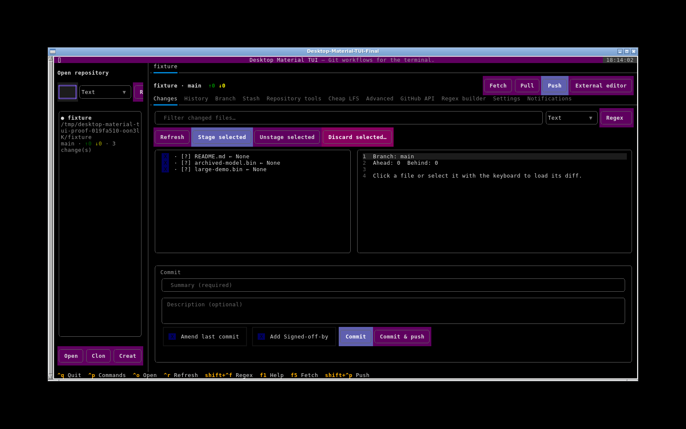

**Overview** · [Install](docs/readme-tabs/install.md) · [Features](docs/readme-tabs/features.md) · [Complete list](docs/readme-tabs/complete-feature-list.md) · [Screenshots](docs/readme-tabs/screenshots.md) · [Roadmap & receipts](docs/readme-tabs/roadmap-and-receipts.md) · [Development](docs/readme-tabs/development.md)

<sub>Tabbed README — GitHub can't run scripts, so each tab above is a separate page.</sub>

# Desktop Material

Desktop Material is an independent Material Design 3 (M3 Expressive) remake of [GitHub Desktop](https://github.com/desktop/desktop). It rebuilds the entire application shell around Material Design 3 while keeping GitHub Desktop's full Git workflow and the same underlying stack: [TypeScript](https://www.typescriptlang.org), [React](https://react.dev), [Electron](https://www.electronjs.org), and [Sass](https://sass-lang.com). This project is in active development.

> **Platform support:** the graphical Electron edition remains Windows-only:
> Windows x64 is its installer and portable-ZIP target, with Windows x64/arm64
> builds and packaged Windows x64 E2E. A separate
> [Linux-first terminal edition](docs/features/linux-tui/README.md) now provides
> mouse, keyboard, and real text-field workflows as a Python package. It is not
> a Linux build of the Electron application.


> **Measured responsiveness checkpoint — July 28, 2026:** the exact released
> Windows build held every sampled idle frame below 17 ms, but twelve warmed
> Changes/History switches still took 56–104 ms and produced six long tasks.
> The navigation path was emitting an identical compare-form update after the
> real section change, forcing a second root render. Navigation and `AppStore`
> now suppress that no-op; focused responsiveness and adjacent lifecycle/lazy
> loading coverage passes **42/42**. Exact post-fix release timing is pending.

> **Local reliability checkpoint — July 28, 2026:** the root renderer now owns
> and releases its store/updater/drag/IPC subscriptions, telemetry and update
> polling timers, and global document/window handlers. Queued idle and
> animation-frame callbacks cannot restart work after unmount. Focused
> lifecycle tests pass **4/4** and changed-file ESLint is clean. The required
> Lowlevel MCP headless production build was attempted but stopped before
> compilation because this checkout has no installed dependency tree;
> built-app capture and remote CI are not yet claimed.

> **Local implementation checkpoint — July 27, 2026:** #78 adds optional
> AES-256-GCM encryption to GitHub Release-backed Cheap LFS payloads. Passwords
> are requested once per operation or, only when the user opts in, retrieved
> from the Windows credential vault; existing pointer formats remain compatible,
> plaintext legacy restores never prompt, and combined authentication/cleanup
> failures fail closed. #80 observes asynchronous push, fetch, and pull actions
> and keeps an invalid canonical remote visible as a yellow warning with a
> **Change remote URL** action. #83 restores independent persisted English and
> Cantonese funny-level sliders from 1–5. #81 and #82 are deliberately deferred
> to a later continuation. Local evidence is **194/194 focused tests** and
> **6768/6768 full tests across 831 files**, with TypeScript and `yarn lint`
> clean. #78, #80, and #83 remain open pending real built-app screenshots;
> packaged visual evidence and remote CI are not yet claimed.

> **Merged and published source — July 27, 2026:** Cheap LFS Release restores now
> open one bounded look-ahead lane at the exact 90% download point and expose
> detailed overall/file/part progress. Browser-bound links can also use a
> secure app-hosted tabbed browser with an explicit system-browser escape.
> Private repositories now keep a separate lock badge even when their leading
> repository glyph is a fork or custom logo. The final focused gate passed
> **760/760**, verifier contracts passed **14/14**, TypeScript is clean, the
> exact Windows production build completed successfully, and the real built
> app passed isolated off-screen English/bilingual interaction and privacy
> inspection. The source is merged and pushed through `2abccae8fd`; Pages and
> wiki publication are live. TUI correction commit `f555d374a6` is contained
> in `origin/main`; remote run `30317262582` passed its Linux TUI matrix and
> Windows TUI core job but failed overall in the unrelated Windows x64 unit
> job. Installer run `30318769692` failed and published no Release. Packaged
> Windows E2E remains verified.
> See
> [Release-backed Cheap LFS](docs/features/repository-management/release-backed-cheap-lfs.md),
> the [app-hosted browser](docs/features/integrations/app-hosted-browser.md),
> and the [private-repository lock badge](docs/features/repository-management/private-repository-lock-badge.md).


## Install on Windows

Desktop Material's automated releases provide a per-user x64 Windows installer.
Run this one line in Windows PowerShell 5.1 or PowerShell 7; it does not require
an administrator shell:

```powershell
Microsoft.PowerShell.Utility\Invoke-RestMethod 'https://raw.githubusercontent.com/Ding-Ding-Projects/desktop-material/main/script/install-windows.ps1' | Microsoft.PowerShell.Utility\Invoke-Expression
```

See the [Install tab](docs/readme-tabs/install.md) for asset verification, manual
downloads, and updater behavior.

## Run the Linux-first TUI

Install the trusted checkout as an isolated tool, then launch a repository with
the literal `github` command:

Linux shell, from a fresh parent directory:

<!-- markdownlint-disable MD013 -->

```bash
git clone https://github.com/Ding-Ding-Projects/desktop-material.git && cd desktop-material && uv tool install ./tui && uv tool update-shell
```

Windows PowerShell, from a fresh parent directory:

```powershell
git clone https://github.com/Ding-Ding-Projects/desktop-material.git; if ($LASTEXITCODE -ne 0) { throw 'git clone failed' }; Set-Location .\desktop-material; uv tool install .\tui; if ($LASTEXITCODE -ne 0) { throw 'uv tool install failed' }; uv tool update-shell
```

<!-- markdownlint-enable MD013 -->

Both commands require Git and
[uv](https://docs.astral.sh/uv/getting-started/installation/). Close and reopen
the terminal afterward so the updated `PATH` is loaded, then run
`github /path/to/repository` on Linux or
`github C:\path\to\repository` on Windows. The interactive acceptance target
remains Linux-first; the Windows Terminal launch path and cross-platform core
are also tested.

`github`, `dmt`, and `desktop-material-tui` are identical launchers for this
terminal edition. This alias does not replace GitHub CLI's `gh`. If another
program or shell alias already owns `github`, use `dmt` or
`desktop-material-tui` instead. Noninteractive discovery and status work too:

```bash
github --help
github status --json
github push --dry-run
github push origin main
github pull --ff-only
github git log --oneline --decorate
```

`github push` runs a native dry-run, then scans safe working candidates and the
publication delta; an unprovable remote base safely falls back to all history
reachable from the pushed source refs. Native Git publishes nothing until that
passes. `github pull` runs native Git first and then restores canonical Cheap
LFS pointers with exact size/SHA-256 verification. The explicit `github git …`
form passes other native Git arguments through without a shell; see the
[wrapper contract](docs/features/linux-tui/cheap-lfs-git-wrapper.md).

The current browser/wrapper milestone passes the full Windows-hosted TUI suite
(250 passed, 1 Linux-only skip in 182.76 seconds), its 29 focused path/browser
tests, and its 47 focused wrapper tests. Ruff lint/format, strict mypy for the
normal and explicit Linux targets, and package build are also green. A real
Debian/Xvfb/xterm run accepted the packaged Open dialog and fixture-backed
push/pull with an exact restored pointer/cache hash match. All three Windows
aliases resolve from the uv tool directory already on `PATH`, the Linux wheel
smoke reported the same aliases, and disposable cleanup is complete. The
remaining automated-versus-live evidence split is explicit in the
[dated run manifest](docs/verification/linux-tui-path-browser-wrapper-2026-07-27/run-manifest.md).

For development, run the locked project directly:

```bash
cd tui
uv sync --locked --extra dev
uv run desktop-material-tui
```

It supports mouse clicks, a folder-only repository browser, safe quoted-path
paste, keyboard focus, editable single-line and multiline text controls, local
Git workflows, GitHub workflows through `gh`, shared RE2 search, localization,
notifications, and XDG persistence. It does **not** yet
claim all 201 graphical-edition capabilities; see the generated
[parity contract](tui/contracts/parity.yaml) and
[TUI documentation](docs/features/linux-tui/README.md).

A minimal non-root Docker image is also available; the
[container guide](docs/features/linux-tui/container.md) includes copy-paste
build and interactive run commands with repository and XDG persistence mounts.



## Explore the tabs

- **[Install](docs/readme-tabs/install.md)** — Windows installer and Linux TUI source/package routes
- **[Features](docs/readme-tabs/features.md)** — the full Material Design 3 shell plus every Git and GitHub workflow
- **[Complete list](docs/readme-tabs/complete-feature-list.md)** — every feature in one bilingual table, labelled Added / Extended / Inherited against GitHub Desktop
- **[Screenshots](docs/readme-tabs/screenshots.md)** — the annotated capture gallery
- **[Roadmap & receipts](docs/readme-tabs/roadmap-and-receipts.md)** — milestone status and published CI/release evidence
- **[Development](docs/readme-tabs/development.md)** — build Desktop Material from source

## Project site & docs

- Project site: https://ding-ding-projects.github.io/desktop-material/
- Wiki: https://github.com/Ding-Ding-Projects/desktop-material/wiki

## Credits & License

Desktop Material is built on [GitHub Desktop](https://github.com/desktop/desktop) (MIT), with feature-parity references from [desktop-plus](https://github.com/desktop-plus/desktop-plus) (MIT). Thanks to both projects and their contributors.

**[MIT](LICENSE)**

The MIT license grant is not for GitHub's trademarks, which include the logo designs. GitHub reserves all trademark and copyright rights in and to all GitHub trademarks. GitHub's logos include, for instance, the stylized Invertocat designs that include "logo" in the file title in the following folder: [logos](app/static/logos).

GitHub® and its stylized versions and the Invertocat mark are GitHub's Trademarks or registered Trademarks. When using GitHub's logos, be sure to follow the GitHub [logo guidelines](https://github.com/logos).
