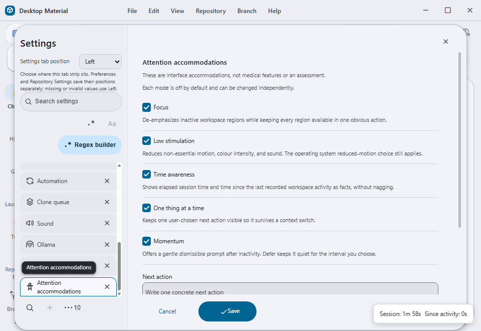
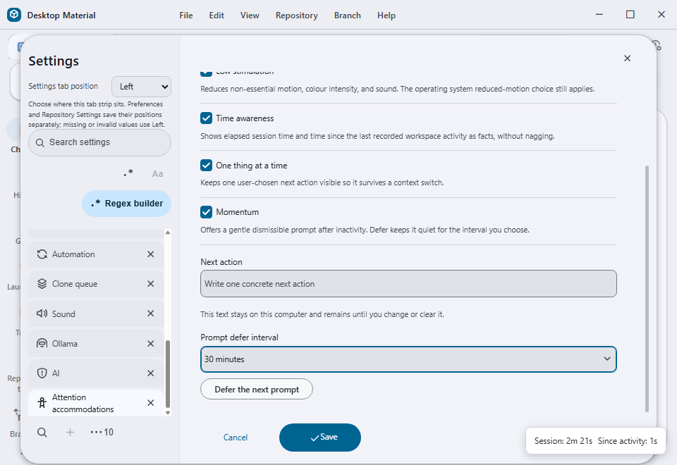
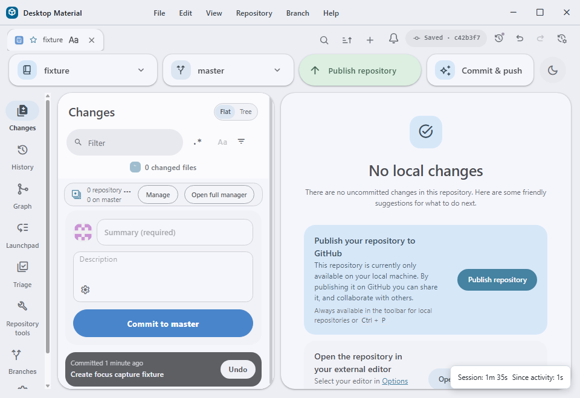

# Attention accommodations

Desktop Material provides five independently toggleable interface
accommodations in **Settings → Attention accommodations**. They are all off by
default, persist locally, and do not diagnose, assess, or make a medical claim
about the person using the app.

## Modes

- **Focus** de-emphasizes inactive workspace regions after focus moves to an
  active region. It never removes content; the inactive region remains
  available through its existing controls.
- **Low stimulation** reduces non-essential animation, transition timing,
  colour saturation, and visual noise. The operating system's
  `prefers-reduced-motion` preference remains authoritative and is respected
  in addition to this setting.
- **Time awareness** displays elapsed time in the current renderer session and
  the time since the most recent recorded activity. These are factual labels,
  not alarms or productivity scores.
- **One thing at a time** keeps one user-entered next action visible. The text
  is bounded to 240 characters, stored locally, and remains until the user
  changes or clears it.
- **Momentum** offers a non-blocking prompt after fifteen minutes without
  activity. Dismissing it records a defer interval and does not show another
  prompt until that interval ends.

## Persistence and privacy

The versioned `attention-accommodation-preferences` record contains only the
five booleans, the bounded next-action text, a defer timestamp, and the last
settings-change timestamp. Invalid or future-shaped values are coerced to safe
defaults. No network request is made and no activity text is exported or sent
to diagnostics.

## Accessibility and localization

Each mode is a keyboard-reachable checkbox with an accessible description. The
next-action field and defer selector have labels and bounded native controls.
Runtime facts use a polite status region; Momentum is dismissible and never
blocks the workspace. English, playful Hong Kong Cantonese, and bilingual copy
are selected through the existing language preference, with the existing
per-language funny-level setting used only to choose framing copy. Facts,
durations, and the user's next action remain unchanged by tone.

## Failure boundaries

If local storage cannot be read, all modes resolve to their off-by-default
values. If a next-action value is malformed or too long, it is trimmed or
cleared rather than partially applied. A missing layout region is left fully
usable; Focus never hides it. Momentum and Time awareness are non-blocking and
can be unavailable without preventing the app from starting.

## Verification status

The implementation, local persistence, English/Cantonese/bilingual copy,
settings search, command-palette registration, and seven focused unit/UI tests
are verified in `app/test/unit/attention-accommodation-test.tsx`. The focused test
also removes one required mode from a copy of the hand-written five-mode
inventory and verifies that the exact inventory check rejects it before
validating the restored list. It also proves hidden overlays are excluded from
Focus and focused descendants resolve to real top-level workspace regions.

The exact `74159be0d9d4da10254ad18873496bb9bd1f5928` production build was
driven on a cheap-Lowlevel hidden Windows desktop with an isolated profile and
disposable repository. Every mode was enabled, conditional controls were
reached by keyboard, and a restart proved Focus kept the normally hidden
repository-drop overlay invisible while Time awareness continued reporting
live session and activity facts. Release packaging remains pending and is not
implied by this unpackaged production-build evidence.

### Current built captures

## Suggested articles

- [Tone: per-language funny-level sliders](tone-funny-level.md)
- [Material ripple and theme reveal](material-ripple-and-theme-reveal.md)
- [Universal-feature completeness inventory](universal-feature-completeness-inventory.md)

## 專注與節奏調節

Desktop Material 喺「設定 → 專注與節奏調節」提供五個可以獨立開關嘅介面
調節。全部預設關閉，資料只會留喺本機，亦都唔係診斷、評估或者醫療功能。

- **專注** 會將冇郁緊嘅工作區域淡化，但唔會收埋內容。
- **低刺激** 減少非必要動畫、轉場、顏色強度同視覺噪音，亦會尊重作業系統嘅
  減少動態設定。
- **時間感知** 報告今次工作階段經過幾耐，同上次記錄到活動隔咗幾耐，唔會用鬧鐘
  或效率分數催人。
- **一次一件事** 保留一件由用戶輸入嘅下一步，最多 240 字，只存在本機。
- **動力提示** 連續 15 分鐘冇活動後顯示可關閉提示；延後之後，指定時間內唔會
  再出現。

所有控制項都可以用鍵盤操作，狀態用 polite live region 宣布，語氣設定只改表達
方式，唔改事實、時間或者用戶輸入嘅下一步。
