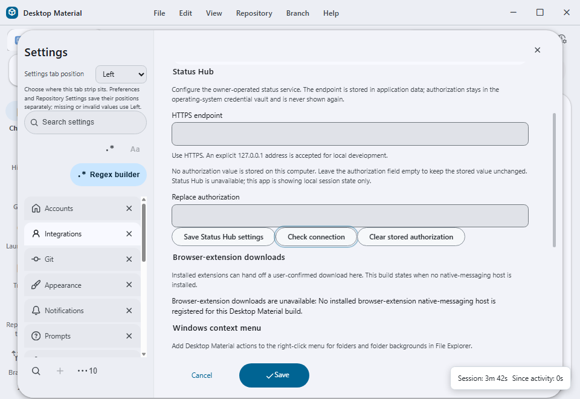

# Status Hub projection

## Behaviour

The existing **Agents** sidebar is the desktop surface for the current
repository's agent-session fleet. It shows a compact status line supplied by a
main-process Status Hub client; it does not create a second dashboard or a
mock copy of the Hub.

The client projects a registered repository, current session state, heartbeat,
and evidence records. Evidence is explicitly `verified`, `running`, `unrun`,
or `blocked`; a local build, source file, or session label never becomes a
green claim by itself. The returned stable URL is shown only when the client
has an authenticated, configured Hub endpoint.

When no owner endpoint or credential is configured, the Agents surface says it
is using local session state only. This fallback is intentional and remains
truthful while the app is offline.

## Owner configuration

**Settings → Integrations → Status Hub** provides the owner controls directly
in the application. The endpoint field accepts HTTPS, plus an explicit
`127.0.0.1` URL for local development. The authorization field is write-only:
leaving it empty preserves the existing vault value, entering a value replaces
it, and **Clear stored authorization** removes it without changing the endpoint.
**Check connection** reads the live main-process status and reports the real
connected, local-only, unavailable, or authentication-unavailable result.

The versioned endpoint file lives below the application user-data directory at
`status-hub/configuration.json`. It is bounded to 4 KiB and written atomically
through a unique temporary file plus the shared Windows rename-retry boundary.
Authorization is stored separately in the operating-system credential vault
under a stable owner account key. Renderer reads return only `endpoint` and
`authorizationPresent`; no IPC response can return the stored value.

The settings surface is indexed by Settings search and the command palette,
teleports to the exact controls, supports English, Cantonese, and bilingual
labels, and clears the password field immediately after a successful save.

## Security boundary

Only the Electron main process performs Hub networking. Renderer IPC carries a
credential-free session projection and receives a credential-free status or
reply record. Credentials belong to the owner-managed operating-system vault;
they are never rendered, logged, exported, or placed in a Hub projection.

The Discord bridge is not a desktop client. Its scope is read-plus-reply in the
Hub's own session inbox. It may not obtain a desktop agent credential, mutate
the desktop session state, or act as an agent. Desktop reply delivery is called
confirmed only after the authenticated Hub inbox poll reports confirmation.

## Failure modes

| Condition | Result |
| --- | --- |
| No endpoint | Local-only status with no stable URL |
| Missing vault credential | Explicit authentication-unavailable status |
| Request timeout or refusal | Explicit unavailable status; local fleet remains usable |
| Oversized or malformed response | Rejected before it reaches the renderer |
| Reply poll lacks delivery confirmation | No delivered claim is shown |
| Invalid endpoint or header injection | Save is refused; prior configuration remains active |
| Malformed or oversized configuration file | Read is refused rather than falling back to an invented configuration |

## Verification

`status-hub-configuration-store-test.ts` verifies endpoint-only persistence,
vault-only authorization, restart reload, preserve/replace/clear behavior,
unsafe endpoint refusal, header-injection refusal, and malformed-file refusal.
`status-hub-owner-settings-test.tsx` verifies credential-free loading, write-only
replacement, immediate field clearing, bilingual controls, and vault clearing.
The existing client, panel, IPC, settings-search, command-palette, and TypeScript
checks remain green. The exact
`74159be0d9d4da10254ad18873496bb9bd1f5928` production build was driven
on a cheap-Lowlevel hidden Windows desktop with an isolated profile and
disposable repository. **Check connection** reached the real main-process
client and displayed the honest local-only result. Two compact-layout defects
were found and repaired before acceptance: first the result was under the
fixed footer, then the result pushed the action row under it. The accepted
layout keeps the result in the credential-help live region before the
write-only field, with every action fully visible at a 960x660 client area.
Release packaging remains pending.

### Current built capture

