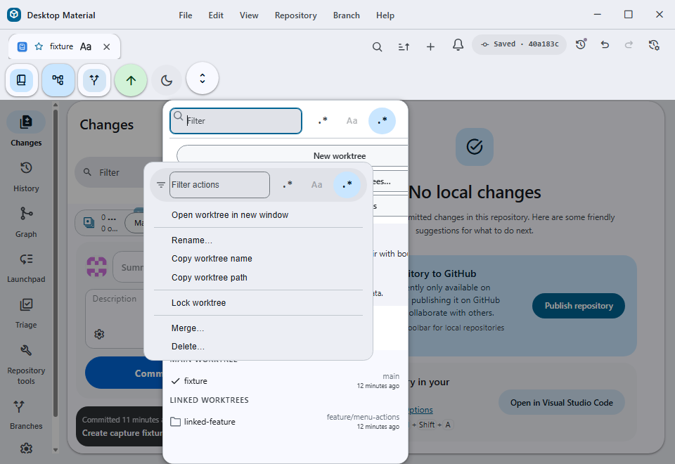
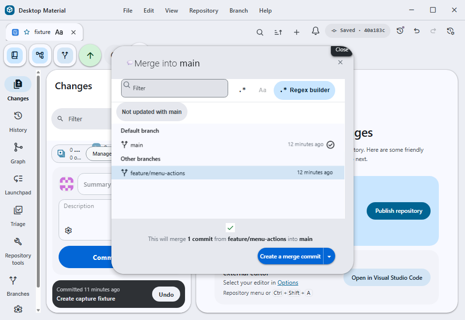
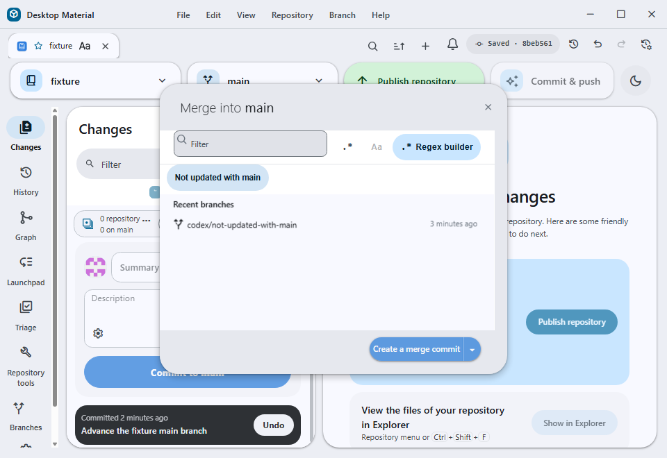
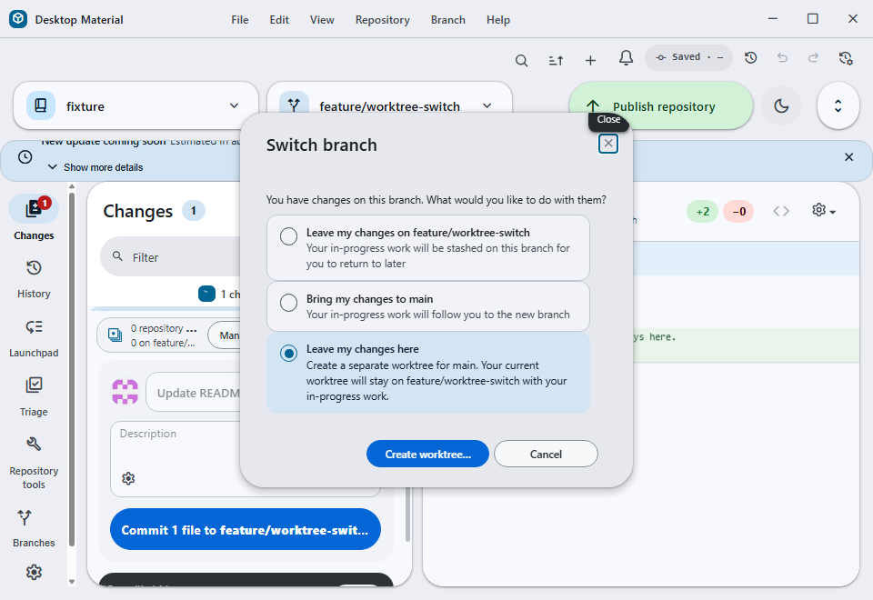
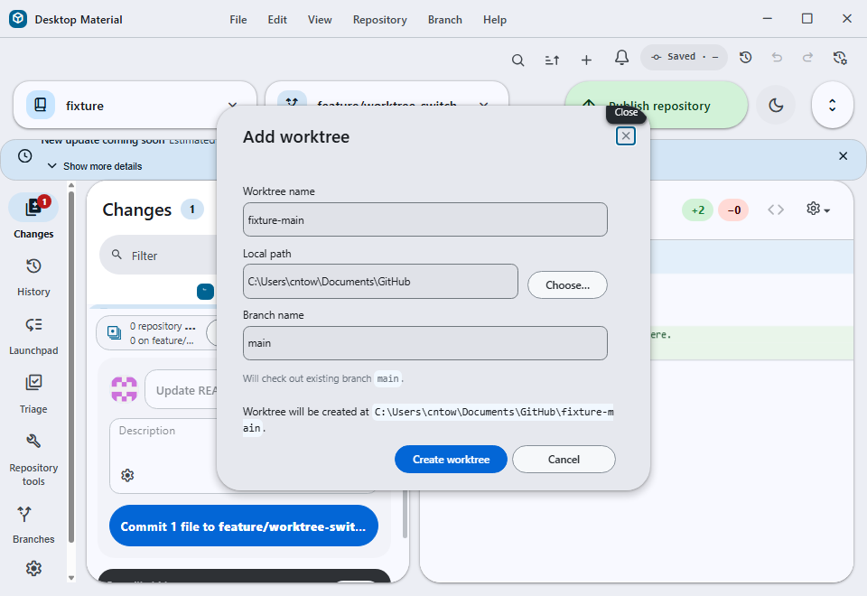

# Branch switcher workflows

The branch sheet combines local and remote branches with text filtering,
recent branches, default-branch context, activity/alphabetical sorting, and
explicit hidden/solo visibility controls. Local branches without a working
upstream retain a visible publish state.

Branch creation can use bounded name presets emitted by an optional custom
integration. Presets show both a prefix/name and description, and the first nine
can be selected by keyboard. Repository Settings can override the default
branch used by comparisons and related workflows.

The worktree list shows each worktree's filesystem creation age beneath its
branch or detached-HEAD label using the shared live relative-time component.
The timestamp is collected when Git worktrees are listed, with a filesystem
creation-time fallback to change time; missing or prunable paths omit the age
instead of displaying an invented value.

Right-clicking an eligible linked worktree now offers **Merge…** beside the
existing guarded **Delete…** action. Merge is available only when Git reports a
local attached branch, a known worktree status, and a target that is not the
current, locked, or prunable worktree. It opens the normal merge preview with
that branch selected, so the user can review the destination and conflicts
before Git changes anything. Delete remains a separate action, stays disabled
for the main or locked worktree, and uses the normal non-force removal and
failure dialog. Merging never silently deletes the worktree.

A checkout still passes through the existing dirty-worktree, conflict,
submodule, and in-progress-operation protections. Filter and visibility choices
do not delete refs. Invalid preset output is treated as display input and the
final branch name remains subject to Git ref validation.

## Merge chooser freshness filter

When the current branch is the repository's default branch, the **Choose a
branch to merge into main** sheet offers a **Not updated with main** filter.
The filter is additive to the existing text and regex controls: selecting it
shows branches whose current tip does not contain the default branch tip, while
leaving the existing branch selection and merge preview behavior unchanged.
The default branch itself is never returned as a stale result. A branch that
diverged after incorporating `main` is considered updated, because its history
already contains the default tip.

The implementation asks Git once for the refs containing the default tip and
canonicalizes both local and remote refs before comparing them with the branch
models. This prevents a remote-tracking ref from incorrectly making a local
branch look stale. The chip is localized as **Not updated with {branch}** in
English, **未追齊 {branch}** in Hong Kong-style Cantonese, and the same two
labels together in bilingual mode. The result refreshes when the repository,
default branch, branch tips, or branch set changes; a stale asynchronous result
is ignored.

If the default branch or its tip cannot be resolved, or Git returns a known
repository/revision error, the freshness chip is omitted rather than showing a
misleading all-stale list. The read-only ancestry query does not fetch, write
refs, change the checkout, or require credentials. Unexpected failures are
logged through the existing Git error path and the normal branch chooser stays
usable.

When the current worktree has uncommitted changes, the switch dialog also
offers **Leave my changes here**. This keeps the current branch and its working
files exactly where they are, then opens the existing Add worktree flow with
the destination branch and a suggested worktree name prefilled. The new linked
worktree is created only after the user chooses and confirms an absolute path;
after creation, the app switches to that worktree. No stash entry is created,
and the current worktree is never checked out to the destination branch.

If the worktree creation fails, the current dirty worktree remains untouched
and the error is shown through the normal worktree error path. A destination
branch already checked out in another worktree continues to use the existing
worktree-switch behavior instead of offering a duplicate checkout.

Failures from a preset process are bounded by timeout/output limits and direct
the user back to Settings. Branch discovery remains usable without the custom
integration.

Verification includes `branch-preset-test.ts`,
`stash-and-switch-branch-dialog-test.tsx`, branch grouping/filter suites,
recent-branch Git tests, the checkout/branch dispatcher suites, and a real
Windows hidden-desktop capture of the dirty-worktree dialog and the prefilled
Add worktree flow. The freshness filter adds
`for-each-ref-test.ts`, `not-updated-with-default-test.ts`,
`merge-branch-filters-test.ts`, and the integrated merge chooser/filter suite.
`multi-window-context-menu-test.ts` covers exact merge-branch forwarding,
missing merge inputs, target-specific deletion, and the main/locked deletion
protections.
The focused menu suite passed **7/7**, including the exact dispatcher route;
TypeScript and changed-file ESLint
passed, and the development build completed in **337.36 seconds**. The two
960×660 client-only captures above came from that exact build on an isolated
off-screen desktop with a disposable `main` and `feature/menu-actions`
worktree pair.
The focused integrated run passed **28/28** tests, TypeScript and changed-file
ESLint passed, and the development build completed through Windows resource
preparation. The built-app capture below is the exact client-only frame from
the disposable `main` fixture: **960×660**, SHA-256
`DA046E4BC768324BAFF001B5DE0C7954F53F1CD498C25338081E8FDB83990346`.

The capture shows `codex/not-updated-with-main` remaining visible while
`codex/updated-with-main` is removed by the active filter.

## Acceptance captures

The built Windows renderer shows the new choice selected and the follow-up
form with the destination branch and worktree name already filled in:

