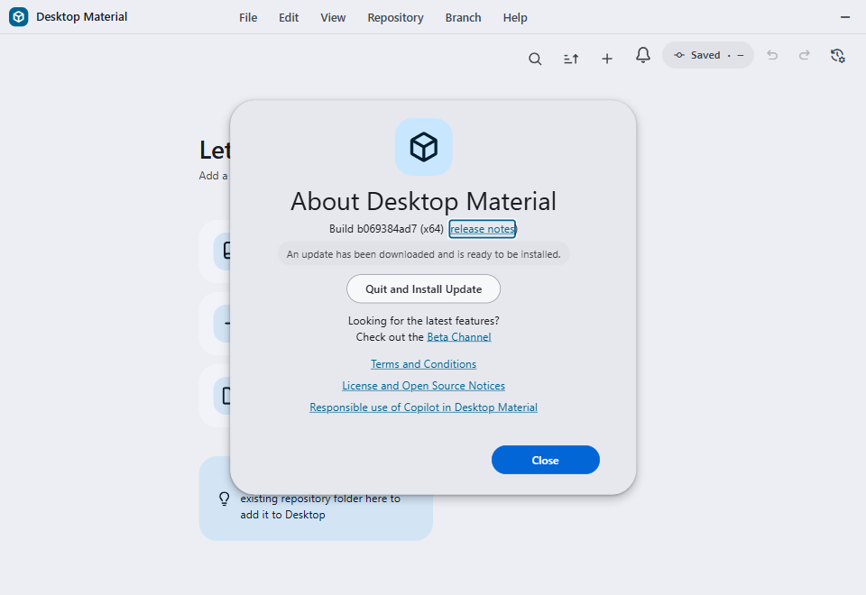

# Automated update build status and release notes

Desktop Material distinguishes an available Windows update from a newer commit
that GitHub Actions is still packaging. Automated GitHub Releases also explain
which exact commits they contain instead of publishing only a generic build
message.

## Behavior

After Squirrel reports that no update is available, the renderer derives the
GitHub repository from the configured `releases/latest/download/` feed. It asks
GitHub for bounded provider data from both `ci.yml` and
`build-installers.yml`, and shows **New update coming soon** only when all of
these checks pass:

- the feed is an HTTPS `github.com/<owner>/<repository>/releases/...` URL;
- the installed build exposes an exact 40-character `__SHA__`;
- either a push-triggered CI run or a `workflow_run`/manual-dispatch installer
  run is `in_progress` on `main` under its exact expected workflow path;
- bounded job data proves that run's exact `Windows x64` build or packaging job
  is itself `in_progress` for the same run ID and head SHA;
- the run exposes a different exact `head_sha`; and
- GitHub's compare endpoint reports that build SHA as `ahead` of the installed
  SHA.

The status is in-memory remote state. It is not written to local storage. The
ordinary last-successful-check timestamp remains persisted, so restart behavior
stays compatible. English renders **New update coming soon**, playful Hong Kong
Cantonese renders **新版本就快焗好出爐**, and bilingual mode renders both in the
shared compact format.

An updater transition generation guards every asynchronous no-update probe. If
Squirrel reports a real available or downloaded release while the provider
request is still running, the real updater event wins. A subsequent manual or
four-hour periodic check uses the release feed normally and begins the existing
download flow as soon as the release is published.

Both release lanes stamp Squirrel packages through
`script/release-version.js` as
`<base>-z<9-letter-base-26-GitHub-run-ID>`. One shared namespace matters because
the historical Super Express `s…` namespace sorted above every normal `b…`
build and could make a newer release look like a downgrade. The `z…` migration
sorts above both legacy lanes, while the fixed-width alphabetic encoding retains
numeric run-ID order under lexical comparison and cannot overflow Squirrel's
legacy integer parser.

## Automated release notes

`Build Installers / Express Release` checks out the exact
`RELEASE_TARGET_SHA` with full history, then runs
`script/generate-automated-release-notes.ts` before the single publish action.
The generator:

1. requires `HEAD` to equal the exact release SHA;
2. scans bounded published Release pages for the newest non-draft,
   non-prerelease installer tag that contains `RELEASES` and a full Squirrel
   package, ignoring Cheap LFS asset buckets, then resolves its tag to an exact
   commit;
3. requires that previous release commit to be an ancestor of the release
   target;
4. reads at most the newest 50 commit IDs and subjects from the exact
   `previous..target` range;
5. collapses control characters and whitespace, neutralizes Markdown, HTML,
   and mentions, and limits each subject to 180 characters;
6. caps the complete notes at 24,000 characters and records any omitted count;
   and
7. writes exact commit links and the visible exact range to a new temporary
   file consumed by `gh release create --notes-file`.

The first release has no previous tag, so it uses the exact target's reachable
history with the same limits. A mismatched checkout, tag target, ancestry,
provider response, Git object ID, or output bound stops publication.

## Express installer release

The same workflow has two deliberately different entry paths:

- A push-triggered `CI` run on the current `main` commit enters packaging
  directly. A successful CI may publish; a failed/cancelled CI may retain the
  installer artifact but can never publish a Release.
- A `workflow_dispatch` from `main` is the express recovery path. Linux lint,
  Windows x64 trampoline/unit/script tests, and the Windows x64 build/package
  job run in parallel; publication waits for all three.

The version is derived from the package version plus the workflow's unique
GitHub run ID, encoded as nine fixed-width base-26 letters in the shared `z…`
namespace. Re-running the same run therefore selects the same immutable tag and
fails closed instead of replacing published assets. Immediately before
publication, the workflow proves that the tag is still absent. One create-only
`gh release create` command publishes the installer, MSI, Squirrel packages,
`RELEASES`, portable ZIP, and generated notes. It never edits or replaces an
existing Release.

Every Release is created non-latest. The shared promotion helper first proves
the source is still current `main`, then examines the newest 100 published
Windows-capable Releases — each must carry both `RELEASES` and a full Squirrel
package — and promotes the greatest valid package version. A partial
Linux/TUI-only Release can still be published and documented, but it is never
allowed to own the Windows `Latest` feed. The helper rechecks both the same-SHA
maximum and `main` after promotion, reconciling an overlapping higher release
or demoting a newly stale candidate. Thus an older job can finish
independently without moving the update feed backward or replacing it with a
404-producing partial release.

The packaging job uploads the verified installer directory as an uncompressed,
three-day Actions artifact before release-note generation, then preserves the
notes separately. A failed CI, notes error, tag race, or GitHub Release failure
therefore leaves the exact installer payload downloadable from that workflow
run for manual recovery whenever the Windows build/package itself succeeded.

Windows jobs restore an exact-content cache of the installed root and app
`node_modules` trees plus Playwright's external FFmpeg payload. Its key includes
operating system, runner and target
architecture, Node/Python versions, both lockfiles and package manifests,
install configuration, the post-install script, the setup action, pinned Yarn,
and local native-vendor sources. A hit must contain reviewed generic,
target-specific Copilot, Electron-runtime, and Playwright sentinels; there are
no partial restore keys. Python setup remains unconditional for native builds.
Build output, `dist`, installers, Release assets, credentials, and runtime
configuration are never cached.

## Workflow concurrency

CI, installer, and Pages invocations each use their unique GitHub run ID and
attempt as the concurrency group with `cancel-in-progress: false`. Newer runs
can therefore start without cancelling a running invocation or replacing the
single older pending slot that GitHub otherwise retains for a shared group.
Source-contract tests scan every local workflow, reject
`cancel-in-progress: true`, and require every declared concurrency group to
include both `github.run_id` and `github.run_attempt`. Workflows without a
concurrency group, including CodeQL, remain independently runnable.

## Super Express release

`.github/workflows/super-express-release.yml` is a separate, manual-only
emergency dispatcher. Dispatching it from `main` checks the exact commit and
tag once, then calls two reusable lanes in parallel:

- `.github/workflows/super-express-release-windows.yml` restores the exact
  desktop dependency cache and builds the Windows x64 production package;
- `.github/workflows/super-express-release-linux-tui.yml` uses an Ubuntu runner
  to build the Linux TUI wheel, source distribution, locked runtime
  constraints, bootstrap, and installer.

Each packaging lane also exposes its own `workflow_dispatch` action for a
manual, packaging-only recovery run. A direct Windows dispatch accepts an
optional exact `main` SHA and Squirrel version; a direct Linux TUI dispatch
accepts an optional exact `main` SHA. Blank inputs use the dispatched commit
and derive the Windows version from the run ID. These direct lane runs upload
their verified artifact but never publish a Release; use the combined
dispatcher when both payloads must ship together.

Both lanes run no unit, script, TUI, lint, type, parity, smoke, trampoline, or
packaged E2E tests, and they omit history-generated release notes. The ordinary
CI and tested Express Release paths remain the default release gates.

The direct lanes still fail closed around their produced content. They require
the exact dispatched commit, use the same validated run-ID package version as
the automatic lane, reject an existing tag, and require every Windows and TUI
asset to be non-empty. The publisher downloads both lane artifacts, writes a
local note from the exact checked-out commit subject/body, and creates one
combined Release. Keeping one publisher preserves both the Squirrel update feed
and the TUI bootstrap URL; two independent Releases would make the shared
`latest` redirect point at an incomplete payload. The complete payload is
uploaded as an uncompressed seven-day Actions artifact before the optional
create-only GitHub Release step. The `publish` dispatch checkbox defaults on but
can be cleared to build recovery artifacts without creating a Release.
Published Super Express Releases use the same current-main and highest-same-SHA
promotion helper as automatic Releases.

No shared concurrency group is declared, so overlapping manual invocations can
finish independently. Tags and Releases are immutable: a same-tag race has one
winner, and later attempts fail without replacing it.

## Downgrade guard

Squirrel installs whichever entry a `RELEASES` manifest ranks highest. It never
compares that entry to the version already running, so a manifest that regresses
reads to it as an ordinary update and moves the whole install base backwards.
Two independent guards close that path.

The published manifest is bounded at its source. Both release lanes pipe
`dist/RELEASES` through `node script/release-version.js filter "$RELEASE_VERSION"`
before anything is copied into the release payload, and the package-copy loop
reads the filtered manifest rather than the raw one. Only entries naming the
`GitHubDesktop` package at exactly the version being built survive; a foreign
package, a leftover lower lane, or an unreadable line fails the release instead
of publishing a feed nobody vetted. Because the copy loop reconstructs any
package file the manifest names, filtering first also prevents a stale entry
from conjuring a mislabelled published asset.

The app checks before it hands the feed over. `app/src/lib/update-version-order.ts`
reproduces Squirrel's legacy NuGet ordering — a four-part numeric core, then the
prerelease label compared case-insensitively as one whole string, with a missing
prerelease outranking a present one — and `probeUpdateFeed` fetches the feed's
`RELEASES` and judges its highest entry against `app.getVersion()`. Only a
`downgrade` verdict is acted on: `AppWindow.checkForUpdates` then reports the
ordinary no-update state instead of calling `autoUpdater.checkForUpdates()`. An
unreachable feed, an oversized or undecodable body, a response that is not a
manifest for this package, and an unreadable running version all return
`indeterminate`, so the guard never blocks an update check it could not
actually evaluate.

Only the update feed is guarded. The release promoter also refuses to select a
published release without the `RELEASES` manifest and a full Squirrel package,
because GitHub's `releases/latest/download/` path is an asset lookup rather
than a release-directory listing. This keeps a valid older Windows feed active
when a newer release contains only the Linux/TUI payload. A Squirrel
bootstrapper invoked as
`Setup.exe --install . --checkInstall` reads its own bundled `RELEASES` from
`%LOCALAPPDATA%\SquirrelTemp`, logs `First run, starting from scratch`, and
applies whatever version it carries without consulting the installed
`app-<version>` folders at all. Re-running a stale downloaded installer
therefore still replaces a newer install with the older build it contains. That
is Squirrel's installer path, outside the app and outside the feed; delete
superseded `GitHubDesktopSetup-x64.exe` downloads rather than relying on the
updater to undo them.

## Configuration

- `DESKTOP_UPDATES_URL` can replace the complete update endpoint. Coming-soon
  detection intentionally disables itself for custom or non-GitHub hosts.
- `DESKTOP_UPDATES_REPO` selects the GitHub `owner/repository` used by the
  default release feed.
- The runtime provider contract expects the active workflow files to remain
  `.github/workflows/ci-windows.yml`, `.github/workflows/build-installers.yml`,
  and the three Super Express workflow files.
- The release-note step receives `GITHUB_TOKEN` through its environment. It is
  never accepted as a command-line value or written to the notes. This applies
  to the tested Express path; Super Express deliberately uses only local Git
  metadata from the checked-out commit.
- Manual express release must be dispatched from `main`. A failed CI conclusion
  permits package-only recovery but blocks publication. A wrong/stale CI
  trigger, stale dispatch SHA, existing tag, or changed default-branch tip
  stops before publication.
- Super Express Release must also be dispatched from `main`. It deliberately
  omits every test/lint/type/parity/smoke gate plus trampoline, packaged E2E,
  and history-note generation. Use it only when that direct build/package path
  is the explicit operator choice. Clearing its `publish` input retains
  artifacts without creating a Release.
- Release run IDs must be positive decimal values of at most 12 digits. The
  shared generator converts them to a nine-letter base-26 payload and rejects a
  stable base without a prerelease channel, malformed versions, and a NuGet
  special-version label over 20 characters.

## Failure modes and security

Network, rate-limit, malformed-response, oversized-response, non-GitHub-feed,
invalid-SHA, non-main, wrong-workflow/event, non-running, stale, behind, and
diverged results all fail closed to the ordinary no-update state. The probe
reads at most 256 KiB per provider response and times out after ten seconds. It
never grants an update or downloads executable content; only Squirrel's
existing feed can do that.

The historical normal `b…` and Super Express `s…` version namespaces were not
cross-lane monotonic. A machine on `3.6.3-beta3-s000000000201`, for example,
correctly treated later `3.6.3-beta3-b0000040887` as older and displayed the
ordinary no-update state. The shared `z…` namespace is the migration floor for
those installations. Package generation fails rather than emitting a version
that cannot be ordered safely.

The run ID must not be embedded as one long decimal tail. The Squirrel/NuGet
comparer shipped with installed builds parses that tail as a 32-bit integer; a
current 11-digit GitHub run ID raises `OverflowException` before an update can be
selected. The letter-only base-26 payload carries the same ordering without any
numeric prerelease token. Packaged updater E2E exercises this exact path.

Commit subjects and release metadata are untrusted. The generator invokes Git
without a shell, validates tag refs and object IDs, bounds subprocess output,
neutralizes active Markdown/HTML/mention syntax, and uses create-new output-file
semantics. Release discovery reads at most twenty five-release pages and caps
each response at 8 MiB; the larger per-page byte bound accommodates the asset
metadata from full 1,000-object Cheap LFS buckets without retaining an
unbounded response. After notes generation, the workflow immediately revalidates
`origin/main` and immutable tag absence before publishing the same
`RELEASE_TARGET_SHA` as the release target.

Super Express does not call the history-aware generator. Its note comes from
`git show` against the already verified `RELEASE_TARGET_SHA`, avoiding an API
or token-dependent metadata failure while retaining the dispatched commit
subject and body.

An invalid dependency cache fails instead of silently installing into a mixed
tree. Cache misses perform the normal bounded install retries and save only
after a successful job. Release creation is intentionally non-idempotent: a
same-tag race has one winner and every later contender fails without changing
the winner. Latest promotion is a separate, source-revalidated operation; it
selects the greatest valid same-source version and never overwrites Release
assets or tags.

## Verification

The partial-Release regression guard landed in commit
`a4ce485037138f24d7534452a861a1fb7749beeb`. The focused version-order,
CI-workflow-safety, and automated-release-notes suites pass **29/29**. On
2026-08-05 the live `Latest` alias was repaired to the existing
Windows-capable Release `v3.6.3-beta3-zadwftypqg`; the exact
`releases/latest/download/RELEASES` URL returned HTTP 200 and served the
Squirrel manifest. The required Cheap headless production build ended before
renderer output was emitted, so no About-dialog screenshot is presented as
runtime evidence for this regression.

Focused acceptance covers safe feed parsing, bounded Actions data, exact
CI/installer job/run/SHA binding, ahead-of comparison, manual-dispatch and
malformed/stale fail-closed behavior, transient storage, the updater-event race,
all three language modes, non-cancelling independent CI/installer/Pages runs,
workflow wiring, exact Git range collection, subject sanitization, output
limits, and first-release handling. The app and script TypeScript
projects, targeted formatting/lint, workflow YAML, express-path gates,
create-only publication, retained artifacts, and exact dependency-cache keys
are also checked locally. The Super Express source contract additionally proves
manual-only triggering, exact-SHA packaging, unit/script-before-build ordering,
omitted lint/E2E/history paths, non-cancelling overlap, retained artifacts,
immutable tag checks, and exact release targeting. Downgrade-guard tests use the
real observed strings — `3.6.2`, `3.6.3-beta3-b0000040888`,
`3.6.3-beta3-s000000000401`, `3.6.3-beta3-zadtjbevjx`, `3.6.3-beta3-zadtofsepy`,
`3.6.3-beta3-zadtorqoxa` — and the live manifest line the feed actually served.
They prove the app comparer agrees with `script/release-version.js` across every
lane, that a `3.6.3` prerelease outranks stable `3.6.2` in both that comparer and
`semver`, that a mixed manifest is judged by the entry Squirrel would install,
that manifest filtering drops foreign packages and lower lanes while keeping the
matching delta, and that the feed probe fails open on network, HTTP, and
non-manifest responses. Release-version tests cover
the exact legacy `s…` versus `b…` failure, fixed-width alphabetic `z…` ordering,
rerun identity, malformed/overflow rejection, and out-of-order same-SHA
selection.

Remote and installed acceptance is complete. Exact-source
[CI `29977738533`](https://github.com/Ding-Ding-Projects/desktop-material/actions/runs/29977738533)
and
[installer run `29978844761`](https://github.com/Ding-Ding-Projects/desktop-material/actions/runs/29978844761)
published the six-asset exact-target Release
[`v3.6.3-beta3-zadtberjmv`](https://github.com/Ding-Ding-Projects/desktop-material/releases/tag/v3.6.3-beta3-zadtberjmv).
A live legacy `s000000000201` installation automatically selected, downloaded,
applied, and subsequently reported that alphabetic `z` version. Successful
[Super Express run `29980281736`](https://github.com/Ding-Ding-Projects/desktop-material/actions/runs/29980281736)
then published greater same-SHA Release
[`v3.6.3-beta3-zadtbhvdfc`](https://github.com/Ding-Ding-Projects/desktop-material/releases/tag/v3.6.3-beta3-zadtbhvdfc),
which the legacy UI visibly downloaded and exposed as ready to install.

Current-source UI acceptance is also published as a separate frame. Runtime
source `b069384ad7d8a65d1192ee06859a705fe484c9c8` reached the ready state
through the real Electron/Squirrel event path using a disclosed verifier-owned
inert payload. Promotion `e3967f1b81ec039624500797dca40a1ab6d98598`
records the inspected 960×660, 47,086-byte PNG with SHA-256
`0fc9caf5b13eb5b914121090f403c394545e02ea4303b11dd4598afcb3a2dfca`.
This development proof does not claim that the inert payload was published.

目前原始碼開發版畫面已驗收：驗證器自有、已披露嘅無害 payload 行過真 Electron/Squirrel 路徑；呢張圖唔代表嗰個 payload 已發佈。

The following immutable image remains the separate legacy Super Express
migration record:

