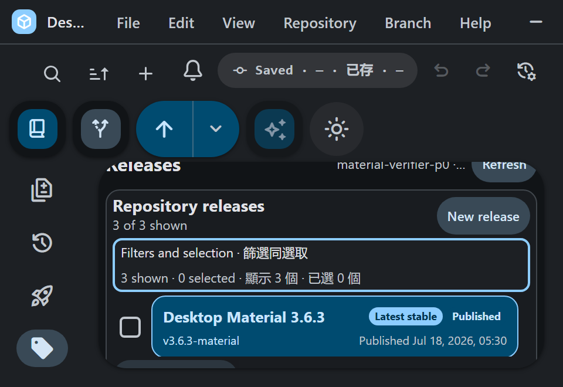

# Repository Releases dashboard

## Behavior and configuration

Open **Releases** from a GitHub repository rail to search and status-filter the
bounded loaded catalog, select a release, inspect metadata and assets, or enter
the existing reviewed create, edit, publish, delete, upload, and download
flows. The desktop catalog reserves 420–560 px for readable names, tags,
statuses, dates, selection controls, and bulk actions. It stacks below the
details pane at 900 px and remains scrollable on narrow or zoomed layouts.
Short or high-zoom panes compact the filter controls, selection summary, bulk
actions, status metrics, and rows so the release list keeps a usable minimum
height instead of disappearing below stacked controls. Metrics reflow within
the pane rather than creating a horizontal strip. The 800×560 combined short/
narrow gate covers the 768×528 CSS viewport produced by 125% zoom in a 960×660
physical window. It keeps page and panel headings at 16/14 px, interactive
labels at 11 px, metadata at 9–10 px, controls at 30–34 px, the tools panel at
176 px, and release rows at 52 px. Its native disclosure wraps instead of
shrinking English/Cantonese bilingual text, and the five metrics use three
columns with the latest value spanning two.

The surface uses the selected repository's provider account and supports fuzzy,
substring, and regular-expression matching plus published, prerelease, and
draft status filters. **Load more releases** requests the next bounded provider
page before filtering it locally.

Release dates include a locale-aware 24-hour `HH:mm` time. After an asset has
downloaded and passed its existing size/digest checks, the result offers both
**Show in folder** and **Open file**. Open-file completion and failure callbacks
are generation-fenced, so a late Windows response cannot update a disposed or
newly selected release. Clearing a filtered selection moves keyboard focus to
an enabled Select all or search fallback even when the filter has zero results.

## Failure modes

Initial loading, asset loading, empty repository, empty filter result, invalid
regular expression, and provider failure remain distinct states. A retry keeps
already loaded data and repeats only the failed scope. Destructive or
publishing controls stay disabled until their exact reviewed selection is
valid.

## Security considerations

Repository, account, and provider host remain bound through every request.
Remote URLs are validated before opening, response and pagination sizes stay
bounded, and asset transfers retain their existing path, size, digest, and
overwrite checks. This feature adds no application HTTP endpoint, so a new
Postman artifact is not applicable.

## Verification

`github-releases-style-test.ts` covers the catalog, compact control and metric
reflow, explicit readable size floors, bilingual wrapping, low-height list
space, Material tokens, containment, focus, and narrow fallback. Provider
behavior, localized compact controls, 24-hour timestamps, guarded Open file
lifecycle, and zero-result focus recovery remain in the GitHub Releases unit
suites. The corrected production bundle completed in 390 seconds wall (Yarn
387.64 seconds). Its 1,179,200-byte `out/renderer.css` has SHA-256
`6fba1434112ea5c02256a12e6ce8af42f5c870f0db5835155acb8075708d9d28`.
Off-screen Win32 acceptance kept one 960×660 physical viewport while probing
100%, 125%, 150%, and 200%. Every scale retained a complete release row with
zero document/body/root/panel horizontal overflow. Compact scales proved the
176 px panel, 52 px row, 30 px target, 9 px text, three-column/latest-span-two,
24-hour timestamp, and disclosure keyboard contracts. The promoted 89,856-byte
PNG has SHA-256
`8e29ac666a0832d353126d8dd759200ba7e853016a940501e5c7cbdbb1cf992a`.
This is the accepted isolated correction receipt; remote publication remains a
separate gate.
