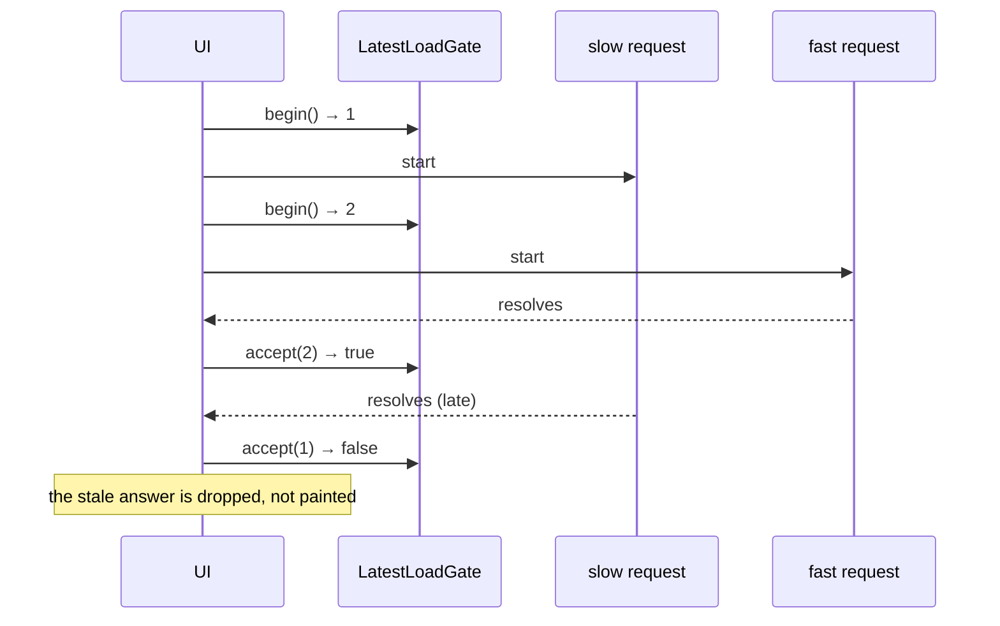

# Progressive asynchronous lazy loading

Desktop Material renders its shell and safe cached state as soon as it can, and
finishes the expensive work behind that first paint. Surfaces that a session may
never open are not evaluated until they are opened, and every one of them owns
its own progress and failure state instead of borrowing the whole window.

Tracked by [issue #82](https://github.com/Ding-Ding-Projects/desktop-material/issues/82).

## Why

`App.render()` returns `null` until `AppStore.loadInitialState()` resolves, so
anything that method awaits is a blank window. Two of the things it awaited were
genuinely slow and genuinely optional:

- **Enumerating installed external editors.** `getAvailableEditors()` walks the
  filesystem and, on Windows, the registry, purely to confirm that the editor the
  user already chose is still installed.
- **Recovering an interrupted clone queue.** Reading and finalizing the batch
  clone journal is disk work whose result nothing on the first screen depends on.

Separately, `repository.tsx` statically imported seven substantial section
modules — Actions, Releases, Cheap LFS, Issues, the GitHub API explorer, provider
triage and repository tools — so all seven were evaluated at launch even in a
session that only ever looked at Changes.

## Behavior

### Startup

`loadInitialState()` now resolves once the shell has everything it needs:
accounts, repositories, persisted preferences, and the applied theme. It then
calls `loadDeferredInitialState()` **without awaiting it**.

The deferred phase runs each step through `runDeferredStartupStep()`, which
isolates failures so one broken step cannot cancel another, and which logs and
reports every rejection through `sendNonFatalException('deferredStartup', …)`.
There are no timers anywhere in that path: nothing is delayed to look
progressive, it merely stops blocking the first paint.

The selected external editor is adopted straight from `localStorage` so the
shell can paint with the user's real choice. See
[Cached data while refreshing](#cached-data-while-refreshing) for why that read
is safe.

### Deferred repository sections

`app/src/ui/lib/lazy-view.tsx` provides two pieces:

- `lazyViewModule(id, loader)` — a module handle that evaluates once, caches the
  result, and **drops a failed load's promise** so a retry genuinely retries
  instead of replaying a cached rejection forever.
- `<LazyView>` — renders the module, or a local progress state, or a local
  failure state.

`repository.tsx` imports the seven heavy sections with `import type` (erased at
compile time) and evaluates them through
`import(/* webpackMode: "eager" */ './…')`.

> `webpackMode: "eager"` is deliberate. The app ships as one bundle, so there is
> no download to defer; what is deferred is each module's **top-level
> evaluation**. Eager mode keeps every module inside the existing bundle — no new
> chunk files, no `publicPath` change, no packaging change — while still holding
> back its execution until the section is opened. Changes and History stay
> statically imported, because deferring what the app opens on would just trade
> one blocking screen for another.

### Loading and failure states

| State | Markup | Behavior |
| --- | --- | --- |
| Loading | `role="status"`, `aria-live="polite"`, `aria-busy="true"` | Announced politely, never moves focus. Spinner honours `prefers-reduced-motion` and `body[data-dm-motion='reduced']`. |
| Failed | `role="alert"` | Names the surface, shows the underlying error verbatim, and offers **Try again**. Focus is not moved. |

A failure also raises a corner notification (`kind: 'app-error'`, so it persists
until dismissed) through `Dispatcher.postNotification`. It is never escalated to
a modal: nothing about it requires a decision before the user can continue, and
every other part of the window stays usable.

## Race safety

`app/src/lib/progressive-load.ts` holds the ordering rules once instead of
re-deriving them per call site.

- `LatestLoadGate.accept(token)` succeeds only for a token strictly newer than
  the last accepted one and not cancelled, so a slow first response cannot
  overwrite a fast second one.
- `ProgressiveLoad.run()` **never rejects**; a rejection becomes a `failed`
  state carrying the real `Error`. `void load.run(…)` therefore cannot produce
  an unhandled rejection and cannot hide a failure either.
- `reset()` cancels every in-flight load, so a response for a previous subject
  (a different repository, a different module) can never be painted as the new
  one's.

Applied at three call sites:

| Call site | Race prevented |
| --- | --- |
| `LazyView` | Swapping a surface mid-load must not paint the previous module with the new surface's props. |
| `RepositoryView.loadSubmoduleCount` / `loadSubtreeCount` | Selecting repository A → B → A starts three loads whose repository hashes all pass an equality check; only the newest may write. These also now log why a count is unknown instead of discarding the reason in a bare `catch {}`. |
| `AppStore.confirmSelectedExternalEditorIsInstalled` | A choice the user makes in Preferences while the availability scan is still running is newer than anything that scan learned, so the scan's answer is discarded when `externalEditorSelectionGeneration` has moved. |

## Cached data while refreshing

Showing stale data while a refresh continues is only correct where a stale read
cannot change what an action does. It is applied in exactly two places:

1. **The selected external editor at startup.** The value is read from
   `localStorage` and shown immediately while the availability scan runs.
   Every launch path (`_openInExternalEditor`) calls `findEditorOrDefault()`
   again before doing anything, and reports a clear `ExternalEditorError` when
   nothing suitable is installed. The stale value can only ever mislabel a
   button, never make it do something different, and nothing is written, moved
   or deleted on its strength.
2. **An already-evaluated view module.** A section opened earlier in the session
   renders synchronously with no progress state. A module's evaluation is
   immutable for the lifetime of the process, so it cannot go stale.

It is deliberately **not** applied to commit or push state, conflict state, or
credentials, where a stale read changes what a button does.

## Configuration

None. There is no setting, no threshold and no delay to tune.

## Failure modes

| Failure | Result |
| --- | --- |
| A deferred startup step rejects | Logged, reported as a `deferredStartup` non-fatal exception, other steps continue. The shell is already usable. |
| A section module fails to evaluate | Local `role="alert"` surface naming the section and the real error, a working **Try again** button, and a persistent corner notification. Every other surface keeps working. |
| A submodule/subtree count fails | The badge falls back to unknown and the reason is written to the log. |
| An out-of-order response arrives | Dropped by `LatestLoadGate`; the newer state stays. |

## Language modes and funny levels

`lazyView.loading` and `lazyView.failedBody` are three-band key families, so the
per-language funny-level slider styles the voice in English and Cantonese
independently. Every band of every language names the surface being loaded.

What failed (`lazyView.failedTitle`), what went wrong
(`lazyView.failedDetail`) and what to press (`lazyView.retry`) carry **no
bands** — they are facts the user acts on, so they read identically at every
funny level.

## Accessibility

- Progress uses `role="status"` + `aria-live="polite"` + `aria-busy`, so it is
  announced without interrupting and without moving focus.
- Failure uses `role="alert"`, which announces assertively and still does not
  move focus.
- The spinner animation is neutralized under `prefers-reduced-motion: reduce`
  and under the app's own `body[data-dm-motion='reduced']` setting.
- The retry control is a standard Material button with the app's normal focus
  ring and hit target.

## Verification

| Suite | Covers |
| --- | --- |
| `app/test/unit/progressive-load-test.ts` | Gate ordering, out-of-order drops, cancel/dispose, cached-while-refreshing, rejection surfacing, and a guard against a timer ever appearing in the module. |
| `app/test/unit/ui/lazy-view-test.tsx` | Polite announcement, focus never moved, direct render with no wrapper element, real error text, retry, cached second mount, module-swap safety, no report after unmount, and both languages' band copy. |
| `app/test/unit/progressive-startup-test.ts` | The startup contract in `app-store.ts` and the deferred-section wiring in `repository.tsx`. |
