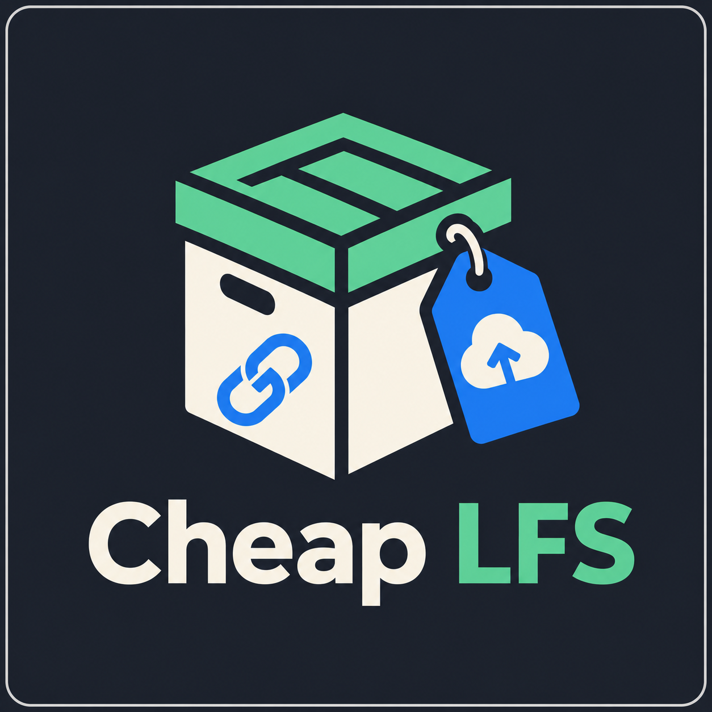
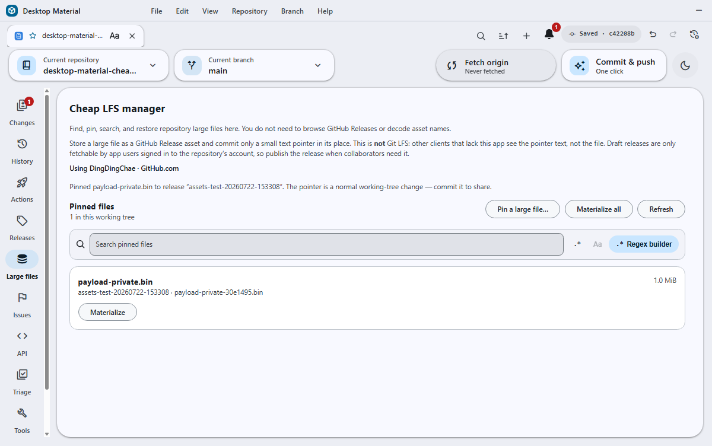
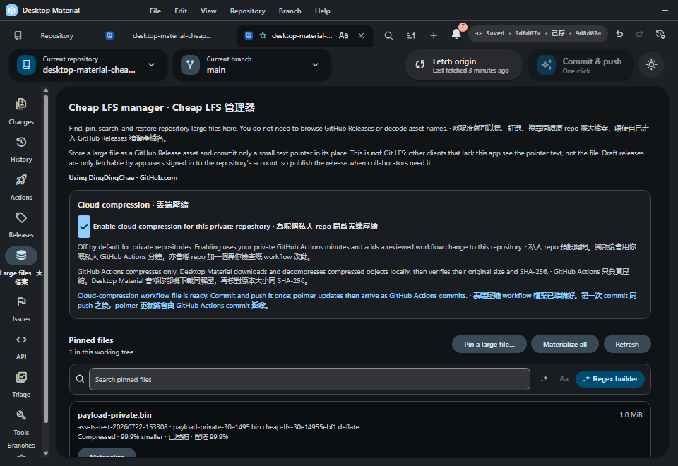
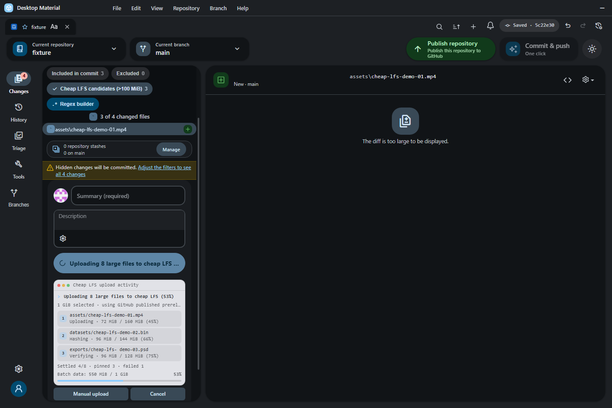

# Release-backed large-file storage

The generated mark above is documentation artwork. It is not embedded in the
pointer format and is not required by the transfer protocol.

The inspected acceptance frame above comes from the production bundle running
on an off-screen Win32 desktop. The same dated exercise materialized and
re-pinned deterministic 1 MiB payloads through the Large files UI in retained
public and private GitHub repositories; see the
[public/private UI receipt](../../verification/cheap-lfs-github-public-private-2026-07-22.md).

The repository rail's **Large files** manager can pin a working-tree file to
one or more GitHub Release assets and leave a small, human-readable pointer at
its tracked path. It is intentionally not Git LFS: a client without Desktop
Material sees the pointer text, and collaborators need access to the referenced
release to materialize the original bytes. The manager lists and searches
committed pointers, restores one or all files, and removes the need to browse or
decode the backing Release asset names. The same panel remains available from
Repository Tools for users who enter through the tools hub. The repository-rail
page owns its vertical scroll, keeping every row reachable in a long inventory.
Choose **Open Cheap LFS settings** in that page to open **Repository settings →
Cheap LFS** directly.

The original bytes are in the named GitHub Release asset or ordered assets, not
inside the Git commit. A fresh clone therefore receives the pointer first.
Desktop Material's default-on clone/open detector then downloads, verifies, and
atomically restores the working-tree file. An older pointer-only clone can be
refreshed by reopening it in the updated app or choosing **Materialize all** in
**Large files**. The committed Git blob remains the pointer so another clone can
repeat the same verified restore. Explicitly public GitHub.com Release pointers
can take this path while signed out; private and unknown repositories remain
account-gated.

## Behavior and configuration

**Repository settings → Cheap LFS → Large-file storage** selects a
published GitHub prerelease, one GHCR OCI image, or one Docker Hub OCI image.
The Cheap LFS preferences live on their own tab in the Repository Settings
dialog, immediately after **Build & run**, and the Large files page's direct
settings action opens that tab; users do not need to leave the repository and
hunt through global preferences.
In the repository **Releases** catalog, Desktop Material hides recognized Cheap
LFS storage-bucket prereleases by default so app-managed object storage does not
crowd ordinary product releases. Choose **Show Cheap LFS storage releases** to
reveal them in the same loaded catalog; turning the option off hides them again
without deleting, publishing, or otherwise changing any release or asset.
The commit panel recommends ordinary Git, Releases, GHCR, or Docker Hub from the
selected byte total and detected local provider setup, but does not silently
change the saved choice. A configured account or credential does not prove live
quota, billing, organization policy, or service health. This page describes
Release storage; see the
[Cheap LFS OCI registry backend](cheap-lfs-oci-registry-backend.md) for image
snapshots, add/remove behavior, timeout splitting, and private encryption.

A manual pin reviews the source file, repository-relative pointer path,
release tag, optional release name, and byte size. The default tag is `assets`;
if it has no release, the app creates a published prerelease so collaborators
can fetch its assets while the bucket remains outside the installer's stable
`/releases/latest` update feed. A draft created by an older Desktop Material is
published in place only after its exact reviewed identity is revalidated.
A file at or below the per-asset cap initially uploads as one raw asset. A
larger file is split into ordered raw parts of at most 1.5 GiB — GitHub allows
release assets up to 2 GiB, but uploads near that ceiling proved unreliable,
so new parts stay well below it — and the pointer records every part's name,
size, and SHA-256 as well as the whole-file size and digest. The raw upload is
immediately cloneable and remains the safe fallback while optional cloud
compression runs.

### Cloud compression

Cloud compression is automatic for a repository whose GitHub visibility is
confirmed public. It is off by default for private repositories and runs there
only after the user explicitly enables the persisted **Cloud compression**
setting; unknown visibility fails closed. Opening the Large files manager, or
saving the private opt-in in Repository Settings, writes one owned caller at
`.github/workflows/cheap-lfs-cloud-compression.yml`. When the repository does
not already carry that caller in its committed history, the app then commits and
pushes it in the background — see
[Background workflow install](#background-workflow-install). The caller also
checks live event visibility, so a formerly public repository stops if it
becomes private unless private consent was explicitly recorded.

#### Background workflow install

GitHub Actions only sees committed files, so a checkout holding the caller as an
uncommitted change is still a checkout where nothing compresses. Leaving that
last step to the user is the step that silently never happened. Enabling cloud
compression, opening the Large files manager, and the automatic materialize pass
therefore each ask the background installer to close the gap.

Detection reads the committed blob at the exact path
`.github/workflows/cheap-lfs-cloud-compression.yml`, never the working tree
alone, and produces one decision:

| Observation | Decision | What happens |
| --- | --- | --- |
| Compression off, or a non-Release storage provider | `disabled` | Nothing. |
| No committed caller, working tree empty or already canonical | `install` | Write the canonical caller, commit it, push it. |
| Committed caller is byte-identical to canonical | `installed` | Nothing, including when the user has edited their working copy. |
| A caller exists but differs from canonical | `offer-update` | A non-blocking notice offers a confirm-class one-click update. Never replaced silently. |
| Anything without the managed marker occupies the path | `blocked-unowned` | Left completely untouched; reported once. |

The install itself never blocks the caller. It claims the repository through the
Cheap LFS in-flight guard so a settings toggle, a panel sync, and a materialize
pass cannot race to create the same commit, then runs detached and reports
through the notification centre and the non-blocking notice stack.

Only the workflow path is committed. The file is staged by name and committed
with `git commit -- <path>`, so whatever the user had staged stays staged and
uncommitted. The commit message is bilingual:
`Add Cheap LFS cloud compression workflow / 加入雲端壓縮工作流`.

Publication reuses the existing batching push machinery and its proofs:

- **Branch already published, remote tip equals the commit's parent** — the push
  goes through `ILocalCommitBatchingOperations.push` with
  `expectedRemoteSha` set to that tip, so it can only ever add this one commit,
  and the new tip is re-read from the remote with `readRemoteTip` rather than
  inferred from a successful `git push`.
- **Branch never published** — the Cheap LFS first-publish anchor is reused
  unchanged, because it is already the reviewed route that creates the branch
  and proves it landed.
- **Branch diverged from its remote** — the caller is committed locally and
  *not* pushed. A background push there would publish local commits the user
  never reviewed, so the workflow rides out with their own next push and the
  notice says so.

Both the commit and the push skip hooks. This commit is app-generated,
single-file, and unattended; a `pre-commit` or `pre-push` hook waiting on a
prompt nobody is watching would hang the background task forever. The user's own
reviewed commit and push still run every hook.

Failures are reported, never retried silently, and every relayed Git string is
sanitized first. The one failure this feature provokes that nothing else does is
called out by name: GitHub refuses any push touching `.github/workflows` when
the credential lacks the `workflow` scope (or, for a GitHub App, the `workflows`
permission), and the notice says exactly that plus the fix — sign out and back
in to grant it, or push the file yourself. A moved remote branch, a missing
remote, a detached HEAD, and an unassociated checkout each get their own plain
reason.

The workflow writer canonicalizes each repository directory component, refuses
redirected parents plus symlink, junction, hardlink, oversized, and unowned
workflow entries, and writes a unique fsynced sibling before publication. New
files use exclusive publication; updates use one same-directory atomic rename
after an immediate identity/content recheck. A concurrent edit or failed rename
leaves the reviewed original intact. UI persistence and workflow setup are also
bound to the originating repository so switching repositories during a private
opt-in cannot apply that consent elsewhere.

The caller pins both `actions/checkout` and Desktop Material's reviewed
composite compressor to immutable commit SHAs. Checkout materializes only
`.github`; the worker then refetches the exact event commit with an exclusive
512 KiB blob limit, inventories regular tree entries without lazy fetching, and
reads only locally present pointer-sized blobs. Ordinary build blobs therefore
remain promised and absent even in a multi-gigabyte repository. One
GitHub-hosted job downloads release objects directly, compresses them
sequentially with raw DEFLATE level 9, and uploads verified side assets directly
back to the Release. It does not use Actions artifacts or caches, and it removes
its temporary raw and compressed files before moving to the next object. This
one-object-at-a-time working set avoids combining multi-gigabyte parts under the
smaller Actions artifact/storage limits.

Compression is adopted only when the stored result is strictly smaller. After
the side asset's size and SHA-256 are verified, the job changes exactly one
pointer object to the existing v1
`part-deflate <original-sha256> <original-size> <stored-size> <asset-name>`
record, commits that pointer alone, and pushes it with `[skip ci]`. A multipart
pointer can therefore be mixed: successful parts become `part-deflate`, while
failed or non-beneficial parts remain ordinary `part` records. The original raw
assets are never deleted because older commits can still reference them. Pointer
adoption uses a temporary full-tree index, proves exactly one path changed,
rechecks the current remote parent, and performs an ordinary fast-forward push.
After each successful pointer commit, every queued pointer is re-proved at the
new tree before the next object begins. A verified compressed side asset is
also retained if a later compare-and-swap check loses a race; another run can
reuse it safely, while the unchanged raw pointer remains cloneable.

GitHub Actions only compresses. It never decompresses or decides that expanded
bytes are valid. Desktop Material downloads a compressed object to an owned
temporary file on the local PC, expands it with a strict output cap equal to
the recorded original size, verifies the original part SHA-256 and size, then
verifies the assembled whole-file SHA-256 and size before atomically replacing
the pointer.

GitHub permits 1,000 assets per Release. Cheap LFS inventories all ten bounded
100-item pages and keeps at most 1,000 assets in each repository Release
bucket. The configured tag names the first bucket (normally `assets`), followed
by `assets-2`, `assets-3`, and so on. A single multipart file or one complete
manual batch is allocated atomically: when it would cross the remaining slots,
the entire group moves to the next bucket and every generated pointer records
that exact derived tag.

Current buckets are published prereleases and resolve through GitHub's direct
release-by-tag endpoint. For compatibility, the cloud Action can still locate
an older draft through a bounded inventory of at most 100 pages of 100 releases;
Desktop Material publishes that exact legacy bucket in place before new pins or
materialization. A draft outside those **10,000 releases** fails safely without
changing the pointer or raw asset. Compression also needs one free asset slot
for its verified side object. If the selected Release has already reached its
**1,000-asset** capacity, the upload cannot be adopted and the raw pointer
remains cloneable and locally materializable. Cheap LFS never deletes the
historical raw asset merely to make room.

The repository's **Cheap LFS** settings tab provides three preferences, all
enabled by default for compatibility:

- **Pin large files before committing** replaces selected files strictly over
  100 MiB before every routed commit entry point when the source repository's
  identity/visibility and the chosen backend credentials are available. The
  selector first stats every reviewed path, skips ordinary and exact-threshold
  files without hashing or tracked-content proof, then requires the same exact
  repository/path-bound destination proof for every oversized candidate. This
  keeps very large selections responsive without weakening large-file source
  validation.
- **Upload up to three large files at once** assigns automatic pins to three
  deterministic Release lanes. Turning it off restores one-at-a-time uploads.
- **Download large files after cloning** materializes detected pointers after
  clone, pull, user fetch, or open under one cancelable per-repository batch.
  The panel also offers explicit per-file and Materialize all actions.
  Canceling Materialize all cancels repository-wide: every batch still queued
  behind the active one (including automatic restores enqueued by a concurrent
  fetch or pull) aborts too, so a canceled download cannot restart when the
  next batch takes over the queue slot. A single-file cancel stays scoped to
  its own request. The batch resolves with a summary, and the panel reports
  partial failure ("Materialized N files; M files failed and were left as
  pointers.") instead of claiming unconditional success, then reloads the
  pinned-file list after completion **and** after a cancel so completed files
  never keep a stale pointer state (which previously also suppressed the
  local-deletion warning on Remove).

The Changes filter includes a **Large files** chip that matches working-tree
files strictly over the same 100 MiB Cheap LFS threshold. Its bounded,
generation-fenced size scan combines with text, regex, included/excluded, and
status filters instead of replacing them. Deleted or missing paths do not
match, and an unreadable or unknown size fails closed rather than being shown
as a safely classified large-file candidate.

The same settings surface shows public cloud compression as automatic and
read-only. A private repository receives a separate off-by-default checkbox
that explains private Actions usage before recording consent. English,
playful Hong Kong-style Cantonese, and bilingual modes cover the setting,
manager status, local-only decompression notice, raw/compressed/mixed
pointer badges, and every background workflow-install notice.

### Post-commit payload restore

A pin uploads from a private copy in the OS temp directory, replaces the
working-tree original with pointer text, and deletes both. Before this contract
existed, a repository that had just committed large files therefore held no
copy of them at all: the post-commit inventory classified every freshly pinned
path as `pointer`, and the very next auto-materialize detect point — a
user-initiated fetch, any pull (including the pull that "Commit & push all"
performs first), reopening or re-selecting the repository, or re-registering it
— downloaded bytes that had been on the machine seconds earlier. Which detect
point fired first is why the same commit sometimes re-downloaded everything and
sometimes did not (#55).

The commit flow now keeps the verified copy alive across the commit and puts it
back:

- `pinFileToRelease` accepts `retainSourceForRestore`. With it set, the private
  upload copy is **not** deleted on the success path, and the pin result carries
  the owned handle plus the payload's proven size and SHA-256. Every failure,
  abort, and early throw still deletes it exactly as before.
- The retained handles travel with the automatic-pin outcome. Whatever is not
  handed back to the commit — an aborted lane, a failed batch, an automatic
  batch superseded by the manual browser handoff — is discarded in the pin
  run's own `finally`, and the commit discards what it received in a `finally`
  of its own. No exit path leaks a temp payload.
- After every commit batch succeeds, and before the Changes refresh, each
  retained payload is reinstalled over the pointer that commit just recorded.
- Restoring turns the entry from `pointer` into `materialized`, and
  `materialized` is excluded from the set the auto-materialize detectors select.
  The result is zero downloads for a file this machine just uploaded.

Verification is not weakened anywhere. A path is touched only when the bytes
currently on disk are byte-for-byte the pointer text that pin published — a
concurrent edit, a checkout, or a failed commit leaves the path strictly alone.
The reinstall goes through the same `replaceFromPath` the download path uses, so
the retained copy is re-hashed and rejected on any size or SHA-256 drift exactly
as a corrupted download is. Nothing here throws: on any failure the committed
pointer is left intact and that file simply materializes later, which is the
behavior that existed before this contract. `cleanupOwned` remains
identity-checked, so a temp replaced by something else is preserved and logged
rather than deleted.

### Never re-pinning an unchanged payload

A selected file whose working-tree bytes are *proven* identical to the pointer
`HEAD` already holds is neither re-uploaded nor committed. Re-pinning it would
spend the user's bandwidth on a byte-identical asset, and committing it would
stage raw bytes into a commit that already contains that exact pointer.

The proof required is deliberately strict, because the consequence is leaving a
path out of the user's commit. All of the following must hold: the inventory
scan recorded an explicit working-tree content hash, that hash equals the
pointer's own digest, the sizes match exactly, and the entry classified as
`materialized` — which is what proves the index pointer is the committed one
rather than a staged rewrite. The classification alone is never sufficient:
identity-only scans legitimately leave the working-tree hash undefined, and a
size-mismatched `modified` entry has no hash at all. Anything the scan cannot
prove is pinned and committed exactly as before, so a genuinely edited large
file is never silently dropped from a commit.

Files left out this way are reported in a notification naming them and stating
that nothing was uploaded because the commit already holds their pointers, in
English, playful Hong Kong-style Cantonese, and bilingual modes.

### Private pointer commit-key guard

A private OCI pointer binds its exact shared registry key to the commit. The
commit preflight therefore keeps unsafe selected paths fail-closed and never
treats an unreadable path as proof of a key. There is one narrow compatibility
exception for deleting a legacy path that Windows cannot safely address: the
app must freshly read repository-bound Git status and prove that the exact
normalized selected path is currently deleted. Because no working-tree content
is being admitted, that status-proven deletion can proceed without reopening
the hostile name.

The exception does not apply to an added, modified, renamed, untracked, missing,
or otherwise nondeleted unsafe path, nor when live status is absent or disagrees
with the selection. A safely readable control-plane path that contains a real
OCI pointer also remains rejected. Ordinary manifests and workflows in such a
control-plane directory may commit, but they cannot be used to smuggle a private
pointer around its exact key proof.

Automatic pinning reports separate hashing, release preparation, upload, and
verification phases. With parallel upload enabled it runs at most three stable
lanes (`assets`, `assets-parallel-2`, and `assets-parallel-3`), while each lane
still mutates its reviewed Release sequentially. The commit composer keeps a
compact terminal-style panel directly below Commit with up to three sanitized
active-file rows, per-file phase and bytes, worker/queue/provider context,
elapsed time, renderer-observed throughput and ETA, aggregate transferred
bytes, and success/failure counts. Long storage recommendations use a native,
keyboard-focusable disclosure. It never renders raw provider or process output.

The historical initial-`c3db37ea55` UI gate rebuilt the production bundle in
400.46 seconds and exercised this Cheap LFS surface on an isolated off-screen
Win32 desktop without diagnostic style injection. The promoted 1,440 x 960 wide
capture has SHA-256
`3d6358567126e3ce0504b04c4489abbfd473b77546bd82dac834553d50fe9333`.
A separate 640 x 960 bilingual narrow capture kept all three worker rows and
both actions contained; its SHA-256 is
`1b99c827d1b5b2cf05298fb1255873acdf0502f72a40437c378c0be7bb989e50`.

After the workers settle, Desktop Material reloads status and stages successful
pointers rather than original binaries. A failed raw file is excluded from the
current commit and remains in Changes for retry; unrelated selected changes and
successful pointers can commit. If nothing safe remains, no empty commit is
created. A partially selected oversized file fails closed before upload because
replacing it with a pointer would necessarily replace the whole file.
Production first uses the trusted GitHub CLI exact-length transport.
This avoids opening Electron's native upload data pipe, which can terminate the
app with a Mojo failed-precondition when the remote consumer closes during a
write. Exact source-range checks still reject files that grow or shrink after
validation, and 100% remains reserved until a valid provider response or a
reconciled asset proves acceptance.

Before a CLI upload, Desktop Material scans the selected Release's complete bounded
inventory once—up to ten 100-asset pages. If it finds one exact-name asset,
it polls only that immutable asset ID. An already completed exact-size,
exact-label, exact-digest object is reused; a persistent `starter` or other
incomplete asset remains visible as **Processing**, still consumes one of the
1,000 slots, and fails closed. The user can delete that exact incomplete asset
from Releases before retrying; it is never downloaded or treated as completed
Cheap LFS data.

When no prior object exists, Desktop Material launches only the real-path
`GitHub CLI\gh.exe` below a validated `Program Files` root and invokes a fixed
`gh api` upload. The exact validated file range is streamed to standard input,
hashed locally, and reported through bounded progress. Hashing and upload use
bounded 1 MiB disk chunks, cutting the per-part callback/write count by
roughly sixteen times versus default 64-KiB chunks without buffering the file.
The selected host and
upload URL, `GH_HOST`, and `GH_REPO` context are fixed by the account-bound
request. The token is supplied only through an isolated child environment,
never an argument; inherited GitHub CLI credentials and debug settings are
removed, an empty temporary CLI config is used, and the directory is deleted
afterward. The process has bounded output, runs without a shell, and is
terminated and awaited on cancel. Uploads run with no inactivity or
total-runtime timeout:
a slow connection can take as long as it needs, and a transfer ends only on
completion, a transport failure, or explicit user cancellation. A failed CLI
request polls briefly for a delayed completed asset. If and only if no
same-name object exists, the app performs one clean byte-zero restart; the
GitHub upload API has no resume primitive. A `starter` is never guessed to be
owned or deleted automatically. Bounded, credential-redacted CLI diagnostics
go to Log History while the visible error retains the actionable failure
reason.

GitHub may spell an absent Release-asset label as either `null` or an empty
string across upload and inventory responses. The bounded provider parser
normalizes both to one unlabeled value before exact response verification, so a
correctly uploaded, digest-matched Cheap LFS asset is not rejected solely for
that representational difference.

Cheap LFS passes the part digest from its required pointer-preparation hash to
the main process. The preferred CLI path then hashes the bytes it actually
consumes and must match that prepared digest, avoiding a redundant full-range
read before upload without trusting renderer data. Generic Release uploads and
the native compatibility path retain their independent pre-upload hash. A
prepared Cheap LFS digest is never sent through the native path because that
transport cannot prove a digest over the chunks it consumed; when the trusted
CLI is unavailable, the app directs the user to install it or use Manual
upload. Cheap LFS also retains its final whole-source verification before
replacing user bytes with a pointer, so a modification during or after transfer
cannot be silently lost.

For Release uploads that do not carry a prepared Cheap LFS digest, if that
trusted CLI cannot be resolved, the app retains a compatibility Electron
transport. It removes the fixed-length header at the final request
boundary and enables chunked encoding before writing, so it does not retain an
entire multi-gigabyte asset in process memory. Like the CLI path, it applies
no stall or runtime timeout by default; only user cancellation or a transport
failure ends the request. The manual browser handoff below is the
recommended recovery if this compatibility path cannot complete safely.

While an automatic upload is active, **Manual upload** switches the same commit
operation to a browser-assisted handoff. Desktop Material stops the current
automatic attempt, plans every remaining file, splits sources above the Release
limit into ordered `.partNNN` assets, and creates one random temporary folder
containing the exact missing asset names. A retry keeps an exact-name,
exact-size prior upload when its provider digest matches; providers without a
digest receive one bounded download-and-hash check before that asset is omitted
from staging. The app opens
the exact validated release editor and then that folder in front for drag and
drop, and waits for the user to upload and save all files to the selected
`assets` bucket. Older GitHub Enterprise responses without a usable release web URL
fall back to the validated repository Releases listing. Whole-file assets use
verified same-volume hardlinks, then bounded streamed copies if a hardlink is
unavailable. The browser folder never contains symlinks: every staged path is
re-read with `lstat`, `stat`, and its expected nonzero size before Explorer can
open it. Multipart ranges are real files copied with one bounded 1 MiB buffer
per active range. **Cancel** stops
either phase until the verified pointer commit begins and removes only the
operation-owned handoff entries. The browser rendezvous backs polling off to a
30-second interval and remains cancelable for roughly six hours, so a slow
multi-gigabyte upload does not expire after ten minutes.

Hashing and handoff staging report byte progress across both passes, so a
multi-gigabyte source advances visibly instead of remaining at 0%. Resumed
assets begin the staging pass as completed bytes. Before any handoff starts,
the app requires enough free temporary-disk space for the worst-case copy
fallback of every missing asset, the largest still-required verification
download, and a safety reserve.
An insufficient volume fails clearly instead of filling the disk mid-copy.

GitHub Release assets have no folder hierarchy, so the handoff directory is
flat even when selected files live in nested repository folders. The manifest
maps every prepared asset back to its original repository-relative path, and
same-named files from different folders receive collision-safe hash suffixes.
Reservation uses Windows' case-insensitive comparison, so `Foo.bin` and
`foo.bin` cannot collide in the flat folder.
The app waits for every new or safely reused part, verifies each required
download and then the whole source, and writes each pointer at its exact
original path. A timeout or cancellation leaves a valid uploaded subset on the
Release so the next manual attempt can stage only the missing names.

## Persistence

The committed pointer contains a format version, release tag, base asset name,
whole-file byte size and SHA-256, plus ordered raw or `part-deflate` records when
required. The binary bytes remain in published GitHub prerelease assets so a
fresh public clone can restore them while signed out, and a private clone can
restore them with its selected authorized account, without an owner-only draft
step.
Per-repository auto-pin,
three-wide-versus-sequential upload mode, auto-materialize, and private
cloud-compression consent are stored in the repository's shared Build & Run
preference record and edited on the dedicated **Cheap LFS** settings tab.
Preferences written by an older app have no parallel-upload field
and resolve compatibly to the new default-on mode.

Materialization writes verified bytes into a private sibling recovery
directory. It revalidates the canonical repository root, every parent in the
tracked path, and the exact pointer identity and contents before quarantining
that pointer. The replacement is published with an exclusive hard link, so a
concurrently created destination is never overwritten. Original and staged
names are removed only after the published identity, size, and digest are
proved; an uncertain race preserves the recovery directory and reports its
path. Multipart files still verify every part and calculate the whole digest
before this compare-and-exchange begins.
One Materialize-all run caches release metadata by tag. When the bounded
release preview does not already contain every required uploaded name, it also
caches one complete paginated asset inventory by release ID. Pointers in the
same `assets` bucket therefore do not issue thousands of duplicate inventory
requests.
Automatic clone/open materialization and explicit Materialize-all work share a
repository-scoped scheduler. This keeps two UI entry points from concurrently
publishing the same restored path through separate compare-and-swap recovery
flows.

## Private scratch and the owned-artifact rule

Cheap LFS writes files of its own while it works. **Cheap LFS's own artifacts
are never pin, upload, commit, or inventory candidates**, at any size. One
shared predicate in `app/src/lib/cheap-lfs/owned-artifacts.ts` recognises all
of them, and every scan consults that one predicate rather than repeating a
pattern:

| Artifact | Shape | Where it lives |
| --- | --- | --- |
| Payload staging temp (download, decompression, reassembly) | `.cheeplfs-<16 hex>.tmp` | `<git-dir>/desktop-material/cheap-lfs-scratch/session-<pid>-<hex>/` |
| Pointer-text staging temp | `.cheeplfs-<16 hex>.tmp` | beside the tracked file, in the working tree |
| Compare-and-exchange recovery directory | `.<name>.cheap-lfs-recovery-<pid>-<uuid>/` with `original` and `replacement` inside | beside the tracked file, in the working tree |
| Manual-upload verification download | `.verify-<16 hex>.tmp` | the OS temporary directory |

Payload temps are multi-gigabyte, so they are staged **outside the working
tree**, in a directory the app creates and owns outright under the repository's
git directory. The publishing `rename()` must stay atomic, so that private area
is used only after the app proves it shares a device with the repository root;
on a split device (a linked worktree whose git directory sits on another volume)
the temp stays an in-tree sibling and relies on the exclusions below instead.
The pointer temp and the recovery directory must be same-device siblings of the
file they replace — the recovery directory quarantines the user's original by
rename so a failed publish can roll it back — so those two stay in the working
tree by design.

The exclusions apply in `selectCheapLfsAutoPinTargets`, in both pointer scans
(the `git grep` inventory and the disk-walk fallback, which never descends into
a recovery directory), in `pinFileToRelease` and `planCheapLfsManualUpload` as
fail-closed backstops before any transfer, and in the working-directory status
projection so an artifact is never offered as a change to stage. Each repository
open, add, clone, or post-pull also refreshes a managed block in the
repository's private `.git/info/exclude`, so an artifact orphaned by a crash
cannot be picked up by `git add -A`, by the app's own staging, or by the user's
tooling. `info/exclude` is local-only and never committed.

**Which way this fails.** Recognition is shape-based and fail-closed *for
actions*: anything shaped like an artifact is never uploaded, pinned, or staged,
whether or not this run created it. Skipping a path is a no-op on the bytes,
while acting on one would publish private scratch to the user's release.
Deletion is the opposite — provenance-based: the crash sweep only clears session
directories inside the app-owned scratch tree, and in-tree temps are removed
only by the failure paths that created them. A user file that genuinely carries
one of these names is therefore never deleted; if it is tracked by Git it keeps
its full status, diff, and commit behaviour, because both the status filter and
`info/exclude` apply only to untracked paths, and `git add -f` still works.

Without this rule, a clone's automatic materialization and a concurrent
commit collided: the in-flight download appeared as a new multi-gigabyte
untracked file, automatic pinning selected it, and the app uploaded its own
scratch to the user's release — failing when materialize renamed the temp away
mid-upload (issue #65).

## Asset naming and the UTF-8 byte budget

Release asset names and labels are budgeted in **UTF-8 bytes**, not in
JavaScript string length. A JavaScript string counts UTF-16 code units, so a
200-character Chinese file name reads as "200" but encodes to 600 bytes, and an
emoji costs four bytes for its two code units. GitHub publishes the number 255
for asset names and labels without stating its unit, and this project has never
probed the live API to settle it, so the byte reading is adopted deliberately as
the fail-closed one: it is never looser than a character budget, so at worst it
shortens a non-ASCII name GitHub would have accepted, whereas a character budget
would offer GitHub a 765-byte name and be refused *after* the transfer had
begun — in a multi-part pin, partway through a batch, with assets already on the
release. Since this app is built for Cantonese-speaking users, CJK file names are
ordinary input rather than an edge case.

`truncateToUtf8ByteBudget` and `keepUtf8ByteTail` (`app/src/lib/utf8-budget.ts`)
do all the trimming and cut only on code-point boundaries, so a surrogate pair
is never halved and the result always re-encodes as well-formed UTF-8. The
contract every naming site holds to:

- **The suffix is never truncated.** `.partNNN`, `.deflate`, and any
  disambiguating content hash are what make a name resolvable and unique. Only
  the base is trimmed, and the multipart budget reserves the `.partNNN` tail up
  front so the whole family fits once each part name is formed.
- **The source base name is trimmed before it is validated,** not after, so a
  long CJK file name shortens instead of being refused outright. Nothing is lost:
  the asset name only records where the bytes are parked, and the committed
  pointer keeps the file's real path in full.
- **Truncation collisions are still separated by content.** Two different long
  names that trim to the same bytes are pulled apart by `dedupeAssetName` and
  `dedupeMultiPartBaseName`, which append a short SHA-256 prefix and then a
  numbered variant, re-trimming the base each time so the result stays in budget.
- **Labels follow the same rule.** A label ends with the tracked path, which is
  exactly where non-ASCII text lives, so its over-long path is elided by bytes
  behind the leading `...` marker, keeping the recognizable tail.
- **The pointer parser is deliberately still character-measured.** No string
  spends fewer bytes than it has code units, so 255 characters is the *wider*
  bound and accepts everything the byte-budgeted writer can now produce.
  Tightening it would orphan pointers written by earlier versions under the old
  character rule — a 247-character CJK base plus `.part001` is 749 bytes, and
  those files are already pinned and already committed. A parser may widen what
  it accepts; it must never narrow it.
- **The tracked-path segment check is also still character-measured,** because
  it describes the *local filesystem* rather than GitHub. NTFS and APFS both
  count 255 name units the way JavaScript does, so a 200-character Chinese file
  name is a real, creatable file on the platforms this app ships to;
  re-measuring in bytes would import ext4's 255-byte `NAME_MAX` and start
  refusing to track files the user can see in Explorer.

Manual release-asset uploads in the Releases view split the difference. The name
the picker suggests from the chosen file is trimmed to the byte budget, so a
long CJK file name still opens the upload panel with an editable name rather
than refusing the file outright. The name the user then confirms is validated,
not trimmed: for a published artifact the name is the user's own deliberate
choice, so an over-budget one is reported before the transfer starts rather than
silently renamed behind their back.

## First publish: anchoring the release before any upload

A GitHub Release tag can only be created against a commit GitHub already has.
`resolveReleaseTargetCommitish` returns the *local* branch name, so on a
repository whose branch has never been pushed `POST /repos/{owner}/{repo}/
releases` answers `422 Validation Failed` for every selected file — the release
route needs a published commit, and publishing needs the pinned commit.

**Design chosen: publish the branch tip before uploading, then prove it.**
`ensureCheapLfsReleaseAnchor` runs once per commit, before any hashing or
upload, and consults the pure decision in
`app/src/lib/cheap-lfs/first-publish.ts`:

| Decision | Meaning | Action |
| --- | --- | --- |
| `ready` | `ls-remote` proved the branch exists remotely | upload |
| `publish-branch` | GitHub repository, remote, branch, and tip all exist locally, but the branch is unpublished | push the tip with `expectedRemoteSha: null`, re-read the remote ref, then upload |
| `bootstrap-commit` | repository, remote, and branch exist but the branch is unborn | create one empty bootstrap commit, then publish it as above |
| `blocked-no-github-repository` | no GitHub repository backs the checkout | refuse, per-file reason |
| `blocked-no-remote` | no push remote configured | refuse, per-file reason |
| `blocked-detached-head` | no branch to publish | refuse, per-file reason |
| `blocked-unborn-branch` | the bootstrap commit itself was refused | refuse, per-file reason |

The bootstrap push reuses the existing batching session primitive
(`operations.push` with `expectedRemoteSha: null`, which asserts the branch does
not exist yet), so it can only ever *create* the branch and can never overwrite
someone else's work. Success is never inferred from the push exit status:
`isCheapLfsFirstPublishProven` re-reads the remote ref and requires it to equal
the exact tip that was pushed. This matches the existing "each batch pushed and
proven" contract already used by automatic commit-push batching.

The alternative — deferring asset upload to the push phase and committing
pointers marked pending-upload — was rejected. It would commit pointers whose
bytes exist nowhere remote, so any clone taken between that commit and the later
push would resolve to a dangling pointer. There is no silent fallback to another
storage provider: a blocking decision refuses, names the reason on every
affected file row and in the notification, and leaves the raw files selected in
Changes for a retry.

### A completely empty repository is bootstrapped, not refused

An unborn branch used to be a blocking decision, which made a genuinely empty
repository unreachable: there was nothing to publish, so no release could be
anchored, so no large file could ever be pinned. Worse, GitHub answers
`GET /repos/{owner}/{repo}/releases` with `[]` for a repository that has **no
commits at all** — even when releases exist on it — so nothing the app could
read while in that state was trustworthy either.

`createCheapLfsBootstrapCommit` therefore creates exactly one commit through the
ordinary `createCommit` machinery:

- `--allow-empty` with an empty index. **No file content is ever invented** —
  the app does not write a README, a `.gitattributes`, or a placeholder.
- Message `Initialize repository for Cheap LFS / 開荒留名`, bilingual like every
  other commit note this project writes, so the history says why it exists.
- The app's ordinary author identity and the repository's ordinary hooks. A
  hook that refuses aborts the bootstrap with
  `cheapLfs.firstPublish.unbornBranch` plus the underlying detail, rather than
  waiting on a prompt nobody is watching.

Only the branch state is reloaded afterwards (`GitStore.loadBranches`), never a
full repository refresh: the commit the user actually asked for is still holding
its own working-directory selection. The publication state is then re-read, and
the ordinary `publish-branch` push publishes the new tip.

### The review fingerprint is taken *after* the anchor

The hidden-inventory behavior above is not merely a stale read, it is a wrong
one, and it produced a real end-to-end abort: the pre-commit review saw `[]`,
the anchor push then un-hid three pre-existing buckets mid-flight, and the
per-mutation review guard correctly refused every upload with *“The reviewed
release, asset, repository, or account changed.”*

The order is therefore fixed:

1. `ensureCheapLfsReleaseAnchor` guarantees the remote holds at least one
   commit — bootstrapping one if the local repository is empty — and reports
   `anchored: true` only when it actually published something proven.
2. `trackAndRefreshAfterCheapLfsAnchor` records the tracking ref and upstream
   and refreshes branch, remote, and status state (see below).
3. `reviewCheapLfsReleaseInventory` re-fetches the complete inventory through
   `GitHubReleasesStore.listAll` and `takeCheapLfsReleaseReview` fingerprints
   it. A walk truncated by `CheapLfsReleaseInventoryMaximumPages`, or an
   unreadable inventory, yields **no** review rather than a false one.
4. Only then does pinning start, carrying that review in
   `ICheapLfsPinOptions.releaseReview`.

`allocateCheapLfsReleaseBucket` uses the review to stay fail-closed for anything
that changes *after* it: a bucket the review proved exists, which the live
lookup can no longer see, aborts instead of being created a second time. Every
mutation still revalidates its own reviewed release before it runs — uploads
through the append guard described next, everything else through the unchanged
whole-payload comparison.

An **already-published repository is untouched by all of this**. It returns
`anchored: false`, takes no extra review, issues no extra request, and pins
exactly as it did before.

### Uploading is guarded as an append, not as a replacement

`GitHubReleasesStore.uploadAsset` is the one mutation that only *adds* to a
release, and it is revalidated by `revalidateReviewedReleaseForAppend` rather
than by the whole-payload `revalidateReviewedRelease` that `update`, `publish`,
`delete`, `deleteAsset`, and `updateAssetLabel` still use verbatim.

The whole-payload comparison is unsatisfiable for an append and proves nothing
about its safety. The reviewed snapshot is read from `GET /releases/tags/{tag}`
and the revalidation from `GET /releases/{id}`; the `assets` array both carry is
a preview, not an authority; a batch necessarily observes the siblings it
uploaded a moment earlier; the provenance annotator rewrites sibling labels; the
cloud-compression workflow posts `.deflate` siblings; and a public asset's
`download_count` moves whenever any stranger fetches it. A 15.8 GiB batch pin
therefore failed file after file with *“The reviewed release, asset, repository,
or account changed”* when nothing meaningful had changed at all (issue #56).

The append guard is still fail-closed. It requires, in order:

1. **Release identity unchanged** — `getGitHubReleaseIdentityFingerprint` covers
   id, tag, target commitish, name, body, draft and prerelease state, created
   and published timestamps, author, and URL. A re-tagged, re-created,
   re-drafted, or body-rewritten release still aborts.
2. **Every reviewed asset still present and intact** —
   `getGitHubReleaseAssetIdentityFingerprint` covers id, name, state, content
   type, size, and digest. A deleted, renamed, re-typed, resized, or rewritten
   sibling still aborts, which keeps the compression workflow's `DELETE`
   correctly fatal.
3. **The target name is free** — an asset that appeared *after* the review and
   holds the name being uploaded aborts, unless its digest is exactly the digest
   this caller is uploading. That one case is the label-drop retry finding its
   own already-completed upload, which is idempotent rather than fatal.
4. Anything else is tolerated: siblings that merely appeared, and sibling
   `label`, `download_count`, or `updated_at` values that moved.

Two supporting changes keep the two sides of the comparison honest. Both
`fetchRelease` and `fetchReleaseByTag` now pass `reloadCache: true`, so the
reviewed snapshot and the revalidation can never be served from different
generations of GitHub's `max-age=60` cache. And `annotateCheapLfsPinnedAssets`
splices each `updateAssetLabel` response back into the release snapshot it
caches per tag, because relabeling one asset invalidates any review of that
release taken before it — previously only the first asset of each release was
ever annotated and the rest were silently counted as skipped. Annotation passes
are also serialized per repository in `AppStore`, so a pass that is deliberately
not awaited can never overlap the next one on the same buckets.

### The anchor push does not run `pre-push`

The bootstrap push is issued with `--no-verify`. It is generated by the app, not
authored by the user: it publishes a branch tip the user has already committed,
only ever *creates* a ref, and exists solely so a Release tag has a commitish.
Running the user's `pre-push` hook for a publication they never requested gives
the hook no decision to make while letting an unrelated hook failure block the
entire large-file route — which is exactly what happened in a repository
carrying the stock Git LFS hooks. The user's own reviewed push, and every batch
push that publishes their commits, still runs every hook. See [Git hook
execution environment](../quality-and-reliability/git-hook-execution.md) for the
separate defect that made those hooks fail under the bundled Windows Git.

### An aborted anchor is never silent

`ensureCheapLfsReleaseAnchor` returns the localized reason key **and** the
underlying cause (typically Git's own message). Returning only a key used to
strand the real failure in a `log.warn` nobody reads: the commit aborted
without touching a single file, the button simply sprang back, and neither the
terminal nor a notification said why.

`buildCheapLfsFirstPublishAbort` now derives all three surfaces from one
failure so they cannot drift apart or be forgotten:

- **per-file rows** carrying `reasonKey` plus `reasonDetail`,
- a **terminal progress snapshot** stating `failed = n`, `succeeded = 0`, and
  the same reason on every row, so the commit terminal states why it stopped,
- a **persistent, non-blocking notice** with the same text, deduplicated per
  repository.

The notice is enqueued directly onto the notice stack rather than through
`emitError`, because `emitError` honors the user's error-presentation
preference and can become a modal dialog — a background abort must never block
the app, and must never be silent either. `reasonDetail` is passed through
`sanitizeCheapLfsFailureReason` before display, so a Git message containing a
credential-bearing URL or token is scrubbed on every one of those surfaces.

### The toolbar stops offering “Publish branch” after the anchor

The anchor push is an exact `<sha>:refs/heads/<branch>` refspec, which
deliberately cannot overwrite anyone's work — but it also sets no tracking, so
the toolbar kept offering **Publish branch** for a branch it had just published,
with no ahead/behind at all. `trackAndRefreshAfterCheapLfsAnchor` closes that
gap immediately after the push is proven: it writes
`refs/remotes/<remote>/<branch>` to the tip `ls-remote` just proved, sets
`branch.<name>` to track it, then reloads remotes, branches, and status in that
order — ahead/behind comes from the `git status` branch header, so it is read
last. Both Git writes are best effort and logged on failure: the uploads already
succeeded and must never be lost to a cosmetic toolbar state.

A fresh-session fallback now repairs that cosmetic state even when an older
session wrote the exact remote-tracking ref but stopped before writing
`branch.*` configuration. After either remotes or status load, `GitStore`
reapplies one shared fallback that compares the canonical local branch ref with
only the same-named ref on the actual default push remote. This ordering matters:
the anchor path reloads remotes and then status, and the second refresh must not
erase the proved publication state.
An equal tip yields `ahead 0 / behind 0`; later local work yields the real ahead
count, so the toolbar offers Push instead of falsely returning to **Publish
branch**. A missing exact ref—or the same branch name on a different remote—
keeps the unpublished state. The branch's upstream remains null so the next
real push still records the missing configuration with `--set-upstream`.

Real-Git fresh-store tests cover equal and one-ahead tips, a follow-up status
refresh, a missing exact ref, and a wrong-remote lookalike. This is the restart
regression tracked in issue
[#39](https://github.com/Ding-Ding-Projects/desktop-material/issues/39).

## Why a pin failed: per-file reasons

Every counted failure carries its cause all the way to the UI. A pin failure
records the provider's HTTP status (`cheapLfsFailureStatusCode` reads
`responseStatus` from `GitHubReleasesError`/`APIError`) alongside its message,
and `ICheapLfsAutoPinProgress.failedFileDetails` republishes both on every
progress snapshot so the Cheap LFS commit terminal can never settle on a bare
`pinned 0 · failed 10`.

Provider text is bounded and scrubbed by `sanitizeCheapLfsFailureReason` before
display: control characters are collapsed so nothing can forge terminal output,
URLs are stripped outright (release and upload URLs can carry query tokens),
`gh*_`/`github_pat_` tokens and `Authorization: Bearer …` values are removed
rather than echoed, and one reason is capped at 240 characters. A reason this
app diagnosed itself is carried as a `reasonKey` instead and always wins over
relayed provider text, so an unpublished repository reads as guidance rather
than as a raw `422`. All copy is available in English and Cantonese and stays
plain and factual at every funny level.

## Failure modes and recovery

An unavailable Releases account, missing release or asset, stale release
review, upload/download error, missing trusted GitHub CLI, CLI
failure, changed source file, digest or size mismatch, oversized pointer
projection, invalid part layout, insufficient temporary space, or cancellation
before pointer commit leaves the original source or tracked pointer in place.
Failed multipart pins attempt to delete only assets uploaded by that
attempt and report any cleanup failure without touching pre-existing assets.
CLI-unavailable, CLI-failed, and incomplete-asset messages direct the user to
retry or use the explicit manual handoff.

A filesystem without the required no-overwrite hard-link operation, a changed
parent directory, or a concurrent destination mutation also fails closed. The
app restores the exact quarantined original when that can be done without
overwriting another process. If either identity cannot be restored or removed
safely, both files remain in the surfaced private recovery directory for manual
review.

A group requiring more than 1,000 assets is rejected before hashing or Release
mutation. A concurrent uploader can consume capacity after allocation; if the
provider then rejects the upload, the operation fails without splitting the
group and applies the same attempt-owned cleanup. Incomplete provider records
such as `starter` still reserve capacity and names, but are shown as processing
and are never accepted as uploaded, downloaded, or materialized. When an upload
response creates an object the app cannot accept, the isolated transfer process
also makes a best-effort authenticated deletion of that exact returned asset ID.
The CLI recovery never uses a clobber operation and never deletes an ambiguous
object discovered after a timed-out native request.

One automatic materialization failure is recorded per pointer and does not
stop the remaining batch; cancellation stops the batch and the summary reports
what stayed as pointers. Automatic pin workers likewise collect ordinary
per-file failures and continue the other lanes. Successfully written pointers
and unrelated selected changes may commit, while every failed raw file is
explicitly removed from that commit and remains visible for retry. Cancellation
stops new lane work, aborts and drains all active workers, and creates no
misleading partial commit. An all-failed selection never becomes an accidental
empty commit.

The manual handoff waits for a bounded roughly six-hour window and scans every
bounded Release-asset page. A timeout, cancel, changed source, missing or
duplicate expected name, wrong size or digest, download mismatch, or
pointer-write failure aborts the commit. Cancellation is fenced immediately
before pointer commit; after the first per-file atomic write begins, the app
finishes the reviewed writes instead of reporting a misleading canceled result.
A later pointer-write failure can leave earlier files as valid pointers, but
the commit is aborted and status is refreshed. Files pinned before the switch
remain valid pointers. Assets that the user uploaded in the browser are left on
the Release for explicit review; the app never treats them as attempt-owned
assets that it may delete automatically.
An exact-name `starter` or other incomplete preexisting object still consumes
Release capacity but never counts as completed upload progress; the error asks
the user to wait for it or delete it in the Release editor before retrying.

Cloud compression validates the raw asset's recorded size and SHA-256 before
compressing. A download, compression, upload, verification, branch-protection,
concurrent-push, or network failure leaves the remote pointer and raw asset
unchanged. A result that is not strictly smaller is a successful safe skip.
The job continues with later objects, reports each failure in the Actions
summary, and fails the run after all candidates have had an independent chance.
An unadopted attempt asset is deleted when ownership is exact; cleanup failure
can leave only a harmless redundant side asset. The original raw asset is
retained even after success so historical pointer commits remain materializable.

The visible **Cancel** action asks for confirmation before it signals any
active automatic upload or manual handoff. Declining the prompt does not touch
the transfer controller, cancel request, or commit state. Confirming signals
cancellation exactly once and explains that worktree files already converted
to pointers or assets already accepted by GitHub may remain even though the app
will not create the commit. The confirmation is available in English, playful
Hong Kong-style Cantonese, and bilingual mode.

## Security considerations

Tracked paths must retain their exact reviewed Windows spelling. Absolute,
drive-rooted, UNC, parent-traversing, empty, dot, Git-metadata, overlong, and
control-character paths are rejected, as are Windows device basenames,
alternate-data-stream colons, other illegal characters, and components ending
in a dot or space. A batch also rejects duplicate or case-colliding
destinations. The canonical repository root and each regular parent directory
are identity-checked at every mutation boundary, so symlink, junction, reparse,
or concurrently redirected parents fail closed. Pointer text is strictly
parsed, capped at 512 KiB, and validates canonical sizes, lowercase SHA-256
values, ordered part totals, and release asset bounds.

Production automatic Release and OCI upload preparation opens the proved
source without following links, hashes it into an operation-owned private copy,
and uploads only that copy. The original source and destination proofs are
revalidated after staging and immediately before provider publication and
pointer replacement. Asset uploads also use exact account-bound Release
mutation reviews, refreshing the Release snapshot before each later part.

Private prerelease assets remain available only to users authorized for the
repository. Explicitly public GitHub.com repositories use a blank-token,
read-only Release context for metadata and asset downloads; the main process
omits the `Authorization` header. Unknown/private visibility and GitHub
Enterprise still require the exact repository-selected account. Anonymous
create, update, publish, delete, upload, and mutation-review operations are
rejected before transport. Public prerelease assets remain outside the stable
Latest release. The feature never puts provider credentials in a pointer.
Temporary downloads are cleaned on success and failure, and unverified bytes
never replace a tracked file.

GitHub CLI recovery accepts only the trusted well-known installation path; it
does not search the current directory or `PATH`. The exact account token is
placed in `GH_TOKEN` or `GH_ENTERPRISE_TOKEN` only for the owned child process,
with prompting, telemetry, update checks, color, inherited `GH_*`/`GITHUB_*`
credentials, and debug output disabled. Standard output and standard error are
bounded and never surfaced as credential-bearing diagnostics. Application quit
stops accepting new Release transfers, aborts all active native or CLI work,
and waits for their teardown through the owned-process shutdown barrier.

Manual mode snapshots every pre-existing asset ID through all ten bounded pages
before opening the handoff. It accepts a new exact-name and exact-size asset or
an explicitly planned reusable ID with the expected size and digest. A reusable
asset without a provider digest is downloaded and hashed before it can count.
The complete paginated inventory is freshly checked when assets count and again
immediately before pointer writes, fencing deletion, replacement, state, size,
and digest changes. New browser assets are downloaded and hashed, then every
source is re-hashed before any pointer is written. Cross-file asset names are
reserved as one batch, including duplicate basenames from different subfolders.
The release URL is supplied by GitHub, checked against the account-bound
provider origin and repository path, and converted only from its validated
`/releases/tag/<slug>` route to `/releases/edit/<slug>`; no token is placed in
the browser URL. Handoff cleanup removes only the random directory entries whose
filesystem identities the operation created, so a replaced path is not
deleted.

The managed cloud caller grants only `contents: write`, runs on the default
branch, serializes runs per repository and ref without canceling an in-flight
object, and never places the app's OAuth token in a workflow input, argument,
artifact, cache, or pointer. Asset names and pointer paths are passed as process
and HTTP values rather than interpolated shell programs. Existing unowned
workflow content at the managed path is never overwritten.

## Verification

### Live GitHub and Desktop Material UI acceptance — 2026-07-22

Live acceptance used one retained public repository and one retained private
repository on the authenticated `DingDingChae` account. The production app
materialized and re-pinned deterministic 1,048,576-byte payloads through the
Large files panel and native Windows picker. The resulting five-line pointers
are pushed on each repository's `main` branch at public commit
`a7c90eff6a4d7963577125e3204a1b9af28da756` and private commit
`e56519d4742c63bb2c9f5f1e917de3fca7379fdd`.

Fresh clones resolved to those exact UI commits, retained the pointer text, and
reported no `git lfs ls-files` entries. All original and UI-created Release
assets report the expected size and SHA-256. The user explicitly authorized a
temporary bridge from the logged-in GitHub CLI account into Desktop Material's
development secure store; the token was never printed, logged, captured, or
committed, and the exact entry was deleted and verified absent after the runs.
Detailed asset IDs, pointer line-ending sizes, hashes, screenshot evidence, and
cleanup observations are in the record:

- [Cheap LFS public/private GitHub and UI acceptance — 2026-07-22](../../verification/cheap-lfs-github-public-private-2026-07-22.md)
- [Cheap LFS cloud compression acceptance — 2026-07-22](../../verification/cheap-lfs-cloud-compression-2026-07-22.md)
- [Cheap LFS commit progress and push batching — 2026-07-23](../../verification/cheap-lfs-commit-progress-2026-07-23.md)
- [14.8 GB Bambu build cloud, clone, and batching acceptance — 2026-07-23](../../verification/cheap-lfs-bambu-build-2026-07-23.md)

### Live 14.8 GB Bambu build acceptance — 2026-07-23

The real Changes UI added the managed public caller at `fc1bedb`. Cloud run
[`30048474438`](https://github.com/codingmachineedge/bambu-build/actions/runs/30048474438)
reported 13 compressed, 0 kept raw, and 0 failed, then ended its 13 pointer-only
commits at `ce438aa`. Independently, the release retained 9,428,683,391 raw
bytes and added
1,491,654,444 compressed bytes: 13 raw plus 13 compressed assets, so old raw
pointers remain restorable.

Verifier run `30048474451` failed as expected because the repository did not
yet include its authoritative manifest. The real UI then pushed exactly the
manifest and bilingual action-pin update at `712ad85`. Verifier run
[`30054805137`](https://github.com/codingmachineedge/bambu-build/actions/runs/30054805137)
passed 8,305 payload files, ten pointers, and 26 assets, and published immutable
release
[`bambu-build-verify-30054805137`](https://github.com/codingmachineedge/bambu-build/releases/tag/bambu-build-verify-30054805137)
with a 5,489-byte manifest asset whose SHA-256 is
`234e88a446073d59c293e40966b6cbcfa080e21467fe14df840452d0c04694b3`.
Final cloud run `30054805097` was a clean 0-compressed, 0-kept-raw,
0-failed-safe no-op.

A fresh real-UI clone at exact `712ad85` locally decompressed all ten paths to
their original 10/10 SHA-256 values while the committed Git objects remained
pointer blobs of 374, 506, 500, 370, 380, 371, 374, 514, 378, and 379 bytes in
the UI's path order. The initial Materialize-all action overlapped automatic
clone/open materialization and produced two exact CAS recovery duplicates. The
integrity proof passed, but that concurrency behavior was not accepted:
repository-scoped serialization was added. A deterministic real-Git overlap
regression now proves the shared queue, exact cancellation ownership, in-lock
pointer refresh, and rejection-tolerant release. The promoted live inventory
frame documents the ten-pointer UI, while this clone receipt remains the exact
10/10 byte proof.

### Live cloud-compression acceptance — 2026-07-22

The production Large files UI added the reviewed public caller in commit
[`72b2db3e0b6554364e07e5e34945c8be5c125216`](https://github.com/DingDingChae/desktop-material-cheap-lfs-public-20260722-153308/commit/72b2db3e0b6554364e07e5e34945c8be5c125216).
[Run `29969707165`](https://github.com/DingDingChae/desktop-material-cheap-lfs-public-20260722-153308/actions/runs/29969707165)
succeeded and pushed pointer-only bot commit
[`f10d8d2acedbba0e3b5ce978dff09c25217cad9c`](https://github.com/DingDingChae/desktop-material-cheap-lfs-public-20260722-153308/commit/f10d8d2acedbba0e3b5ce978dff09c25217cad9c).
The private UI first showed the feature off, then persisted explicit consent in
commit `3d398786dd4c599730e0dbb77b0c83a5fa14a57a`; run `29969957449`
succeeded and pushed bot commit
`6259b0fa0dc6c65cdb5a90af8e1da9358b45b0ac`.

Both resulting compressed assets are 1,033 bytes with stored SHA-256
`8d22b086820b0896bdcb33cf965ebc275cb0b5f0b4c44a364aa4144c015f9f7b`.
Their raw 1,048,576-byte source assets remain present, and per-row UI
materialization of each compressed pointer produced exactly 1,048,576 bytes
with original SHA-256
`30e14955ebf1352266dc2ff8067e68104607e750abb9d3b36582b8af909fcb58`.

Earlier public run
[`29967844734`](https://github.com/DingDingChae/desktop-material-cheap-lfs-public-20260722-153308/actions/runs/29967844734)
hit the draft-release tag-endpoint 404, reported one object failed safely, and
left both the raw pointer and asset unchanged. Desktop Material then
materialized that raw pointer through the production UI to the same exact size
and digest. The corrected Action's bounded draft lookup produced the succeeding
public and private results above. The full run, asset, pointer, screenshot, and
remaining publication record is in the cloud-compression acceptance receipt.

The focused Large files UI test also pins the factual 1.5 GiB-part copy.

`cheap-lfs/pointer-test.ts` covers canonical single/multipart pointers, legacy
deflated compatibility, size limits, part totals, path normalization, and the
1.5 GiB-part upload plan. `cheap-lfs/operations-test.ts` covers raw uploads,
deduplicated asset names, 1,000-asset rollover without splitting groups,
mutation reviews, attempt-owned cleanup, source race checks, cancellation,
per-part and whole-file verification, paginated inventory reuse, and atomic
materialization. Its cloud cases additionally prove bounded cleanup for a
truncated DEFLATE stream, over-expansion, and exact-size wrong-hash output.
`cheap-lfs/tracked-path-store-test.ts` covers strict Windows spellings,
canonical parent-chain and link rejection, private verified upload copies,
source/destination revalidation, case-colliding batches, exclusive no-overwrite
publication, rollback, and surfaced recovery artifacts.
`cheap-lfs/cloud-compression-action-test.ts` runs the real composite action
against a temporary Git remote and fake GitHub Release API, proving a verified
side asset and `part-deflate` commit, exact raw-pointer preservation on forced
upload failure, and a non-beneficial incompressible skip. The cloud policy and
UI suites cover public automatic setup, private explicit consent, unknown
visibility, unowned-workflow refusal, symlink/junction/hardlink rejection,
atomic replacement failure, concurrent edits, repository-switch races,
immutable action pins, mixed badges, and local-only single-object
decompression.
`cheap-lfs/workflow-auto-install-test.ts` covers the background install:
every detection outcome (missing, committed-canonical, committed-divergent,
locally edited, unowned), every publish outcome (push, anchor,
defer-unpushed-commits, and each blocking reason), the `workflow`-scope refusal
classification, a contract test proving every `uses:` in the canonical template
is pinned by a full 40-character commit SHA, and an end-to-end run against a
real repository with a real local bare remote that proves the caller is
committed and the remote tip matches, that exactly one commit touching exactly
one path is published, that a foreign file at the path is never rewritten, that
a divergent managed caller is replaced only after confirmation, that a diverged
branch is committed but never pushed, and that the user's staged selection
survives untouched.
`cheap-lfs/manual-upload-test.ts` covers whole-batch handoff names, atomic
bucket rollover, Windows case-insensitive reservation, live preparation
progress, free-space preflight, verified hardlink/copy staging, zero-byte and
symlink rejection, resumable multipart subsets, stale-ID fences, pagination,
pre-existing-asset exclusion, cancel-safe cleanup, remote and source hash
verification, and provider-bound Releases URLs. Release model/API and transfer
tests prove a complete 1,000-record exact response remains bounded, incomplete
objects count but cannot transfer, and the smaller multi-release response cap
is unchanged. `cheap-lfs/automation-test.ts`,
`cheap-lfs/commit-entry-points-test.ts`, and
`cheap-lfs/commit-status-refresh-test.ts` cover the 100-MiB commit gate, every
routed commit entry point, phase and byte progress, manual switching,
preference/account gating, failure aborts, and status reload before commit.
`cheap-lfs/cancel-confirmation-test.ts`, `commit-message-test.tsx`,
`cheap-lfs-test.tsx`, and
`build-run-cheap-lfs-settings-test.tsx` cover the localized manual/cancel
controls and confirmation fence, reviewed panel actions, inventory,
cancellation, progress, and persisted preferences.
`github-release-transfer-test.ts` additionally proves
chunked mode is enabled before the first Electron write, `Content-Length` is
removed only at that boundary, required headers remain, source chunks are
advanced one at a time, native network-progress sampling and stall
cancellation, trusted CLI resolution, sanitized token/config isolation,
exact-range stdin streaming and digest, GitHub.com/GHE host mapping, bounded
output/process teardown, one complete 1,000-asset scan followed by ID polling,
late completion reconciliation, fail-closed persistent `starter` handling,
one no-object clean retry, prepared-digest live verification, redacted CLI
diagnostics, automatic stall/411/502 fallback,
100%-only-after-acceptance progress, and
application-quit teardown. An earlier transfer and localization checkpoint
passed 34/34 tests (21 transfer and 13 localization), plus root TypeScript
no-emit and focused lint, format, and diff checks. The combined changed-surface
gate passed 165/165 across 18 suites.
