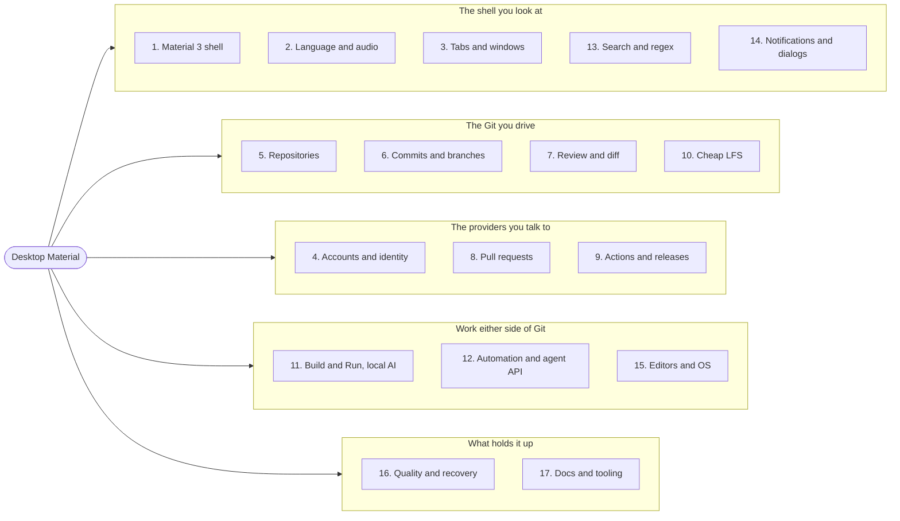
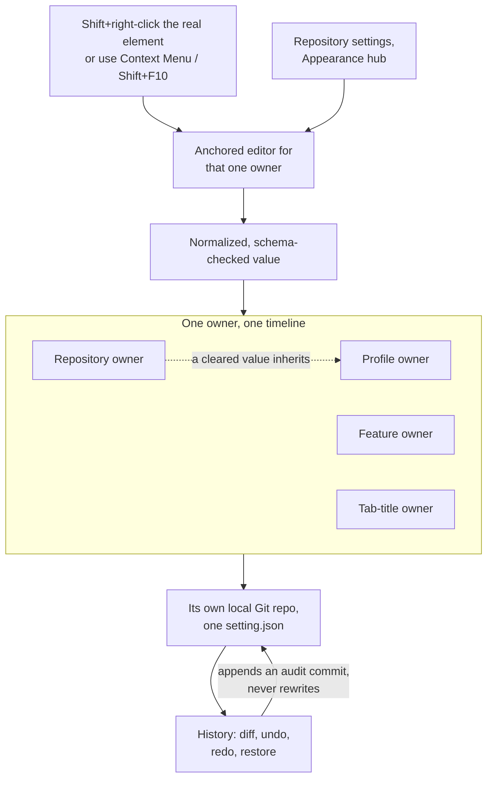
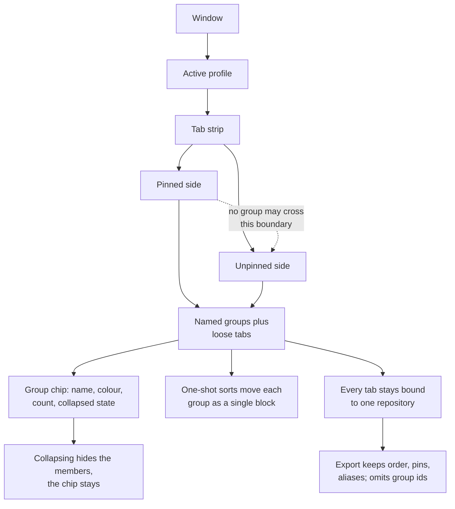
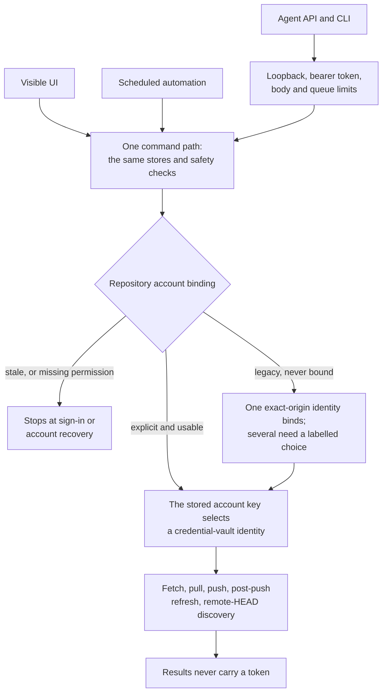
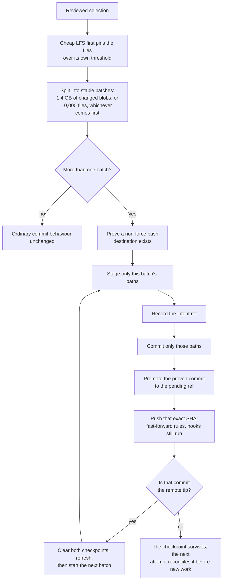

[Overview](../../README.md) · [Install](install.md) · **Features** · [Complete list](complete-feature-list.md) · [Screenshots](screenshots.md) · [Roadmap & receipts](roadmap-and-receipts.md) · [Development](development.md)

[總覽](../../README.md) · [安裝](install.md) · **功能** · [完整清單](complete-feature-list.md) · [截圖](screenshots.md) · [路線圖同憑證](roadmap-and-receipts.md) · [開發](development.md)

Tabbed README — GitHub can't run scripts, so each tab above is a separate page.

分頁式 README — GitHub 唔行得 script，所以上面每個分頁都係獨立一版。

# Features / 功能

The full Material Design 3 shell plus every Git and GitHub workflow Desktop
Material ships. For milestone status and published CI/release evidence, see the
[Roadmap & receipts](roadmap-and-receipts.md) tab; for annotated captures, see the
[Screenshots](screenshots.md) tab.

完整嘅 Material Design 3 外殼，加埋 Desktop Material 出貨嘅每一個 Git 同 GitHub 工作流程。里程碑狀態同已發佈嘅 CI／發佈證據睇 [路線圖同憑證](roadmap-and-receipts.md) 分頁；有註解嘅擷取睇 [截圖](screenshots.md) 分頁。

The archived [Linux TUI prototype](../features/linux-tui/README.md) adapted a
subset of these workflows for character-cell terminals. Its source, generated
[parity contract](../../tui/contracts/parity.yaml), package notes, and five
Xvfb captures remain as historical July 27 evidence only. It is not a current
supported product/release target, and its gaps do not block the Windows
application.

封存低嘅 [Linux TUI 原型](../features/linux-tui/README.md) 將呢啲工作流程嘅一部分改編到字元格終端機。佢嘅原始碼、產生嘅 [對等契約](../../tui/contracts/parity.yaml)、套件筆記同五張 Xvfb 擷取，淨係作為 7 月 27 日嘅歷史證據。佢唔係目前支援嘅產品／發佈目標，佢嘅缺口亦都唔會阻塞 Windows 應用程式。

> Looking for an exhaustive checklist instead of this prose tour? The
> **[Complete list](complete-feature-list.md)** tab records every feature in one
> bilingual (English / 廣東話) table and labels each one **Added**,
> **Extended**, or **Inherited** relative to upstream GitHub Desktop.

> **July 27 published source acceptance:** the app-hosted browser, exact-90%
> Cheap LFS restore look-ahead, and private-repository lock passed the final
> focused **760/760 across 58 files** gate, 14/14 verifier contracts, full
> TypeScript check, exact Windows production build, and isolated hidden-desktop
> interaction/privacy review. The source and captures are pushed through
> `2abccae8fd`, and Pages/wiki publication is verified live. Packaged Windows
> E2E is verified. Installer/Release evidence was still pending at that dated
> checkpoint; the separate historical TUI correction is non-blocking under the
> Windows-only product boundary.

> **7 月 27 日已發佈來源接受：**app 自寄瀏覽器、精確 90% Cheap LFS 還原預讀同私人儲存庫鎖，通過咗最終聚焦嘅 **58 個檔案共 760/760** 關卡、14/14 驗證者契約、完整 TypeScript 檢查、精確 Windows 生產建置，同隔離嘅隱藏桌面互動／私隱覆核。原始碼同擷取經 `2abccae8fd` 推送，Pages／wiki 發佈已驗證上線。已打包 Windows E2E 已驗證。喺嗰個有日期嘅檢查點，安裝程式／發佈證據仍然待辦；獨立嘅歷史 TUI 修正喺 Windows-only 產品界線下唔構成阻塞。

**The whole feature set on one page / 成套功能一版睇晒**

**What the map says.** Desktop Material's 201 features sit in 17 numbered
areas, clustered here five ways: the shell you look at (1 Material 3 shell,
2 language and audio, 3 tabs and windows, 13 search and the regex builder,
14 notifications and dialogs); the Git you drive (5 repositories, 6 commits and
branches, 7 review and diff, 10 Cheap LFS); the providers you talk to
(4 accounts and identity, 8 pull requests, 9 Actions and releases); work either
side of Git (11 Build & Run and local AI, 12 automation and the agent API,
15 editors and OS integration); and the foundations (16 quality and recovery,
17 documentation and tooling). Those numbers are the section numbers in the
[Complete list](complete-feature-list.md), so the map is an index, not a
summary.

**張圖講咩。** Desktop Material 嘅 201 項功能分佈喺 17 個編號範疇，喺呢度夾成五組：你望住嘅外殼（1 Material 3 外殼、2 語言同聲音、3 分頁同視窗、13 搜尋同 regex builder、14 通知同對話框）；你操作嘅 Git（5 儲存庫、6 commit 同分支、7 覆核同差異、10 Cheap LFS）；你溝通嘅供應方（4 帳戶同身分、8 pull request、9 Actions 同發佈）；Git 兩邊嘅工作（11 Build & Run 同本機 AI、12 自動化同 agent API、15 編輯器同作業系統整合）；同埋地基（16 品質同復原、17 文件同工具）。嗰啲數字就係 [完整清單](complete-feature-list.md) 入面嘅章節編號，所以呢張圖係索引，唔係摘要。

**張圖講咩。** Desktop Material 嘅 201 項功能分喺 17 個範疇，呢度夾埋做五嚿：你望住嘅外殼（1 Material 3 外殼、2 語言同聲音、3 分頁同視窗、13 搜尋同 regex、14 通知同對話框）；你揸住嘅 Git（5 倉庫、6 Commit 同分支、7 審閱同 diff、10 Cheap LFS）；你要傾偈嘅供應商（4 帳戶同身分、8 Pull request、9 Actions 同 Release）；Git 前後嗰啲工夫（11 Build & Run 同本機 AI、12 自動化同 agent API、15 編輯器同作業系統）；同埋托住成座嘢嘅地基（16 品質同復原、17 文件同工具）。啲號碼就係 [Complete list](complete-feature-list.md) 嘅章節號，所以呢張係索引，唔係摘要。

**Advanced Git and collaboration workflows (M21)**

**進階 Git 同協作工作流程（M21）**

- Keep multiple provider identities bound to the right repository; pin, hide,
  filter, and switch large repository sets; search current-branch or all-ref
  History; inspect remote-only commits; preview an ordinary manual pull after
  a successful fetch; and run a reviewed pull/fetch batch across an exact
  repository subset
- When a repository has more than one configured remote, the ordinary Fetch
  action says **Fetch all remotes** and fetches the complete remote set in a
  stable current-first order; a one-remote repository keeps its existing
  **Fetch `<remote>`** behavior. See the [multi-remote fetch sync
  guide](../features/repository-management/multi-remote-fetch-sync.md).
- Review and create pull requests without leaving the app: inspect files in a
  tree, expand diff context, comment, reply, resolve, approve, request changes,
  edit metadata, inspect checks, receive activity notifications, and safely
  check out an exact branch or commit from another fork
- Stash only selected files, name and manage multiple stashes—including stashes
  created outside Desktop Material—and manage the complete local/remote tag
  lifecycle with reviewed destructive operations and recovery receipts
- Compare CSV/TSV data structurally, preview TGA images, open files through a
  broader editor catalog or WSL, work with network/WSL repository paths, manage
  the global ignore file, import/export patch series, run allowlisted custom Git
  command presets, and delete reviewed local branches in bulk
- Browse live GitHub Projects and a bounded last-known-good offline cache, while
  retaining existing Copilot commit-message controls and one-click editor
  actions. The [30-item demand ledger](../features/github-desktop-demand-backlog.md)
  links each request to its behavior, safety boundary, and verification contract

- 令多個供應方身分綁住正確嘅儲存庫；釘選、隱藏、篩選同切換大量儲存庫；搜尋目前分支或者全 ref 嘅 History；檢視淨係喺遠端嘅 commit；成功 fetch 之後預覽一次普通手動 pull；並且喺一個精確嘅儲存庫子集上行經覆核嘅 pull／fetch 批次
- 當一個儲存庫設定咗多過一個 remote，普通嘅 Fetch 操作會變成 **Fetch all remotes**，並以穩定嘅「目前優先」次序抓取完整 remote 集合；單 remote 嘅儲存庫保持原本嘅 **Fetch `<remote>`** 行為。睇 [多 remote 抓取同步指南](../features/repository-management/multi-remote-fetch-sync.md)。
- 唔使離開 app 就覆核同建立 pull request：用樹狀檢視檔案、展開差異脈絡、留言、回覆、解決、批准、要求修改、編輯 metadata、檢視檢查、收到活動通知，並且安全咁由另一個 fork checkout 精確嘅分支或者 commit
- 淨係 stash 揀咗嘅檔案、為多個 stash 命名同管理（包括喺 Desktop Material 以外整嘅 stash），並且用經覆核嘅破壞性操作同復原收據，管理完整嘅本機／遠端標籤生命週期
- 結構化比較 CSV／TSV 資料、預覽 TGA 圖片、經更廣嘅編輯器目錄或者 WSL 開檔案、處理網絡／WSL 儲存庫路徑、管理全域 ignore 檔案、匯入／匯出 patch 系列、行白名單自訂 Git 命令預設，並且批次刪除經覆核嘅本機分支
- 瀏覽即時 GitHub Projects 同一個有界嘅「最後已知良好」離線快取，同時保留現有嘅 Copilot commit 訊息控制同一鍵編輯器操作。[30 項需求分類帳](../features/github-desktop-demand-backlog.md) 將每個請求連去佢嘅行為、安全界線同驗證契約

**Local Ollama model lifecycle (M23)**

**本機 Ollama 模型生命週期（M23）**

- Add an **Ollama (local)** provider in **Settings → Copilot → Providers**, then
  open its purpose-built **Manage models** workspace without writing native API
  requests
- Inspect endpoint health/version, installed and running inventories, searchable
  model details, runtime allocation, capabilities, and bounded metadata with
  separate unavailable and partial states
- Pull with streamed progress and cancellation; copy or guarded-rename a model;
  load or unload it; and delete only after confirming the exact model name
- Synchronize Ollama's installed inventory back to that provider's selectable
  Copilot models. Management requires an exact loopback `/v1` base and derives
  only fixed native `/api/*` routes; remote HTTP/HTTPS hosts, arbitrary
  prefixes, credentials, queries, and fragments are rejected. The complete
  workspace follows English, playful Hong Kong Cantonese, or bilingual mode.
  See the
  [feature guide](../features/integrations/ollama-model-manager.md)

- 喺 **設定 → Copilot → Providers** 加一個 **Ollama (local)** 供應方，然後打開佢專用嘅 **Manage models** 工作區，唔使自己寫原生 API 請求
- 檢視端點健康／版本、已安裝同執行中嘅清單、可搜尋嘅模型詳情、執行期分配、能力同有界 metadata，並且分開「不可用」同「部分」狀態
- 用串流進度同取消功能 pull；複製或者有防護咁改模型名；載入或者卸載佢；並且要確認咗精確模型名先刪除
- 將 Ollama 已安裝嘅清單同步返該供應方可揀嘅 Copilot 模型。管理功能要求精確嘅 loopback `/v1` 基底，並且淨係推導固定嘅原生 `/api/*` 路由；遠端 HTTP／HTTPS 主機、任意前綴、憑證、查詢同片段全部拒絕。整個工作區跟隨英文、活潑香港廣東話或者雙語模式。睇 [功能指南](../features/integrations/ollama-model-manager.md)

The accepted off-screen manager capture is a privacy-safe synthetic scene at
1452×1001. Its full health, inventory, search, running-state, pull cancellation
and rollback, completed pull, copy, rename, load, unload, confirmed-delete, and
provider-sync exercise is recorded in [`HANDOFF.md`](../../HANDOFF.md).

接受咗嘅離屏管理員擷取係一個 1452×1001、保護私隱嘅合成場景。佢完整嘅健康、清單、搜尋、執行狀態、pull 取消同回復、完成 pull、複製、改名、載入、卸載、確認刪除同供應方同步操作，記錄喺 [`HANDOFF.md`](../../HANDOFF.md)。

**Material Design 3 Expressive shell**
- App-bar branding with an inline pill menu
- Left icon navigation rail — Changes (with a badge), History, Branches, Settings, and the account avatar
- A floating pill toolbar with repository and branch chips, a small colour-coded CI result on the current branch, and a sync pill that shows an ahead badge; it measures the available lane and live ellipsis pressure, then moves Build & Run and, if needed, Commit & Push into an accessible **More** surface before labels clip
- Floating, radius-24 elevated workspace cards with an animated light/dark theme
- Full MD3 workspace surfaces: tri-state selection checkboxes, tonal status chips, token-based diff colors, an inverse-surface undo banner, and a redesigned welcome flow and blank slate
- A pure Material first-run Welcome task card and tonal workspace preview, paired with a Material 3 public landing page built from an expressive app bar, hero surface, principle cards, evidence gallery, and tonal calls to action

**Material Design 3 Expressive 外殼**

- 應用程式列品牌識別，配行內藥丸選單
- 左側圖示導覽列 — Changes（有標記）、History、Branches、Settings 同帳戶頭像
- 一條浮動藥丸工具列，有儲存庫同分支標籤、目前分支上一個細小、以顏色分類嘅 CI 結果，同一個會顯示「領先」標記嘅同步藥丸；佢會量度可用嘅空間同即時嘅省略號壓力，喺標籤被裁走之前先將 Build & Run，需要嘅話再將 Commit & Push，移入一個可存取嘅 **More** 介面
- 浮動、圓角 24 嘅升起工作區卡片，配動畫淺色／深色主題
- 完整 MD3 工作區表面：三態選取勾選框、色調狀態標籤、以 token 為本嘅差異顏色、反色表面嘅還原橫額，同重新設計嘅歡迎流程同空白狀態
- 純 Material 嘅首次執行 Welcome 任務卡同色調工作區預覽，配一個由表現力應用程式列、主視覺表面、原則卡片、證據相簿同色調行動呼籲組成嘅 Material 3 公開登陸頁

**Appearance customization**
- **Personal vocabulary** — load a local JSON file that renames the words the
  app shows you. Always visible on **Settings → Appearance**, whether or not a
  file has ever been loaded, because a control that only appears once it is in
  use is a control nobody finds. Nothing ships with mappings; the complete byte
  payload is validated before a single word is applied; a refused file changes
  nothing, not even partially, and never displaces one that was already
  working; and no term ever reaches an export, a log, a capture or the network.
  Suppressed entirely in School mode
- **Narrator voice** — the spoken narrator's voice, speaking rate and pitch are
  chosen on **Settings → Sound**, separately for English and Cantonese, because
  picking an English voice says nothing about which Cantonese voice should read
  the other half of a bilingual line. Voices are enumerated from the platform
  at runtime with an explicit *choose automatically* default; the stable voice
  identity is persisted rather than the localized display name; and a voice
  that has since been uninstalled is reported as missing with the choice kept
- **Settings → Appearance** now contains only ordinary preferences such as language, theme, scale, repository-list behavior, branch sorting, formatting, and diff tab size. Custom visuals are never stuffed into a general Appearance page
- Choose an explicit, persisted language mode: **English**, respectful and playful
  **Hong Kong Cantonese**, or a compact **Bilingual** presentation. English is
  the safe fallback; Desktop Material does not silently replace the selection
  from the Windows locale
- About one launch in ten, a bundled photograph of a Hong Kong dim sum dish
  appears in the bottom-left corner, named in both languages —
  *Classic Har Gow · 蝦餃* — and clears itself. It never delays startup, never
  takes focus, and stays away on a first run, an error, an update, an open
  dialog, or inside your quiet hours. There is no setting to switch it off.
  See [The dim sum surprise](../features/design-system/dim-sum-surprise.md)
- `Shift`+right-click an actual visual owner—or focus it and press the Context Menu key or `Shift+F10`—to open its editor beside that element. A plain right-click remains available to the surface's ordinary context menu, and surfaces that have one keep a Customize entry in it. This covers the app identity/workspace, update bar, toolbar, repository list, tab strip, code/diff surface, individual Material feature entry points, each repository name/logo, each tab title, and the temporary-submodule Back control. Specialized Git context menus keep priority on their surrounding hit areas
- Every appearance owner has one versioned `setting.json` in its own local Git
  repository and its own **History** manager with lazy diffs, undo, redo, and
  restore. History actions append audit commits; the editor footer exposes the
  exact local path. Profile owners, feature IDs, repository instances, and tab
  instances never share a mutable timeline. A rapid slider/color burst persists
  only its latest normalized value before the existing commit debounce, while
  queued setting reads and History remain strict ordering barriers
- Repository-scoped workspace, toolbar, tab-strip, list-name, and logo values can inherit their profile owner. Toolbar appearance includes safe text color plus curated family, bounded size, emphasis, case, spacing, effect, and alignment controls; a repository can inherit those typography properties individually or clear its whole local layer. A local `desktop-material.appearance-id` UUID keeps those dedicated repositories stable when the working copy moves; the old aggregate config is migration/startup compatibility only
- The temporary-submodule Back owner offers **Tonal**, **Filled accent**, or **Outlined**, plus label choices. The vector repository-logo studio keeps bounded JSON import/export and safe code-native layers; an inherited row can jump to the profile default beside the same actual logo
- Toolbar measurement respects Icons only and compact density. Build & Run overflows first, followed by Commit & Push; widening the window or shortening a dynamic label restores the same mounted controls deterministically, while an open **More** surface remains stable until it closes

**How appearance is layered.** There is no central appearance studio. You reach
an editor two ways — `Shift`+right-clicking the element that actually owns the
look (or focusing it and using the Context Menu key / `Shift+F10`), or the
Repository settings Appearance hub — and both commit through the same owner
path, so an edit made either way is indistinguishable, History included. The
normalized value lands on exactly one owner: a profile owner, a repository
owner, a feature owner, or a single tab's title owner. A repository owner whose
value is cleared inherits the matching profile value. Each owner keeps one
`setting.json` in its own local Git repository, and its History panel can diff,
undo, redo, or restore — each of which appends an audit commit rather than
rewriting the chain.

**外觀係點分層。** 呢度冇一個中央外觀工作室。你有兩條路開到編輯器 — 撳住 `Shift` 再右擊真正擁有嗰個樣嘅元素（或者聚焦佢再撳 Context Menu 掣／`Shift+F10`），或者經儲存庫設定嘅 Appearance hub — 兩條路都經同一條擁有者路徑提交，所以無論用邊條路改，結果都分唔出，連 History 都一樣。正規化之後嘅值淨係落喺一個擁有者：profile 擁有者、儲存庫擁有者、功能擁有者，或者單一分頁嘅標題擁有者。一個被清空咗值嘅儲存庫擁有者會繼承對應嘅 profile 值。每個擁有者喺自己嘅本機 Git 儲存庫入面保存一個 `setting.json`，而佢嘅 History 面板可以 diff、還原、重做或者恢復 — 每一項都係加一個稽核 commit，唔會改寫個鏈。

**外觀係點分層。** 呢度冇一個中央外觀工作室。你有兩條路開到編輯器：撳住 `Shift` 再右擊真正擁有嗰個樣嘅元素（或者 focus 住撳 Context Menu 掣／`Shift+F10`），或者行 Repository settings 嘅 Appearance hub；普通右擊繼續開原本嘅功能選單。兩條外觀路徑都行同一個 owner 路徑落去，所以邊度改都一模一樣，連 History 都一樣。個正規化咗嘅數值淨係落喺一個 owner 度：profile owner、repository owner、feature owner，或者某一個分頁標題嘅 owner。Repository owner 清空咗個值，就會繼承返 profile 嗰個。每個 owner 喺自己嘅本機 Git repo 揸住一個 `setting.json`，History 面板可以睇 diff、undo、redo、還原 — 每一下都係加多個審計 commit，唔會改寫舊歷史。

**Repository tabs**
- Browser-like repository tabs, per-account and bound to repos, with inline rename
- Per-tab title styling: `Shift`+right-click the actual title for bold/italic/underline, size, text color, background color, font family, and alignment, with curated palettes, recent colors, a custom picker, one-click return to default, and that tab's dedicated Git history. Ordinary right-click opens the tab command menu, whose explicit **Customize Appearance…** action reaches the same editor. The clicked tab initializes before the editor opens; an in-progress profile transition gives localized retry guidance instead of escaping to the app crash boundary
- Collect tabs into named, curated-color groups. A visible chip before the first member shows its name, count, active state, and expanded/collapsed state; mouse, Enter, or Space really hides/restores the member tabs. Group actions, dialog copy, announcements, and accessible names follow English, playful Hong Kong-style Cantonese, or bilingual mode
- Group metadata persists across open/close and bulk-close operations, per-window reloads, profile history, and session imports. A group cannot cross the protected pinned/unpinned boundary. Deleting a group never closes its tabs
- Mark tabs as favorites, drag a repository folder onto the app to open or switch its tab, and export or import the current ordered tab session with pins, favorites, aliases, and per-tab appearance. Portable exports intentionally omit profile-local group definitions and `groupId` memberships, while import preserves the destination profile's existing groups
- Keep the original **Close Tabs Containing…** regex workflow, or use the guarded inverse **Close all tabs except those containing…** action. The inverse matches a case-insensitive literal substring across the visible label, repository alias/name, and local path; live counts and a bounded preview make the result reviewable, and an empty or zero-match query cannot confirm
- Pin important tabs and arrange each pinned or unpinned group manually with drag-and-drop or named keyboard move actions. Moving a member outside its named group ungroups only that tab; one-shot A→Z, Z→A, newest-opened, oldest-opened, repository-status, and favorites-first/last sorts keep every remaining named group together as one stable block. The chosen order persists without continuously reshuffling as repository status changes
- Dragging gives a lifted-tab treatment and a live before/after insertion rail, with reduced-motion and pinned-boundary fallbacks. The strip also exposes a searchable, regex-capable **Tab history** list for restoring up to twelve recently closed tabs without losing their group, pin, favorite, label, or appearance
- Use **Search tabs** to switch by name, alias, path, or clone URL, and narrow **Arrange tabs** with its literal multi-key filter without changing the all-tab scope of one-shot sorts

**儲存庫分頁**

- 似瀏覽器嘅儲存庫分頁，逐帳戶並且綁住儲存庫，可以行內改名
- 逐分頁嘅標題樣式：撳住 `Shift` 右擊真正嗰個標題，就可以改粗體／斜體／底線、大小、文字色、背景色、字體同對齊，配精選調色板、最近用色、自訂選色器、一鍵回復預設，同埋嗰個分頁專屬嘅 Git 歷史。普通右擊會開分頁命令選單，佢明確嘅 **Customize Appearance…** 操作去到同一個編輯器。撳咗嘅分頁會喺編輯器打開之前初始化；如果 profile 轉換緊，就會俾本地化嘅重試指引，唔會跌落 app 崩潰邊界
- 將分頁收埋入具名、精選顏色嘅群組。第一個成員前面嘅可見標籤顯示佢個名、數量、使用中狀態同展開／摺疊狀態；用滑鼠、Enter 或者 Space 係真係收埋／還原啲成員分頁。群組操作、對話框文案、播報同無障礙名稱全部跟隨英文、活潑香港廣東話或者雙語模式
- 群組 metadata 喺開關、批次關閉、逐視窗重新載入、profile 歷史同工作階段匯入之間保持。群組唔可以跨越受保護嘅釘選／非釘選界線。刪除群組永遠唔會關閉佢啲分頁
- 將分頁標記做最愛、將儲存庫資料夾拖入 app 就可以打開或者切換佢個分頁，亦都可以匯出或者匯入目前有次序嘅分頁工作階段，連釘選、最愛、別名同逐分頁外觀。可攜匯出刻意唔包含 profile 本地嘅群組定義同 `groupId` 成員關係，而匯入會保留目的 profile 現有嘅群組
- 保留原本嘅 **Close Tabs Containing…** regex 工作流程，或者用有防護嘅相反操作 **Close all tabs except those containing…**。相反操作會喺可見標籤、儲存庫別名／名稱同本機路徑上，比對唔分大小寫嘅字面子字串；即時計數同有界預覽令結果可覆核，而空白或者零匹配嘅查詢確認唔到
- 釘選重要分頁，並且用拖放或者具名鍵盤移動操作，手動排列每一個釘選或者非釘選群組。將成員移出佢嘅具名群組淨係將嗰個分頁解組；一次過嘅 A→Z、Z→A、最新開啟、最舊開啟、儲存庫狀態同最愛先／後排序，會令每一個剩低嘅具名群組維持做一整塊。揀咗嘅次序會保持，唔會因為儲存庫狀態變就不停重排
- 拖曳會有抬起分頁嘅效果同即時嘅插入前／後導軌，並且有減少動態同釘選界線嘅後備。分頁列亦都提供一個可搜尋、支援 regex 嘅 **Tab history** 清單，可以還原最多十二個最近關閉嘅分頁，唔會失去佢哋嘅群組、釘選、最愛、標籤或者外觀
- 用 **Search tabs** 按名稱、別名、路徑或者 clone 網址切換，並且用 **Arrange tabs** 嘅字面多鍵篩選收窄範圍，同時唔改變一次過排序嘅「全部分頁」範圍

**How the strip is organized.** Tabs and their groups belong to a window and a
profile, so switching either gives you that context's own strip. The strip has
a protected pin boundary and no group is allowed to straddle it; each side
holds its own named groups and loose tabs. A group is a label, never a
behaviour change: its chip carries the name, colour, member count and collapsed
state, collapsing hides the members while the chip stays reachable, the one-shot
sorts move a whole group rather than shuffling a stranger into the middle of it,
and deleting a group closes nothing. Each tab stays bound to its repository
throughout. A portable session export deliberately carries order, pins,
favourites, aliases, and per-tab appearance but not group definitions or
membership, because a group belongs to the profile that receives the import.

**成條分頁列點編排。** 分頁同佢哋嘅群組屬於一個視窗同一個 profile，所以轉視窗或者轉 profile 都會見到嗰個脈絡自己嗰條列。條列有一條受保護嘅釘選界線，冇任何群組跨得過；兩邊各自有自己嘅具名群組同散裝分頁。群組係一個標籤，唔會改變行為：佢個標籤帶住名稱、顏色、成員數同摺疊狀態；摺疊會收埋成員但係個標籤仍然到得到；一次過嘅排序會整組一齊移，唔會將個陌生分頁塞入中間；刪除群組唔會關閉任何嘢。每個分頁自始至終綁住佢嘅儲存庫。可攜嘅工作階段匯出刻意帶住次序、釘選、最愛、別名同逐分頁外觀，但係唔帶群組定義同成員關係，因為群組屬於接收匯入嗰個 profile。

**成條分頁列點編排。** 分頁同佢哋嘅群組屬於某個視窗、某個 profile，所以轉窗或者轉 profile 就會見到嗰邊自己嗰條列。條列有一條受保護嘅釘住界線，冇任何群組跨得過；兩邊各自有自己嘅具名群組同散裝分頁。群組淨係一個標籤，唔會改行為：個 chip 寫住名、顏色、成員數同收埋咗未，收埋之後成員唔見但 chip 仲喺度撳得到，一次過排序係搬成嚿群組，唔會塞個唔相干嘅分頁入去中間，而刪群組更加唔會關到任何分頁。每個分頁自始至終都綁實佢嗰個倉庫。可攜嘅工作階段匯出會帶走次序、釘住、收藏、別名同逐分頁外觀，但故意唔帶群組定義同成員關係 — 因為群組係屬於接收匯入嗰個 profile 嘅。

**Multi-account**
- Multiple accounts including multiple identities per host; per-account tabs, repos, and settings
- Repository-bound HTTPS Git fetch, pull, push, post-push refresh, scheduled
  sync, refspec fetch, and remote-HEAD discovery use the exact selected account.
  Background sync reuses a namespace- and target-validated local remote HEAD;
  an explicit fetch gives discovery five seconds and process-tree cleanup one
  final five-second grace window, so the advisory refresh has a ten-second hard
  settlement bound even when a child never reports closure. A renamed default
  is still discovered when the old branch exists. Concurrent callers share one
  in-flight system proxy lookup per URL instead of multiplying abandoned
  resolver work. Missing or invalid refs still perform one authenticated
  discovery. Legacy unbound organization repositories prefer a
  verified write-capable same-host identity, while a missing explicit binding
  fails closed instead of silently using another account
- GitHub browser sign-in requests the bounded feature scopes used by the app:
  repository/user access, workflow-file updates, notifications, read-only
  organization membership, and the `write:packages` grant used by the Cheap LFS
  GHCR path. Repository deletion, package deletion, and unrelated administrative
  scopes remain excluded; the registry documentation's PAT-classic-only caveat
  is recorded in the OCI feature guide
- Browse complete GitHub organization repository lists, filter cloning by
  organization, and choose a personal or organization owner from the Publish
  dialog's non-collapsing, keyboard-operable listbox with fuzzy, substring,
  and bounded-regex search
- Add GitLab accounts, including self-hosted endpoints, with a personal access token; add Bitbucket accounts with an app password, then browse and clone their repositories from the provider tab
- Select all repositories with a mixed-state checkbox, or opt in to automatically clone only newly discovered repositories in the background. **Settings → Clone queue** keeps each signed-in account's base directory, parallel/sequential mode, and enabled state discoverable after the Clone dialog closes; auto-clone never opens an unsolicited progress dialog
- Pause and resume pending multi-clones, including after restart or an interrupted process. A bounded atomic recovery journal revalidates the exact destination, usable clean worktree, `HEAD`, and matching origin without deleting occupied folders; failed/review-required queues remain visible until explicitly dismissed
- Switching clone accounts clears stale repository selection and validation, reloads the exact account catalog, and keeps its latest async result from being overwritten by an older account/path check
- Clone a private repository from a generic HTTPS URL without a credential prompt when an eligible signed-in account matches the exact origin. Only authentication or repository-not-found ambiguity can try another exact-origin account; the successful account affinity is retained, while tokenless or stale tokenless bindings are skipped and missing, SSH, non-authentication, and cross-origin credentials never widen fallback
- The repository list can hide its automatically maintained Recent group from **Settings → Appearance**
- Filter the cloned-repository list independently by its exact bound account and provider service; local-only, unavailable-account, and unknown/signed-out scopes are explicit instead of inferred from a host name
- Repositories with exact private provider metadata show a separate localized,
  keyboard-focusable lock without replacing their fork glyph, custom logo, or
  ordinary repository icon; public and unknown metadata make no privacy claim
- Repositories can be pinned from their context menu into a dedicated top group
- Provider triage consumes the same exact repository-account binding selected in Repository Settings. One valid matching identity can bind an unassigned repository; multiple matches require an explicit labelled choice; missing, stale, permission, and organization-SSO states route to the appropriate sign-in or account-management recovery without silently replacing a valid binding

**App-hosted browser — locally accepted**

- **Settings → Advanced → Open web links** persists whether HTTP(S) links open
  inside Desktop Material or in the system browser
- The app-hosted window supplies tabs, New tab, Back, Forward, Refresh/Stop, a
  labelled URL bar, Go, ordinary bookmarks, and **Open externally**; bare hosts
  become HTTPS, while arbitrary text is never sent to a search provider
- Remote pages run in sandboxed `WebContentsView` tabs without Node, preload,
  app IPC trust, Electron permissions, downloads, or certificate bypass.
  Redirects remain in the current tab, `window.open` is captured into a new
  trusted-chrome tab, and query/fragment/credential data is removed from logs
  and bookmarks
- Authentication uses an explicit intent, an in-memory session, no bookmarks,
  automatic storage/cache cleanup, and a visible **Continue in system browser**
  escape. See the [security and recovery contract](../features/integrations/app-hosted-browser.md)

- **設定 → Advanced → Open web links** 會記住 HTTP(S) 連結係喺 Desktop Material 入面開，定係喺系統瀏覽器開
- App 自寄嘅視窗提供分頁、新分頁、返回、前進、重新整理／停止、有標籤嘅網址列、Go、普通書籤同 **Open externally**；淨係主機名會變成 HTTPS，而任意文字永遠唔會送去搜尋供應方
- 遠端頁面喺沙箱 `WebContentsView` 分頁執行，冇 Node、冇 preload、冇 app IPC 信任、冇 Electron 權限、冇下載、亦都唔會繞過憑證。轉址留喺目前分頁，`window.open` 會被擷取入一個新嘅受信任外框分頁，而查詢／片段／憑證資料會由記錄同書籤移除
- 認證用明確意圖、記憶體內工作階段、唔留書籤、自動清理儲存／快取，同一個可見嘅 **Continue in system browser** 出口。睇 [保安同復原契約](../features/integrations/app-hosted-browser.md)

**App 內瀏覽器 — 本機驗收已經過關。** 你可以喺
**Settings → Advanced → Open web links** 揀連結喺 app 入面定系統瀏覽器開。App
內嗰個有分頁、網址列、前後頁、重新整理、Go、書籤同外部逃生門；遠端網頁鎖喺
sandboxed `WebContentsView`，冇 Node、冇 preload、冇 app IPC 信任、冇權限、唔會
幫你下載或者繞過壞憑證。登入分頁用記憶體工作階段、加唔到書籤，閂咗會清資料，
亦永遠有得轉去系統瀏覽器。

**Versioned settings & history**
- Ordinary per-account settings remain in the profile Git repository and **Edit → Settings History…** (`Ctrl+Alt+Z`). Appearance and per-tab visual changes use the narrower element-local histories reached from their anchored editors
- Each appearance editor names and copies its exact local repository path; every element-local undo, redo, or restore appends an audit commit instead of rewriting history
- Right-click a History commit—or press the row's named **More actions** control, Context Menu key, or `Shift+F10`—for the same selection-aware reset, checkout, reorder, revert, branch, tag, cherry-pick, copy, and provider actions

**有版本嘅設定同歷史**

- 普通嘅逐帳戶設定仍然留喺 profile Git 儲存庫同 **Edit → Settings History…**（`Ctrl+Alt+Z`）。外觀同逐分頁嘅視覺改動用嘅係由佢哋錨定編輯器到達、範圍更窄嘅元素本地歷史
- 每個外觀編輯器都會顯示同複製佢精確嘅本機儲存庫路徑；每一次元素本地嘅還原、重做或者恢復都係加一個稽核 commit，唔會改寫歷史
- 右擊一個 History commit — 或者撳嗰行具名嘅 **More actions** 控制項、Context Menu 掣或者 `Shift+F10` — 就會見到同樣感知選取嘅 reset、checkout、重排、revert、開分支、加標籤、cherry-pick、複製同供應方操作

**Non-modal dialog framework**
- Dialogs float without blocking the app, drag by their headers, cascade, and can be brought to front — the app stays fully interactive behind an open dialog
- Mouse-wheel and trackpad gestures scroll from anywhere over dialog content, with nested lists/editors retaining their own range and chaining to the outer body at an edge
- Preferences rebuilt as an MD3 940×660 dialog with a left rail, an Active chip, and a pill footer
- Repository and branch pickers are MD3 side sheets; the clone dialog is restyled to match
- Acknowledgement-only application errors default to dismissible red notices at the bottom right; choose traditional blocking dialogs in **Settings → Notifications**, while errors that require a decision, retry, sign-in, or remediation always remain dialogs. An error that names the affected repository's stale `.git/index.lock` offers a scoped **Remove lock file** action after Desktop confirms the repository is idle and the lock is old and unchanged
- GitHub sign-in and Git/SSH credential prompts use one recoverable FIFO, so
  concurrent host-key, passphrase, password, and generic authentication
  requests cannot be dropped by popup de-duplication

**非模態對話框框架**

- 對話框浮動而唔會阻塞 app，可以拉住標題拖曳、疊層，亦可以帶到最前 — 開住對話框嗰陣，後面個 app 仍然完全用得
- 滑鼠滾輪同觸控板手勢可以喺對話框內容任何位置捲動，巢狀清單／編輯器保留自己嘅範圍，去到邊界就串連去外層
- Preferences 重建成一個 MD3 940×660 對話框，有左側導軌、Active 標籤同藥丸頁尾
- 儲存庫同分支選擇器係 MD3 側頁；clone 對話框亦都重新設計配合
- 淨係要確認嘅應用程式錯誤，預設係右下角可關閉嘅紅色提示；喺 **設定 → 通知** 可以揀返傳統阻塞式對話框，而需要決定、重試、登入或者補救嘅錯誤永遠保持做對話框。如果錯誤指名咗受影響儲存庫嘅過時 `.git/index.lock`，喺 Desktop 確認咗個儲存庫閒置、個鎖夠舊而且冇改變之後，會提供一個範圍限定嘅 **移除鎖檔案** 操作
- GitHub 登入同 Git／SSH 憑證提示用同一條可復原嘅 FIFO，所以同時發生嘅主機金鑰、密碼片語、密碼同一般認證請求，唔會俾彈窗去重機制丟失

**Notification centre**
- A bell and right-hand side sheet backed by its own local git repo — search by title, message, or repository metadata; filter by event type; select all visible results; bulk mark read/unread or delete; and visibly confirm **Clear all**, with every change recoverable from Git-backed history
- Switch to a separate live GitHub inbox for any signed-in GitHub.com or Enterprise account; every available 50-item API page is fetched automatically with no 200-item display ceiling. Filter unread/all and participating threads, search titles/repositories/types/reasons, select visible results, open only validated provider links, bulk mark read/done, or confirm **Clear all** for the complete fetched inbox; partial failures remain visible for retry and remote threads are never copied into the local log

**通知中心**

- 一個鈴仔同右側頁，背後有自己嘅本機 git 儲存庫 — 可以按標題、訊息或者儲存庫 metadata 搜尋；按事件類型篩選；選取所有可見結果；批次標示已讀／未讀或者刪除；並且要明確確認先 **全部清除**，每一個改動都可以由 Git 支援嘅歷史復原
- 可以切換去任何已登入 GitHub.com 或者 Enterprise 帳戶嘅獨立即時 GitHub 收件匣；每一頁 50 項嘅 API 都會自動攞晒，冇 200 項顯示上限。篩選未讀／全部同有參與嘅討論串、搜尋標題／儲存庫／類型／原因、選取可見結果、淨係打開已驗證嘅供應方連結、批次標示已讀／完成，或者為整個已抓取收件匣確認 **全部清除**；部分失敗會保持可見等重試，而遠端討論串永遠唔會複製入本機記錄

**Search everywhere, with a regex builder**
- Every search bar gains fuzzy / substring / regex filter modes, a case toggle, and per-list filter chips
- A full safe-RE2 regex builder — anchors, character classes, quantifiers,
  groups/captures, alternation, the honestly supported ignore-case flag, and a
  live match/capture tester — reachable from the search bars; unsupported
  lookaround and backreferences are explained before Apply
- The `Ctrl+Shift+P` command palette uses wider, richer rows with a leading icon, title, optional search-term line, and localized group chip. `Ctrl+Shift+F` remains the current-repository Open in Folder shortcut. Its anchored **Customize appearance** editor persists comfortable/compact density and independent icon/group/keyword visibility; Escape closes only the editor and restores toggle focus

**周圍都搜尋得到，仲有 regex builder**

- 每一個搜尋列都有模糊／子字串／regex 篩選模式、大小寫開關同逐清單篩選標籤
- 一個完整、安全嘅 RE2 regex builder — 錨點、字元類別、量詞、群組／擷取、交替、誠實支援嘅忽略大小寫旗標，同即時匹配／擷取測試器 — 由各個搜尋列到達；唔支援嘅 lookaround 同反向參照會喺 Apply 之前解釋清楚
- `Ctrl+Shift+P` 命令面板用更闊、更豐富嘅列，有前置圖示、標題、可選嘅搜尋詞行同本地化群組標籤。`Ctrl+Shift+F` 仍然係目前儲存庫嘅「喺資料夾開啟」快捷鍵。佢錨定嘅 **Customize appearance** 編輯器會記住舒適／緊湊密度同獨立嘅圖示／群組／關鍵字可見性；Escape 淨係閂編輯器並且將焦點還原去開關

**Repository safety and cleanup**
- A context-menu option can permanently discard changes without sending files to the trash, including untracked files, for large cleanup operations where the regular discard flow would be slow
- Local-only branches use a clear publish indicator, including branches whose configured upstream was deleted
- Branch lists can be sorted by last activity or alphabetically from **Settings → Appearance**
- The commit composer can show the effective Git author name/email plus the winning config scope and file before commit
- Merge commits use a distinct, subdued italic summary in History so integration points are easy to scan

**儲存庫安全同清理**

- 有一個右鍵選單選項可以永久捨棄改動而唔會將檔案送去回收筒（包括未追蹤檔案），適合普通捨棄流程太慢嘅大型清理
- 淨係喺本機嘅分支有清楚嘅發佈指示，包括原本設定咗嘅上游已經被刪除嗰啲
- 分支清單可以喺 **設定 → 外觀** 按最後活動或者字母排序
- Commit 撰寫器可以喺 commit 之前顯示生效嘅 Git 作者名／電郵，加埋勝出嘅 config 範圍同檔案
- 合併 commit 喺 History 用獨特、低調嘅斜體摘要，令整合點易掃

**Dynamic UI scaling**
- A UI-scale slider (50–200%) in Preferences → Appearance plus auto-fit-to-window that shrinks the interface to fit smaller windows (on by default), composing with `Ctrl` `+` / `-` / `0`
- At the supported minimum window size, a requested 200% scale safely auto-fits below the requested maximum, keeping the title bar, navigation, Appearance controls, and footer visible without horizontal clipping; the latest P0 gate measured 94%, while the earlier screenshot in the [Screenshots](screenshots.md) tab records a 96% viewport

**動態介面縮放**

- 喺 Preferences → Appearance 有一個介面縮放滑桿（50–200%），加自動配合視窗大小（預設開啟），會將介面縮細以配合細視窗，並且同 `Ctrl` `+`／`-`／`0` 一齊運作
- 喺支援嘅最細視窗尺寸下，要求 200% 縮放會安全咁自動配合到低過要求嘅最大值，令標題列、導覽、Appearance 控制項同頁尾都見得到而唔會橫向裁走；最新嘅 P0 關卡量到 94%，而 [截圖](screenshots.md) 分頁入面較早嗰張記錄嘅係 96% 視區

**Per-repo `.gitignore` manager**
- Open **Repository → Manage .gitignore…** for a manager that auto-suggests templates from your repo's contents, a searchable catalog of ~19 templates grouped by category, one-click apply/remove, and a raw editor — all merged into marked, reversible sections

**逐儲存庫嘅 `.gitignore` 管理員**

- 開 **Repository → Manage .gitignore…** 會見到一個管理員：佢會按你儲存庫嘅內容自動建議範本、提供約 19 個按類別分組嘅可搜尋範本目錄、一鍵套用／移除，同一個原始編輯器 — 全部合併入有標記、可逆轉嘅區段

**One-click Build & Run**
- Auto-detects bounded, nested project roots and runnable profiles for Node/npm/yarn/pnpm/bun, Deno, Rust, Go, .NET, Python, Java/Kotlin, PHP, Ruby, Swift, Dart/Flutter, Elixir, Scala, Haskell, Zig, Make, and CMake; each choice shows its project folder so similarly named profiles are unambiguous
- Installs dependencies, builds, and runs the selected profile in one action, streaming output to an MD3 log panel with a one-shot **Scroll to bottom** action, persisted auto-scroll that pauses when the user reads history, and persisted display-only long-line truncation that leaves the complete text available to **Copy all output**
- Auto-ignores build outputs (applies the matching `.gitignore` template + an artifacts section) before building
- Bounded auto-fix on failure through a per-repository choice of Codex CLI or OpenCode, stdin-only prompts, explicit install/auth/auto-approve consent, renderer-owned process-tree cancellation, and a Build & Run verification rerun unless **Stop** cancels it; plus a per-repo settings tab, bounded nested-project discovery, optional single-prompt UAC pre-elevation, and English, playful Hong Kong Cantonese, or bilingual labels

**一鍵 Build & Run**

- 自動偵測有界嘅巢狀專案根同可執行設定檔，涵蓋 Node/npm/yarn/pnpm/bun、Deno、Rust、Go、.NET、Python、Java/Kotlin、PHP、Ruby、Swift、Dart/Flutter、Elixir、Scala、Haskell、Zig、Make 同 CMake；每個選項都顯示佢嘅專案資料夾，所以名相似嘅設定檔唔會混淆
- 一個操作就安裝依賴、建置同執行選定嘅設定檔，並將輸出串流去一個 MD3 記錄面板，有一次過嘅 **捲到底** 操作、會喺用戶睇緊歷史時暫停嘅持久自動捲動，同持久嘅「淨係顯示層面」長行截斷（完整文字仍然可以用 **Copy all output** 攞返）
- 建置之前自動忽略建置輸出（套用對應嘅 `.gitignore` 範本加一個產物區段）
- 失敗嗰陣可以經逐儲存庫揀嘅 Codex CLI 或者 OpenCode 做有界自動修復，淨係用 stdin 提示、明確嘅安裝／認證／自動批准同意、由 renderer 擁有嘅行程樹取消，以及一次 Build & Run 驗證重跑（除非撳 **Stop** 取消）；另外仲有逐儲存庫設定分頁、有界嘅巢狀專案探索、可選嘅單次提示 UAC 預先提權，同英文、活潑香港廣東話或者雙語標籤

**Automation and GitHub Actions**
- Configure scheduled commit-and-push and pull globally, override them per account or repository, and rely on safety guards that skip unsafe repositories and preserve draft commit messages
- Run commit-and-push immediately, or merge all branches/worktrees with per-target progress and Copilot-assisted conflict handling
- Browse GitHub Actions runs in the repository rail, filter by workflow/branch/event/status, re-run all or failed jobs, inspect jobs and steps, securely download and search logs, search each loaded artifact catalog with fuzzy/substring/safe-regex modes, and dispatch workflows with inputs. When no workflow run is selected, the run list fills the available row; selecting a run restores the resizable detail pane. A protected-main **CI Windows** dispatch can select `cloud` or `[self-hosted, Windows, X64, desktop-material-windows-local]`; pushes, pull requests, and reusable calls remain hosted. Actions caches remain listable, searchable, and deletable; cache-archive download is labeled unavailable because GitHub exposes no supported download API, while workflow artifacts retain their verified download path
- Set up a repository-scoped Windows runner with a searchable rich GitHub account picker. Public repositories receive an immutable workflow and queue preflight; a completed known unsafe finding can proceed only after the user records intent in the form and accepts a Windows-owned confirmation bound to the current setup evidence. Unknown visibility and incomplete audit evidence remain blocked. Release notes are shown in their own collapsible section rather than inside Release details.
- Sign in to GitHub with the upstream-compatible OAuth request shape: the authorization and token exchange omit an unregistered custom `redirect_uri` and use the OAuth application's registered callback. See the [GitHub OAuth login guide](../features/integrations/github-oauth-login.md)
- Cancel only queued, running, waiting, or pending workflow runs from a Material confirmation that identifies the exact workflow/run, ref, actor, and commit when available. The app revalidates repository, account, run identity, and cancellable status before one normal cancellation request, prevents duplicate submission, then refreshes until GitHub reports a terminal state
- Dispatch **Build Installers / Express Release** from `main` when a release is urgent: lint, Windows x64 trampoline/unit/script tests, and packaging run in parallel, exact installed dependencies are content-cached, the complete installer payload is retained as a workflow artifact before publication, and one create-only command publishes deterministic exact-commit notes without replacing an existing tag
- Dispatch the separate **Super Express Release** workflow only for an emergency direct lane: its Windows package runs the complete script-contract suite before build and publication, while unit, TUI, lint, type, parity, smoke, and packaged E2E tests remain in ordinary CI and tested Express. It then builds Windows x64 and Linux TUI packages in parallel through their own reusable workflows. The direct Windows `workflow_dispatch` action preserves its verified artifact, keeps both build and publication on `[self-hosted, Windows, X64, desktop-material-windows-local]`, and publishes one uniquely tagged, non-draft Windows Release marked `Latest` after asset verification; the direct Linux TUI action remains packaging-only, and reusable calls remain artifact-only. Windows packages are permanently unsigned, must report `NotSigned`, and disclose possible SmartScreen or unknown-publisher prompts. A cold Windows publisher installs pinned checksum-verified PortableGit, GitHub CLI, and `jq` below `RUNNER_TOOL_CACHE`. The combined dispatcher restores the exact desktop dependency cache, runs every job on the registered self-hosted Windows or Linux runner, writes notes from the checked-out commit, verifies every installer/feed/package asset, retains the complete payload, and publishes one uniquely versioned immutable combined Release for the exact dispatched `main` commit. If a required local runner is unavailable, the affected build or publisher queues or fails rather than escaping to a hosted runner. Keeping the combined publisher as the only cross-platform publisher preserves the shared `latest` update/bootstrap feed. Ordinary CI and tested Express remain the default gates. Automatic and Super Express packages share one Squirrel-monotonic `z` version namespace, with a run-attempt suffix for reruns, and only the greatest release for revalidated current `main` can own the update feed

**自動化同 GitHub Actions**

- 全域設定排程 commit-and-push 同 pull，可以逐帳戶或者逐儲存庫覆寫，並且靠安全防護略過唔安全嘅儲存庫同保留草稿 commit 訊息
- 即刻執行 commit-and-push，或者合併所有分支／worktree，有逐目標進度同 Copilot 協助處理衝突
- 喺儲存庫側欄瀏覽 GitHub Actions 執行，按工作流程／分支／事件／狀態篩選、重跑全部或者失敗嘅工作、檢視 job 同 step、安全咁下載同搜尋記錄、用模糊／子字串／安全 regex 模式搜尋每個已載入嘅產物目錄，並且帶輸入派送工作流程。冇揀任何執行嗰陣，執行清單會填滿嗰行；揀咗一個執行就回復可調整大小嘅詳情面板。受保護 main 嘅 **CI Windows** 派送可以揀 `cloud` 或者 `[self-hosted, Windows, X64, desktop-material-windows-local]`；push、pull request 同可重用呼叫維持喺託管 runner。Actions 快取仍然列得到、搵得到同刪得到；快取封存下載標示為不可用，因為 GitHub 冇提供支援嘅下載 API，而工作流程產物保留佢已驗證嘅下載路徑
- 用可搜尋嘅豐富 GitHub 帳戶選擇器設定綁儲存庫嘅 Windows runner。公開儲存庫會收到不可變嘅工作流程同佇列預檢；一個已完成嘅「已知不安全」發現，要用戶喺表格記錄意圖，並且接受一個綁住目前設定證據、由 Windows 擁有嘅確認之後先可以繼續。可見性未知同審核證據不完整仍然會被阻擋。發佈說明放喺自己嘅可摺疊區段，唔會塞入 Release 詳情入面。
- 用同上游相容嘅 OAuth 請求形狀登入 GitHub：授權同 token 交換都唔帶未註冊嘅自訂 `redirect_uri`，並且用 OAuth 應用程式已註冊嘅回呼。睇 [GitHub OAuth 登入指南](../features/integrations/github-oauth-login.md)
- 淨係取消排隊中、執行中、等待中或者待處理嘅工作流程執行，經一個 Material 確認框；佢會識別精確嘅工作流程／執行、ref、發起者，同（有嘅話）commit。App 會喺一次正常取消請求之前重新驗證儲存庫、帳戶、執行身分同可取消狀態，防止重複提交，然後不斷刷新直到 GitHub 報告終止狀態
- 緊急發佈嗰陣可以由 `main` 派送 **Build Installers / Express Release**：lint、Windows x64 trampoline／單元／script 測試同打包並行執行，精確嘅已安裝依賴用內容快取，完整嘅安裝程式負載喺發佈前保留成工作流程產物，而一條「只建立」嘅命令會發佈確定性、對應精確 commit 嘅說明，唔會取代現有 tag
- 淨係喺緊急直通線道先派送獨立嘅 **Super Express Release** 工作流程：佢嘅 Windows 打包會喺建置同發佈之前行完整嘅 script 契約套件，而單元、TUI、lint、型別、對等、煙霧同已打包 E2E 測試仍然留喺普通 CI 同經測試嘅 Express。之後佢會經各自嘅可重用工作流程並行建置 Windows x64 同 Linux TUI 套件。直接嘅 Windows `workflow_dispatch` 操作會保留佢已驗證嘅產物，令建置同發佈都留喺 `[self-hosted, Windows, X64, desktop-material-windows-local]`，並且喺資產驗證之後發佈一個唯一 tag、非草稿、標示為 `Latest` 嘅 Windows Release；直接嘅 Linux TUI 操作維持淨係打包，而可重用呼叫維持淨係產物。Windows 套件永久未簽署，必須報告 `NotSigned`，並且披露可能出現 SmartScreen 或者未知發佈者提示。一部冷啟嘅 Windows 發佈機會喺 `RUNNER_TOOL_CACHE` 下面安裝釘住、經 checksum 驗證嘅 PortableGit、GitHub CLI 同 `jq`。合併嘅派送器會還原精確嘅桌面依賴快取、喺已註冊嘅自架 Windows 或者 Linux runner 上行每一個 job、由 checkout 咗嘅 commit 寫說明、驗證每一個安裝程式／來源／套件資產、保留完整負載，並且為精確派送嘅 `main` commit 發佈一個唯一版本、不可變嘅合併 Release。如果需要嘅本機 runner 唔可用，受影響嘅建置或者發佈會排隊或者失敗，唔會走去託管 runner。將合併發佈器保持做唯一嘅跨平台發佈器，可以保住共用嘅 `latest` 更新／啟動來源。普通 CI 同經測試嘅 Express 仍然係預設關卡。自動同 Super Express 套件共用一個 Squirrel 單調遞增嘅 `z` 版本命名空間，重跑會加執行嘗試後綴，而淨係對應重新驗證過嘅目前 `main` 嘅最大發佈先可以擁有更新來源

**Agent access and command line**
- Enable an opt-in, token-gated local agent server from **Settings → Agent access**; it exposes MCP and REST on a random loopback-only port and never returns account credentials
- In **Paired LAN devices** mode, use **Open mobile connection page** to replace any old code and open a fresh five-minute, one-use pairing link in the default browser; the secret remains in the URL fragment and is never sent to the site server
- Use the bundled stdio proxy or command-line client to list accounts/repos/tabs, inspect status, clone, commit, fetch/pull/push, manage branches/tabs, run automation, and dispatch workflows
- Turn a validated REST catalog request or named GraphQL operation into a profile-backed **App function** from the API rail. Functions are bound to the exact repository, provider, and account; read functions extend the local MCP/REST agent catalog, while mutation functions always return to the visible review step

**Agent 存取同命令列**

- 喺 **設定 → Agent access** 開啟一個要主動選擇、由 token 把關嘅本機 agent 伺服器；佢喺一個隨機、淨係 loopback 嘅埠上提供 MCP 同 REST，並且永遠唔會回傳帳戶憑證
- 喺 **Paired LAN devices** 模式，用 **Open mobile connection page** 取代任何舊代碼，並喺預設瀏覽器開一條全新、五分鐘、一次性嘅配對連結；秘密留喺 URL 片段入面，永遠唔會送去網站伺服器
- 用隨附嘅 stdio proxy 或者命令列客戶端列出帳戶／儲存庫／分頁、檢視狀態、clone、commit、fetch／pull／push、管理分支／分頁、執行自動化同派送工作流程
- 由 API 側欄將一個已驗證嘅 REST 目錄請求或者具名 GraphQL 操作，變成一個由 profile 支援嘅 **App function**。功能綁住精確嘅儲存庫、供應方同帳戶；讀取類功能會擴充本機 MCP／REST agent 目錄，而變更類功能永遠會返回可見嘅覆核步驟

**Why three front doors reach one back door.** Whether a Git operation is
started by clicking in the UI, by scheduled automation, or by the opt-in local
agent server, it executes through the same stores and the same safety checks —
the agent route simply passes a loopback, bearer-token, body-size and queue
gate first. From there the repository's own account binding, not sign-in order,
decides which identity is used: the stored account key selects a
credential-vault identity, a binding that has gone stale or lost permission
stops at account recovery instead of borrowing a neighbour, and a legacy
never-bound repository is bound by a single exact-origin match while several
matches ask you to choose. Account credentials are never returned in a result.

**點解三度前門通向同一度後門。** 一個 Git 操作，無論係喺介面撳出嚟、由排程自動化發起，定係由你主動開啟嘅本機 agent 伺服器叫出嚟，都係經同一批 store 同同一批安全檢查執行 — agent 嗰條路淨係多咗先過 loopback、bearer token、內文大小同佇列呢幾道閘。之後決定用邊個身分嘅，係儲存庫自己嘅帳戶綁定，唔係登入次序：儲存低嘅帳戶鍵揀出憑證保管庫入面嘅身分；一個已經過時或者失去權限嘅綁定會停喺帳戶復原，唔會借隔籬嗰個嚟用；而一個從來未綁過嘅舊儲存庫，喺得一個精確 origin 相符嗰陣會自動綁定，有幾個相符就要你自己揀。帳戶憑證永遠唔會喺結果入面回傳。

**點解三度前門通向同一度後門。** 一個 Git 操作，無論係你喺介面撳出嚟、排程自動化跑出嚟，定係由你自己開啟嘅本機 agent 伺服器叫出嚟，都係行同一批 store 同同一批安全檢查 — agent 嗰條路淨係要先過 loopback、bearer token、body 大細同佇列嘅關卡。之後決定用邊個身分嘅，係倉庫自己嘅帳戶綁定，唔係邊個先登入：儲住嗰條帳戶 key 會撳出憑證保險庫入面嘅身分；綁定過期咗或者冇權限就停喺帳戶復原，唔會靜靜雞借隔籬個帳戶；而從來未綁過嘅舊倉庫，如果同 origin 淨係有一個身分就自動綁，有幾個就要你自己揀。結果永遠唔會帶住權杖走。

**Power-user history, stashes, and windows**
- Search History by title, message, tag, or hash and open the dedicated full-width Graph repository page that visualizes commit ancestry
- Use the repository-wide Stash Manager to create, inspect, apply, pop, rename, branch from, or delete an exact stash while retaining partial-failure context; the separate tabbed manager searches every Git stash without a 500-entry cap, keeps recovery identities visible, and exports selected entries as a directory, ZIP, or configurable 7z archive
- Pull every repository from the repositories sheet with per-repository results; an ambiguous HTTPS authentication or not-found response can retry every remaining token-bearing signed-in account for that exact origin without displaying an identity or token
- Deepen or unshallow a repository from History/Repository Tools with the same exact-origin Desktop credential trampoline and bounded signed-in-account recovery when the default credential is rejected
- Use repository pinning/grouping, branch presets/default-branch controls, and per-repository editor overrides
- Add, lock, move, rename, repair, remove, or prune worktrees, and open repositories or worktrees in separate windows with isolated per-window selection and persisted tabs
- Choose **File → Add local repository → Auto-detect repositories…** to scan a parent folder with bounded, link-safe traversal, review the discovered Git repositories, and add them together

**進階用戶嘅歷史、stash 同視窗**

- 按標題、訊息、標籤或者雜湊搜尋 History，並且打開專用嘅全寬 Graph 儲存庫頁面，將 commit 祖先關係視覺化
- 用全儲存庫嘅 Stash 管理員建立、檢視、套用、pop、改名、由佢開分支或者刪除一個精確嘅 stash，同時保留部分失敗嘅脈絡；獨立嘅分頁式管理員搜尋每一個 Git stash 而冇 500 項上限、令復原身分保持可見，並且將選定項目匯出成資料夾、ZIP 或者可設定嘅 7z 封存檔
- 喺儲存庫面板 pull 全部儲存庫，並有逐儲存庫結果；如果 HTTPS 認證含糊或者回 not-found，可以為嗰個精確 origin 重試每一個仲有 token 嘅已登入帳戶，而唔會顯示身分或者 token
- 由 History／Repository Tools 加深或者取消淺 clone，用同樣嘅精確 origin Desktop 憑證跳板，並且喺預設憑證被拒嗰陣做有界嘅已登入帳戶復原
- 使用儲存庫釘選／分組、分支預設／預設分支控制，同逐儲存庫嘅編輯器覆寫
- 新增、鎖定、移動、改名、修復、移除或者修剪 worktree，並且喺獨立視窗打開儲存庫或者 worktree，每個視窗有自己隔離嘅選取同持久分頁
- 揀 **File → Add local repository → Auto-detect repositories…** 用有界、防連結陷阱嘅遍歷掃描一個上層資料夾，覆核搵到嘅 Git 儲存庫，然後一次過加入

**Guided Git and provider administration**
- Manage cone-mode sparse checkout through a three-step **Choose/Adjust/Restore → Review selection → Apply and refresh** guide that remains visible above the scrolling editor and review content. State-aware guidance distinguishes empty, invalid, ready, running, and completed states; review freezes and shows every bounded normalized selection entry before Git updates and refreshes the worktree
- Exchange reviewed patch series, rewrite local commits from an explicit plan,
  configure commit/tag signing, administer Git LFS, and run bounded guided
  bisect sessions from named Repository Tools panels. The repository rail's
  direct **Large files** manager lists, searches, pins, and materializes
  Release- and OCI-backed Cheap LFS pointers. It owns the repository page's
  vertical scroll, so a long inventory stays reachable, and its direct
  **Open Cheap LFS settings** action opens **Repository settings → Cheap LFS**.
  For Release storage, automatic
  uploads prefer the trusted, isolated `gh api` exact-range transport, avoiding
  Electron's crash-prone native upload pipe when GitHub CLI is available; the
  memory-bounded native path remains a compatibility fallback. Reconciliation
  scans up to 1,000 assets once then polls only an exact asset ID, fails closed
  on an incomplete asset, and retains the exact Release editor plus verified
  whole-batch drag/drop recovery. It reports throttled hash/staging progress,
  checks worst-case temporary space, polls cancelably for six hours, and creates
  ordered `.partNNN` range files above the per-asset limit. Flat case-safe
  assets map back to original nested paths; prerelease buckets hold at most
  1,000 assets without splitting a multipart file or manual batch; Materialize
  all shares one inventory per Release and verifies/reassembles original bytes
- Live public/private acceptance materialized and re-pinned deterministic 1 MiB payloads through the production Large files UI and native Windows picker, then pushed the resulting five-line pointers as real `main` history. See the [dated UI receipt](../verification/cheap-lfs-github-public-private-2026-07-22.md)
- Choose published-prerelease, GHCR, or Docker Hub Cheap LFS storage per
  repository. The OCI choices keep the full current object set in one logical
  image within explicit 4,096-object, 8,192-layer, and 8 MiB metadata proof
  bounds: additions and removals publish a new immutable manifest, reuse
  unchanged blobs, retention-tag every historical digest, and rewrite
  pointer-form files to the verified digest while leaving already materialized
  raw files intact. Existing Docker organization
  or collaborator namespaces are retained; verified materialized files can be
  migrated between GHCR and Docker Hub as a fresh full snapshot.
  Private-source chunks use AES-256-GCM with the intentionally tracked shared
  repository key; public OCI and public GitHub.com Release pointers can restore
  while signed out. Windows builds ship digest-pinned ORAS 1.3.2 plus its
  Apache-2.0 license; the ARM64 package currently runs that audited x64 binary
  through Windows 11 x64 emulation and fails closed if it cannot start. See
  [Cheap LFS OCI registry storage](../features/repository-management/cheap-lfs-oci-registry-backend.md)
- Automatic Cheap LFS preparation can run sequentially or with at most three
  files uploading at once. It cheap-stats the complete reviewed selection
  before content-proofing only oversized candidates, then shows per-file
  phases/bytes, worker and queue state, provider context, elapsed time,
  throughput, and ETA in a keyboard-accessible compact terminal below Commit.
  The panel also reports the selected-versus-recommended provider.
  Release restore is separately capped at two shared download lanes: the next
  file or multipart part starts only when the current provider transfer reaches
  the exact 90% point. The shared restore panel distinguishes current and
  look-ahead lanes; file/part ordinals; logical versus actual network bytes;
  download, decompress, verify, materialize, and cancel phases; queue,
  successes, failures, elapsed time, rate, and ETA. Combined local tests, the
  exact production build, and hidden-desktop acceptance pass; remote
  publication remains a separate gate.
  Failed raw
  files stay selected for retry while unrelated changes and successful pointers
  may commit. The Changes filter can isolate files over the same 100 MiB
  threshold, and the default clone/open detector repairs both new and older
  pointer-only clones through verified local materialization. Private registry
  key validation accepts a Windows-hostile legacy path only when fresh Git
  status proves that exact selected path is deleted; a current unsafe path or a
  real OCI pointer in a control-plane path remains blocked
- When many ordinary small files approach a decimal 1.5 GB push, Desktop
  Material automatically creates and pushes commits with a conservative 1.4 GB
  changed-blob budget plus bounded path/proof overhead. It proves each
  fast-forward remote tip before creating the next commit, retains a durable
  retry checkpoint, and uses process-local no-delta/no-compression packing for
  only the immutable exact-SHA batch push so CPU-bound packing cannot strand an
  otherwise safe batch. Ordinary pushes and persistent Git configuration stay
  unchanged. It
  safely rebuilds an individually oversized, linear, clean local-only commit
  from an older app behind a compare-and-swap backup ref. Safe older commits
  retain their exact objects; a rebuilt oversized commit preserves its reviewed
  message/final tree but necessarily receives new IDs and loses commit
  signatures. See
  [Automatic commit and push batching](../features/repository-management/automatic-commit-push-batching.md)

**引導式 Git 同供應方管理**

- 經一個三步嘅 **選擇／調整／還原 → 覆核選取 → 套用同刷新** 引導管理 cone 模式 sparse checkout，個引導會一直留喺捲動嘅編輯器同覆核內容上面。感知狀態嘅指引分清楚空白、無效、就緒、執行中同完成狀態；覆核階段會凍結並顯示每一個有界正規化嘅選取項目，之後 Git 先更新同刷新 worktree
- 由具名嘅 Repository Tools 面板交換經覆核嘅 patch 系列、按明確計劃改寫本機 commit、設定 commit／標籤簽署、管理 Git LFS，同埋執行有界嘅引導式 bisect。儲存庫側欄嘅 **Large files** 管理員直接列出、搜尋、釘選同實體化由 Release 同 OCI 支援嘅 Cheap LFS pointer。佢擁有儲存庫頁面嘅垂直捲動，所以長清單一樣去到，而佢直接嘅 **Open Cheap LFS settings** 操作會打開 **儲存庫設定 → Cheap LFS**。Release 儲存嘅自動上載會優先用受信任、隔離嘅 `gh api` 精確範圍傳輸，喺有 GitHub CLI 嗰陣避開 Electron 容易崩潰嘅原生上載管道；記憶體有界嘅原生路徑保留做相容後備。對帳會一次過掃描最多 1,000 個資產，之後淨係輪詢一個精確資產 ID，遇到不完整資產就 fail closed，並且保留精確嘅 Release 編輯器同已驗證嘅整批拖放復原。佢報告受節流嘅雜湊／暫存進度、檢查最壞情況嘅暫存空間、可取消咁輪詢六個鐘，並且喺超過單一資產上限嗰陣建立有次序嘅 `.partNNN` 範圍檔案。扁平、大小寫安全嘅資產會對應返原本嘅巢狀路徑；預發行桶最多容納 1,000 個資產而唔會拆散一個多分段檔案或者手動批次；Materialize all 每個 Release 共用一份清單，並且驗證同重組原始位元組
- 真實嘅公開／私人接受測試，經生產版 Large files 介面同 Windows 原生選擇器實體化同重新釘選確定性嘅 1 MiB 負載，然後將產生嘅五行 pointer 推送成真正嘅 `main` 歷史。睇 [有日期嘅 UI 收據](../verification/cheap-lfs-github-public-private-2026-07-22.md)
- 逐儲存庫揀已發佈預發行、GHCR 或者 Docker Hub 做 Cheap LFS 儲存。OCI 選項將目前完整嘅物件集放喺一個邏輯映像入面，受明確嘅 4,096 物件、8,192 層同 8 MiB metadata 證明界限：新增同移除會發佈一個新嘅不可變 manifest、重用冇改動嘅 blob、為每一個歷史摘要加保留標籤，並且將 pointer 形式嘅檔案改寫成已驗證嘅摘要，同時唔郁已經實體化嘅原始檔案。現有嘅 Docker 組織或者協作者命名空間會保留；已驗證嘅實體化檔案可以喺 GHCR 同 Docker Hub 之間以全新完整快照遷移。私人來源嘅分段用 AES-256-GCM 配刻意受追蹤嘅共用儲存庫金鑰；公開 OCI 同公開 GitHub.com Release pointer 喺未登入嘅情況下都還原得到。Windows 建置隨附摘要釘住嘅 ORAS 1.3.2 同佢嘅 Apache-2.0 授權；ARM64 套件目前經 Windows 11 x64 模擬執行嗰個已審核嘅 x64 二進位檔，如果啟動唔到就 fail closed。睇 [Cheap LFS OCI registry 儲存](../features/repository-management/cheap-lfs-oci-registry-backend.md)
- 自動 Cheap LFS 準備可以順序執行，或者最多三個檔案同時上載。佢會先對完整嘅覆核選取做平價 stat，然後淨係對超大候選做內容證明，再喺 Commit 下面一個鍵盤可存取嘅緊湊終端機，顯示逐檔案階段／位元組、工作者同佇列狀態、供應方脈絡、已用時間、吞吐量同 ETA。個面板亦都會報告「揀咗」對「建議」嘅供應方。Release 還原另外限制喺兩條共用下載線道：下一個檔案或者多分段部分，要等目前供應方傳輸去到啱啱好 90% 先開始。共用嘅還原面板分清楚目前同預讀線道、檔案／分段序號、邏輯對實際網絡位元組、下載／解壓／驗證／實體化同取消階段，以及佇列、成功、失敗、已用時間、速率同 ETA。合併本機測試、精確生產建置同隱藏桌面接受全部通過；遠端發佈仍然係另一個關卡。失敗嘅原始檔案會保持選取等重試，而無關嘅改動同成功嘅 pointer 可以照 commit。Changes 篩選可以隔離超過同一個 100 MiB 門檻嘅檔案，而預設嘅 clone／開啟偵測器會經已驗證嘅本機實體化，修復新舊兩種「淨係得 pointer」嘅 clone。私人 registry 金鑰驗證淨係喺最新 Git 狀態證明咗嗰個精確選取路徑已被刪除嗰陣，先接受一個對 Windows 唔友善嘅舊路徑；目前不安全嘅路徑，或者控制平面路徑入面一個真正嘅 OCI pointer，仍然會被阻擋
- 當大量普通細檔案接近十進位 1.5 GB 推送上限，Desktop Material 會自動建立同推送 commit，用保守嘅 1.4 GB 改動 blob 預算加有界嘅路徑／證明開銷。佢喺建立下一個 commit 之前，會證明每一次快進嘅遠端 tip、保留一個持久嘅重試檢查點，並且淨係為嗰個不可變、精確 SHA 嘅批次推送使用行程本地嘅無 delta／無壓縮打包，令 CPU 綁住嘅打包唔會拖死一個原本安全嘅批次。普通推送同持久 Git 設定維持不變。佢亦都會喺一個 compare-and-swap 備份 ref 後面，安全咁重建由舊版本 app 造成、個別過大、線性而且乾淨嘅本機 commit。安全嘅舊 commit 保留佢哋精確嘅物件；一個重建咗嘅過大 commit 保留佢覆核過嘅訊息／最終樹，但係必然會攞到新 ID 同失去 commit 簽章。睇 [自動 commit 同 push 批次](../features/repository-management/automatic-commit-push-batching.md)

**How a huge selection reaches the remote.** Cheap LFS runs first, as a
separate earlier step, so genuinely large files become pointers before ordinary
Git bytes are ever measured. What remains is split on a stable file order under
two ceilings at once — 1.4 GB of changed blobs (100 MB of the decimal 1.5 GB
budget is reserved for pack overhead) and 10,000 files, plus a conservative
48 MiB raw-diff estimate — so a mountain of tiny files splits too. One batch
behaves exactly like an ordinary commit. Two or more, and Desktop Material
first proves a non-force destination, then repeats a strict loop per batch:
record an intent ref, commit only that batch's paths, promote the proven commit
to a pending ref, push that exact SHA, and only create the next commit once the
push is proven to be the remote tip. If the push, the app, or the machine dies
mid-loop, those two compare-and-swap checkpoints are what the next attempt
reconciles before it starts anything new. Ordinary pushes and your persistent
Git configuration are untouched.

**一大堆嘢係點樣推得上遠端。** Cheap LFS 行先，係獨立而且更早嘅一步，所以真係大嗰啲檔案喺度量普通 Git 位元組之前就已經變咗 pointer。剩低嘅按穩定檔案次序切開，同時受兩條上限管住 — 1.4 GB 改動 blob（十進位 1.5 GB 預算入面留咗 100 MB 俾 pack 開銷）同 10,000 個檔案，加一個保守嘅 48 MiB 原始差異估算 — 所以一大堆細檔案一樣會切開。得一個批次嘅話，行為同普通 commit 完全一樣。兩個或者以上，Desktop Material 會先證明目的地唔需要 force，然後逐個批次重複一個嚴格循環：記錄一個 intent ref、淨係 commit 嗰個批次嘅路徑、將已證明嘅 commit 升做 pending ref、推送嗰個精確 SHA，並且要等推送被證明係遠端 tip 之後先建立下一個 commit。如果推送、app 或者部機喺循環中途死咗，下一次嘗試就係靠嗰兩個 compare-and-swap 檢查點做對帳，之後先開始任何新嘢。普通推送同你持久嘅 Git 設定完全唔會郁。

**一大堆嘢係點樣推得上遠端。** Cheap LFS 行先，係獨立而且更早嘅一步，所以真係大嗰啲檔喺度量普通 Git 位元組之前就已經變咗指標。剩低嘅按穩定檔案次序切開，同時受兩條上限管住 — 1.4 GB 變更 blob（十進制 1.5 GB 預算入面留返 100 MB 俾打包開銷）同 10,000 個檔，再加一個保守嘅 48 MiB raw diff 估算 — 所以一大堆芝麻綠豆咁細嘅檔一樣切得開。得一批嘅話，行為同普通 commit 一模一樣。兩批或以上，Desktop Material 會先證明有一個唔使 force 嘅推送目的地，跟住逐批死板咁行呢個圈：寫低 intent ref、淨係 commit 呢批嘅路徑、將證實咗嘅 commit 升做 pending ref、推嗰個精確 SHA，直到證實佢真係遠端 tip 先至開下一個 commit。中途死機、閂咗 app 或者推到一半斷線，下次嘅嘗試就係靠嗰兩個 compare-and-swap 檢查點對返數，先至做新嘢。普通 push 同你嘅持久 Git 設定完全冇郁過。

- Use the primary toolbar or application-menu Pull action to fetch and review the exact current/upstream object IDs, ahead/behind state, configured integration route, and bounded incoming commits and files before Git changes a clean worktree. Confirmation revalidates the full reviewed OID and integrates it without a second fetch; a failed fetch cannot surface stale tracking data. English, playful Hong Kong Cantonese, and bilingual review copy follow the saved language mode, while scheduled and local-agent automation remain noninteractive. See [Reviewed ordinary Git pull previews](../features/repository-management/pull-previews.md)
- Rebase the current branch onto a searched target through a reviewed current→target summary with ahead/behind context and a bounded commit preview. Fresh preflight state blocks dirty or conflicted repositories and ongoing operations, exact refs are revalidated before Git starts, conflicts remain in the existing continue/abort flow, and Desktop Material never force-pushes automatically
- Manage every named remote with guarded add/rename/update/default/remove operations, and inspect or create exact known client hooks through the effective `core.hooksPath` without displaying hook contents or absolute paths. Remote rows stack before their name, URL, and controls collapse below a readable width, and the Repository Tools workspace keeps its diagnostics and results vertically reachable at compact heights
- Save a credential-vault-backed SSH working copy in **Repository Settings → Remote**, then Clone, inspect Status, Fetch, Pull, Push, or deploy Docker Compose. The paired remote site can list the same redacted host definitions and request a reviewed clone without receiving a password or key. Updates are fast-forward-only on the configured branch; Desktop never resets or force-checks out the host. Public site hosting remains explicit server configuration: point DNS at that SSH host and configure its reverse proxy, TLS certificate, and container port outside Desktop Material
- Add a submodule from **Repository settings → Submodules** through the same GitHub.com, Enterprise, URL, and GitLab/Bitbucket chooser used for cloning. The reviewed flow keeps exact-account credential affinity, validates a safe empty repository-relative path and optional branch, streams bounded progress, and offers real cancellation before refreshing the submodule list
- Open any initialized submodule with **Open temporary viewer**, or use the same action on a changed/new submodule commit card. The checked-out child opens read-only in the current workspace and is never added to the repository list, Recent group, or persisted last selection. The context bar provides both the customizable Back control and an obvious **Close viewer** action; either returns to the saved parent and clears temporary viewer state. The adjacent **Subtrees** tab embeds the full add, pull, push, and split manager. Stale, uninitialized, invalid-Git, traversal, sibling-prefix, and symlink/junction escape targets fail without importing anything
- Pin, hide, solo, and restore branch visibility; preview exact merge-tree conflict paths before a merge changes the worktree
- Triage bounded Issue and pull-request summaries for the exact selected GitHub, GitLab, or Bitbucket account/repository, including explicit provider-unavailable, unsupported, partial, and capped states

- 用主工具列或者應用程式選單嘅 Pull 操作，喺 Git 改動一個乾淨 worktree 之前，先抓取同覆核精確嘅目前／上游物件 ID、領先／落後狀態、已設定嘅整合路線，同有界嘅傳入 commit 同檔案。確認嗰陣會重新驗證完整覆核過嘅 OID，並且唔使第二次抓取就整合佢；一次失敗嘅抓取唔可以浮出過時嘅追蹤資料。英文、活潑香港廣東話同雙語嘅覆核文案跟隨已儲存嘅語言模式，而排程同本機 agent 自動化維持非互動。睇 [經覆核嘅普通 Git pull 預覽](../features/repository-management/pull-previews.md)
- 經一個覆核式「目前→目標」摘要，將目前分支 rebase 到搜尋到嘅目標，附領先／落後脈絡同有界嘅 commit 預覽。全新嘅預檢狀態會阻擋污糟或者衝突中嘅儲存庫同進行中嘅操作，精確 ref 喺 Git 開始之前重新驗證，衝突留返喺現有嘅繼續／中止流程，而 Desktop Material 永遠唔會自動 force push
- 用有防護嘅新增／改名／更新／設預設／移除操作管理每一個具名 remote，並且經生效嘅 `core.hooksPath` 檢視或者建立精確嘅已知客戶端 hook，而唔會顯示 hook 內容或者絕對路徑。Remote 行會喺名稱、網址同控制項縮到低過可讀闊度之前先堆疊，而 Repository Tools 工作區喺緊湊高度下仍然令診斷同結果垂直到得到
- 喺 **儲存庫設定 → Remote** 儲存一個由憑證保管庫支援嘅 SSH 工作副本，然後 Clone、檢視 Status、Fetch、Pull、Push 或者部署 Docker Compose。配對咗嘅遠端網站可以列出同一批已遮蔽嘅主機定義，並且要求一次經覆核嘅 clone，而唔會收到密碼或者金鑰。更新喺設定嘅分支上淨係快進；Desktop 永遠唔會重置或者強制 checkout 個主機。公開網站寄存仍然係明確嘅伺服器設定：將 DNS 指去嗰個 SSH 主機，並且喺 Desktop Material 以外設定佢嘅反向代理、TLS 憑證同容器埠
- 喺 **儲存庫設定 → Submodules** 用同 clone 一樣嘅 GitHub.com、Enterprise、URL 同 GitLab／Bitbucket 選擇器加 submodule。經覆核嘅流程保持精確帳戶嘅憑證親和性、驗證一個安全嘅空白、相對儲存庫嘅路徑同可選分支、串流有界進度，並且喺刷新 submodule 清單之前提供真正嘅取消
- 用 **Open temporary viewer** 打開任何已初始化嘅 submodule，或者喺一張有改動／新嘅 submodule commit 卡上用同一個操作。Checkout 咗嘅子項會喺目前工作區以唯讀方式打開，永遠唔會加入儲存庫清單、Recent 群組或者持久嘅最後選取。脈絡列同時提供可自訂嘅返回控制項同一個明顯嘅 **Close viewer** 操作；兩者都會返回已儲存嘅父項並清除暫時檢視器狀態。隔籬嘅 **Subtrees** 分頁內嵌完整嘅新增、pull、push 同 split 管理員。過時、未初始化、無效 Git、遍歷越界、兄弟前綴同 symlink／junction 逃逸嘅目標都會失敗，而且乜都唔會匯入
- 釘選、隱藏、單獨顯示同還原分支可見性；喺合併改動 worktree 之前預覽精確嘅 merge-tree 衝突路徑
- 為精確選定嘅 GitHub、GitLab 或者 Bitbucket 帳戶／儲存庫，分流有界嘅 Issue 同 pull request 摘要，包括明確嘅供應方不可用、不支援、部分同已達上限狀態

**Guided GitHub workflows**
- Compose pull requests with repository templates and metadata, then inspect, update, review, close/reopen, or merge the exact reviewed pull request through a fail-closed lifecycle
- Browse paginated Actions artifacts, download with bounded redirect and digest checks, and inspect the effective rules that apply to the current branch
- Use the repository Releases dashboard to compare loaded, stable, prerelease, and draft counts; search and status-filter its compact high-zoom catalog with an 800×560 small-screen gate proven at 100%, 125%, 150%, and 200%, readable size floors, and a wrapping English/Cantonese/bilingual tools disclosure; inspect authors, locale-aware 24-hour timestamps, targets, asset types, digests, and download totals; open a verified downloaded file or show it in Explorer; create reviewed releases publicly in one operation or save them as drafts; and keep bounded edit, publish, delete, upload, and download workflows. Browse, search, filter, inspect, edit, comment on, close, or reopen Issues through repository/account-bound review state
- Use the repository-contextual GitHub API functions surface, bound to the selected account and provider host, to run automatically added repository, issues, pull-request, release, and workflow actions as buttons; hide the API rail item when it is not needed, and reveal the full REST/GraphQL catalog only for advanced custom functions

**引導式 GitHub 工作流程**

- 用儲存庫範本同 metadata 撰寫 pull request，然後經一個 fail-closed 嘅生命週期檢視、更新、覆核、關閉／重開或者合併嗰個精確覆核過嘅 pull request
- 瀏覽分頁式嘅 Actions 產物、喺有界轉址同摘要檢查下下載，並且檢視適用於目前分支嘅生效規則
- 用儲存庫 Releases 儀表板比較已載入、穩定、預發行同草稿數量；用一個喺 100%、125%、150% 同 200% 都證明過嘅 800×560 細螢幕關卡、可讀嘅尺寸下限，同一個會換行嘅英文／廣東話／雙語工具摺疊，搜尋同按狀態篩選佢嘅緊湊高縮放目錄；檢視作者、感知地區嘅 24 小時時間戳、目標、資產類型、摘要同下載總數；打開已驗證嘅下載檔案或者喺檔案總管顯示佢；一個操作就公開建立經覆核嘅發佈，或者儲存做草稿；並且保持有界嘅編輯、發佈、刪除、上載同下載工作流程。亦可以經綁儲存庫／帳戶嘅覆核狀態瀏覽、搜尋、篩選、檢視、編輯、留言、關閉或者重開 Issue
- 用綁住選定帳戶同供應方主機、按儲存庫脈絡嘅 GitHub API 功能介面，將自動加入嘅儲存庫、issue、pull request、發佈同工作流程操作當按鈕咁行；唔需要嗰陣可以收埋 API 側欄項目，並且淨係為進階自訂功能先展開完整嘅 REST／GraphQL 目錄

### Responsiveness and resource lifecycle / 反應速度同資源生命週期

- Reuse a valid local remote default during background sync; explicit fetches
  refresh it with a five-second bound so default-branch renames remain visible
- Collapse synchronous appearance bursts into one latest-value write without
  crossing queued `get()` reads, flushes, or owner-history operations
- Release same-origin request records on success, failure, and cancellation,
  preventing failed network requests from growing process-lifetime state
- Sandboxed Markdown previews remove capture listeners, cancel deferred scroll
  work, and release iframe references on unmount

- 背景同步期間重用一個有效嘅本機遠端預設；明確嘅抓取會喺五秒界限內刷新佢，令預設分支改名一樣見得到
- 將同步嘅外觀寫入爆發合併成一次最新值寫入，而唔會越過排隊中嘅 `get()` 讀取、flush 或者擁有者歷史操作
- 喺成功、失敗同取消嗰陣都釋放同源請求紀錄，避免失敗嘅網絡請求令行程存活期間嘅狀態不斷增長
- 沙箱 Markdown 預覽會喺 unmount 嗰陣移除擷取監聽器、取消延後嘅捲動工作，並且釋放 iframe 參照

**Fully Material, everywhere**
- The remaining stock surfaces — tooltips, menus, banners, autocomplete popups, segmented controls, split-buttons, dialog internals, History/CI surfaces — are re-tinted through the Material token system in both light and dark themes
- Every button now exposes a shared hover and keyboard-focus hint derived from its explicit help text, accessible name, or visible label; icon-only native buttons mounted later by dialogs and virtualized views receive the same non-native tooltip treatment
- Compact-height dialogs and tools keep named actions reachable without page-level horizontal clipping. In particular, the Regex Builder reflows its category/token grid and scrolls its body while preserving the tester and footer, and the Remote Manager protects readable field/control widths before stacking
- The exhaustive responsive gate inventories every repository rail page, preferences tab, repository-settings tab, clone tab, nested API/File History/notification surface, and safe menu dialog, then proves true-bottom reachability at desktop, minimum, narrow, short, wide, 125%, 150%, and minimum-window 200% scenarios

**周圍都係徹底 Material**

- 剩低嘅原裝介面 — 工具提示、選單、橫額、自動完成彈窗、分段控制項、分割按鈕、對話框內部、History／CI 介面 — 全部經 Material token 系統喺淺色同深色主題重新上色
- 每一個按鈕而家都有一個共用嘅懸停同鍵盤焦點提示，由佢明確嘅說明文字、無障礙名稱或者可見標籤推導出嚟；由對話框同虛擬化檢視之後掛載嘅純圖示原生按鈕，一樣有同樣嘅非原生工具提示處理
- 緊湊高度嘅對話框同工具令具名操作到得到，而唔會有頁面層級嘅水平裁走。特別係 Regex Builder 會重排佢嘅類別／token 格線並且捲動內文，同時保留測試器同頁尾，而 Remote Manager 會喺堆疊之前保住可讀嘅欄位／控制項闊度
- 徹底嘅響應式關卡盤點每一個儲存庫側欄頁面、偏好設定分頁、儲存庫設定分頁、clone 分頁、巢狀 API／檔案歷史／通知介面同安全選單對話框，然後喺桌面、最小、窄、矮、闊、125%、150% 同最小視窗 200% 情境下證明真正到得到底部

**Also shipped:** multi-clone with organization chips, parallel/sequential modes and URL-only import/export; one-click commit and push with a generated message; self-update checks against Desktop Material releases; SVG diff hardening and display controls; safer undo/reset/tag deletion confirmations; and responsive, keyboard-accessible MD3 surfaces throughout the app.

**另外出咗：**多重 clone 配組織標籤、並行／順序模式同淨係網址嘅匯入／匯出；一鍵 commit 同 push 配自動產生訊息；對住 Desktop Material 發佈嘅自我更新檢查；SVG 差異加固同顯示控制；更安全嘅還原／重置／標籤刪除確認；以及成個 app 入面響應式、鍵盤可存取嘅 MD3 介面。