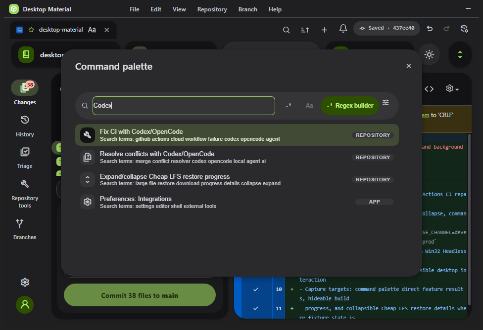
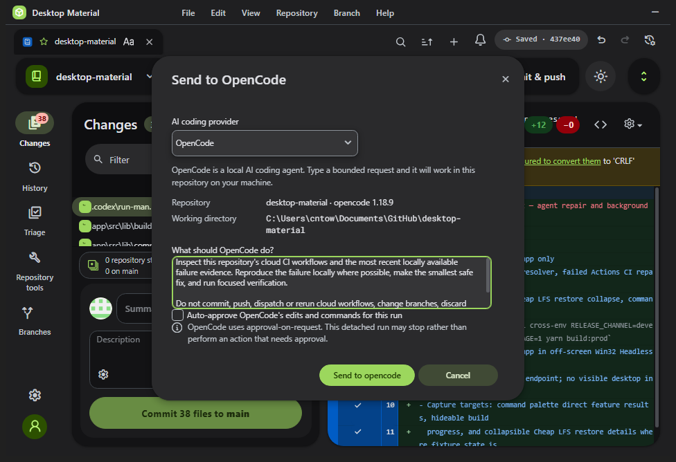
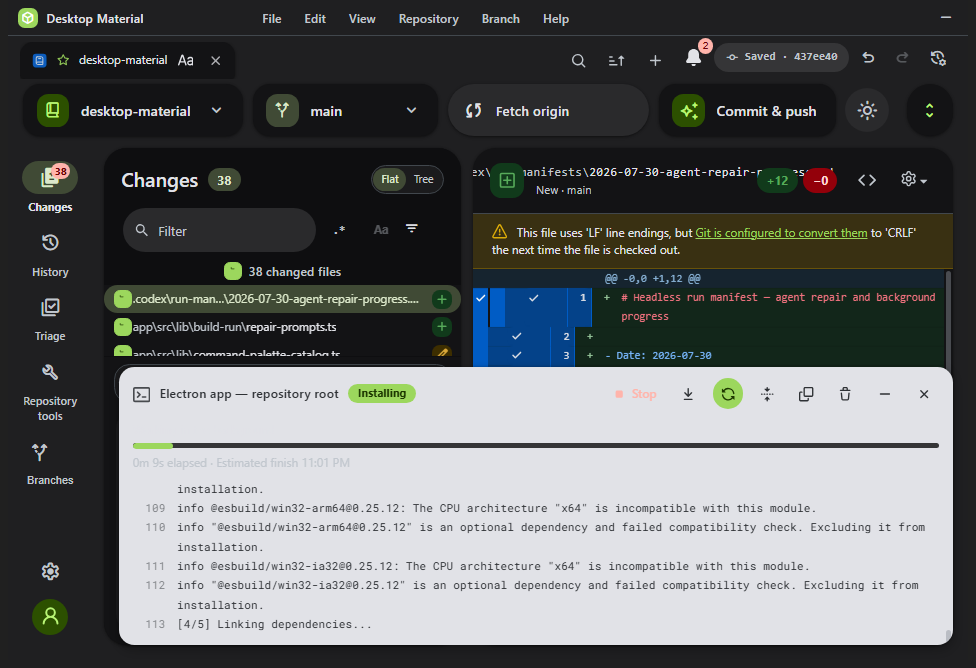
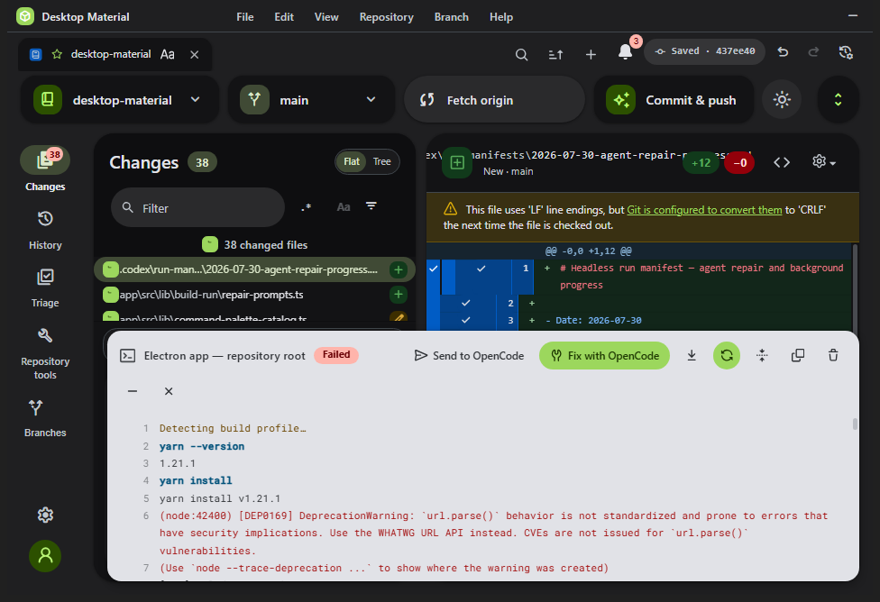

# Agent repair and background progress verification — 2026-07-30

The Windows production renderer was built with the repository's exact headless
command and launched from `out/main.js` on the off-screen Win32 desktop
`desktop-material-agent-repair-20260730`. All interaction and capture used the
fixed Lowlevel MCP endpoint; the visible desktop was never focused or touched.

## Accepted surfaces

The palette retains the fuzzy/substring/regex mode, case toggle, full regex
builder, and appearance control. `Codex` finds both repair actions and the Cheap
LFS progress command. Pressing Enter on **Fix CI with Codex/OpenCode** opened the
real provider composer directly:

The Build & Run panel rendered an elapsed clock, estimated finish, determinate
progress, and an enabled close button while installation was active:

Closing the panel did not invoke Stop. Selecting **Show background progress** in
the command palette reopened the same output. The test repository's install then
failed independently of this UI change, and the reopened panel truthfully showed
that terminal state:

Cheap LFS collapse/expand was verified in the focused DOM suite rather than by
inventing an active transfer: the header remains visible, `aria-expanded` and
`aria-controls` change correctly, and the detailed progress container toggles
its `hidden` state.

## Automated evidence

- TypeScript: `yarn tsc --noEmit` passed.
- Focused Windows tests: 42/42 passed across six files.
- Targeted source lint passed after replacing the ARIA id's rejected
  `Math.random()` with a deterministic per-mount counter.
- Repository-wide Prettier check passed.
- Headless desktop and the exact launched Electron PID were closed after capture.
