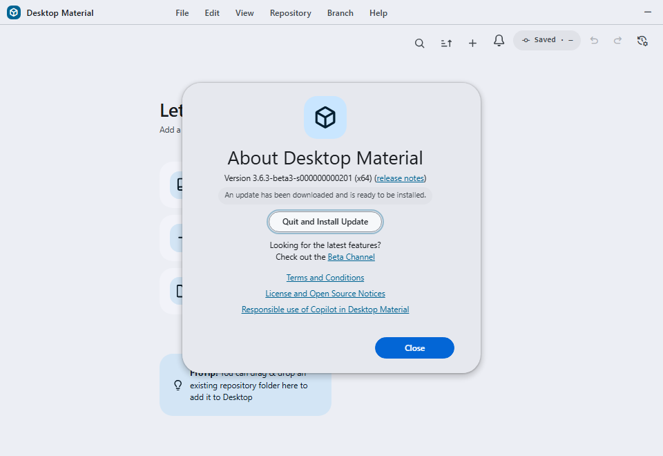

# Cross-lane automatic updater verification — 2026-07-22/23

## Result

Desktop Material's installed legacy Super Express build
`3.6.3-beta3-s000000000201` now moves forward through the ordinary and Super
Express release lanes. Both lanes use a fixed-width alphabetic `z` version that
sorts above the historical `b…` and `s…` packages and avoids the installed
Squirrel/NuGet comparer's 32-bit numeric prerelease overflow.



## Fail-closed correction

Commit
[`241cc90ce90f240bad075edac7ebe43eea515df8`](https://github.com/Ding-Ding-Projects/desktop-material/commit/241cc90ce90f240bad075edac7ebe43eea515df8)
first unified the release lanes. Its
[CI run `29976419466`](https://github.com/Ding-Ding-Projects/desktop-material/actions/runs/29976419466)
exposed an `OverflowException` when the legacy NuGet comparer parsed an
11-digit decimal prerelease tail. Packaged E2E failed and the release workflow
created no Release.

Commit
[`04246fdf12c09446b88d2f40130581d603131c8e`](https://github.com/Ding-Ding-Projects/desktop-material/commit/04246fdf12c09446b88d2f40130581d603131c8e)
replaced that tail with a nine-letter base-26 run-ID encoding. Local acceptance
included the installed Squirrel comparer, 1,000 adjacent versions, carry
boundaries, ReleaseEntry parsing, 16 focused updater/workflow checks, all 31
script checks, TypeScript, targeted lint/format, and diff integrity.

## Remote publication

Exact-source
[CI `29977738533`](https://github.com/Ding-Ding-Projects/desktop-material/actions/runs/29977738533)
passed Windows x64, Windows arm64, installed packaged E2E, unit/script tests,
and lint for `04246fdf12c09446b88d2f40130581d603131c8e`. Code scanning and
Pages also passed. Downstream
[Build Installers `29978844761`](https://github.com/Ding-Ding-Projects/desktop-material/actions/runs/29978844761)
published and promoted exact-target Release
[`v3.6.3-beta3-zadtberjmv`](https://github.com/Ding-Ding-Projects/desktop-material/releases/tag/v3.6.3-beta3-zadtberjmv)
with all six required assets. Its `RELEASES` entry was:

<!-- markdownlint-disable MD013 -->

```text
4D59C42287F7A76818F05CF4BFD55B3CE8E6B9EE GitHubDesktop-3.6.3-beta3-zadtberjmv-full.nupkg 311110425
```

<!-- markdownlint-enable MD013 -->

The live automatic update installed that version before the isolated onboarding
reload could preserve the transient ready event. To capture the real UI without
rewriting installed package state, an intentional same-source
[Super Express run `29980281736`](https://github.com/Ding-Ding-Projects/desktop-material/actions/runs/29980281736)
ran the full unit/script gates, built and verified the payload, and published
greater Release
[`v3.6.3-beta3-zadtbhvdfc`](https://github.com/Ding-Ding-Projects/desktop-material/releases/tag/v3.6.3-beta3-zadtbhvdfc).
GitHub's Latest endpoint resolved to that exact non-draft, non-prerelease
Release on `04246fdf12c09446b88d2f40130581d603131c8e`.

<!-- markdownlint-disable MD013 -->

| Asset | Bytes | GitHub SHA-256 |
| --- | ---: | --- |
| `GitHub.Desktop-x64.zip` | 320,232,837 | `2021eff8ebd311c8fa9b1732b79ab501b5b2957f11a018db552f80ff838f1d3f` |
| `GitHubDesktop-3.6.3-beta3-zadtbhvdfc-full.nupkg` | 311,110,476 | `f1e6cd73bc5dfe2c84dd3e7e6c252bdacfb253c0c0729273a4f473e4ec074ed5` |
| `GitHubDesktop-3.6.3-beta3-zadtbhvdfc-x64-full.nupkg` | 311,110,476 | `f1e6cd73bc5dfe2c84dd3e7e6c252bdacfb253c0c0729273a4f473e4ec074ed5` |
| `GitHubDesktopSetup-x64.exe` | 311,228,928 | `31583a97f910f92556067c4afb76ced73a19ecc7c3cdb4223eb96f9852647138` |
| `GitHubDesktopSetup-x64.msi` | 310,837,248 | `5b995d11ecc4a2496af23feb73b55e294859f8b4b8fe0a8f94bfc8cf3b28c844` |
| `RELEASES` | 101 | `feb7af55e75d75b27e9ff46b714961cb60c59616a60ee226a3fa19345b8192d0` |

<!-- markdownlint-enable MD013 -->

Its feed entry was:

<!-- markdownlint-disable MD013 -->

```text
60AF9476C5D4ADEAF3CA2AE316CBFBDC307A2B92 GitHubDesktop-3.6.3-beta3-zadtbhvdfc-full.nupkg 311110476
```

<!-- markdownlint-enable MD013 -->

## Installed Squirrel evidence

The ordinary background check began from the exact legacy executable. The
sanitized appended log segment recorded:

- `localVersion=3.6.3-beta3-s000000000201`;
- download of `GitHubDesktop-3.6.3-beta3-zadtberjmv-full.nupkg`;
- writing `app-3.6.3-beta3-zadtberjmv` and repointing the execution stub;
- `Finished Squirrel Updater`; and
- a later check using `localVersion=3.6.3-beta3-zadtberjmv`.

For the second UI-visible check, the manual request included
`skipGuidCheck=1`, compared from `zadtberjmv`, downloaded the
`zadtbhvdfc` full package, wrote its app directory, repointed the stub, and
finished. Staging identifiers and query GUIDs were redacted and are not stored
in this repository.

## Off-screen UI acceptance

The fixed Lowlevel MCP service ran from checkout
`ed1427f69b20dcd66df1de2ae3c6ba6591e2e640` at
`http://127.0.0.1:8765/mcp`. The scheduled task used its fixed venv Python,
checkout, loopback host, and port. One uniquely named off-screen Win32 desktop
launched only the exact installed legacy executable with an isolated profile
and disposable Git fixture. No visible-desktop switch occurred.

After Help → About Desktop Material, the test reproduced **You have the latest
version** on the running `s000000000201` UI. Once the higher Release was Latest,
the HWND-targeted **Check for Updates** action showed **Downloading update…**
and the top-edge progress indicator. It then showed **An update has been
downloaded and is ready to be installed** plus **Quit and Install Update**. The
install button was deliberately not clicked.

The accepted client-only capture is
`docs/assets/screenshots/auto-updater-update-ready.png`: 960×660, 49,195 bytes,
SHA-256
`a02cffa612114be3af5e0fffcd5b602a4ba4dfd3226298e48d143a6bed76bd4d`.
Two independent nonblank captures were byte-identical. The dialog was closed,
File → Exit ended the saved app PID, no owned helper remained, the desktop had
zero windows, and the off-screen desktop closed successfully.
