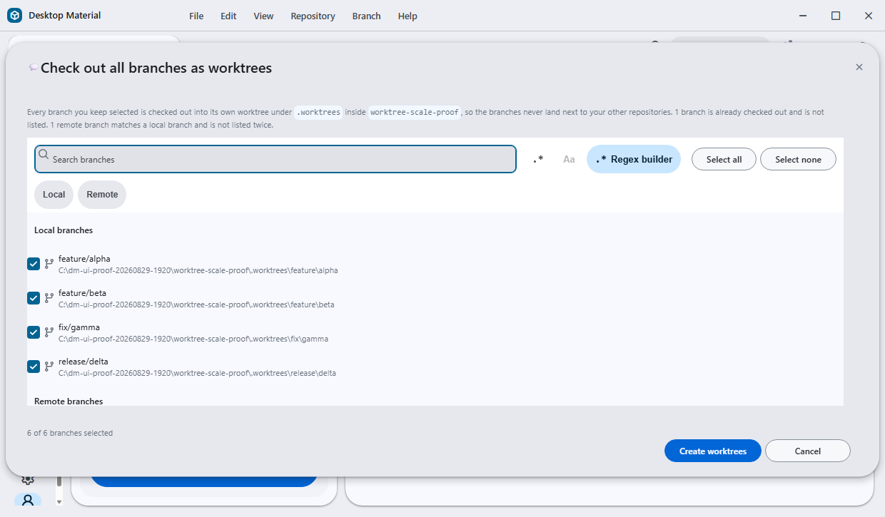
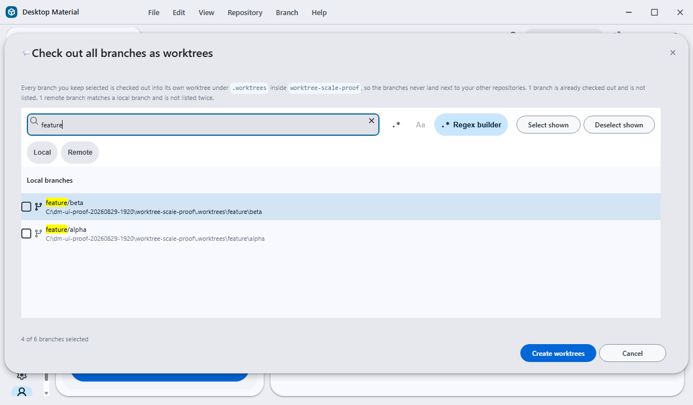
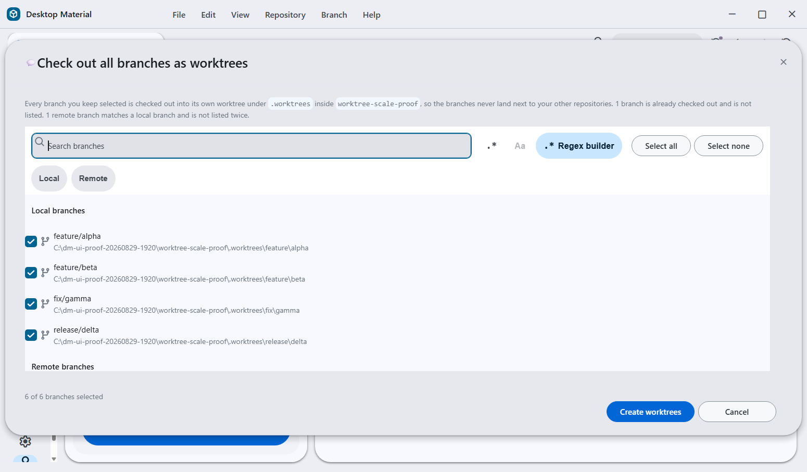
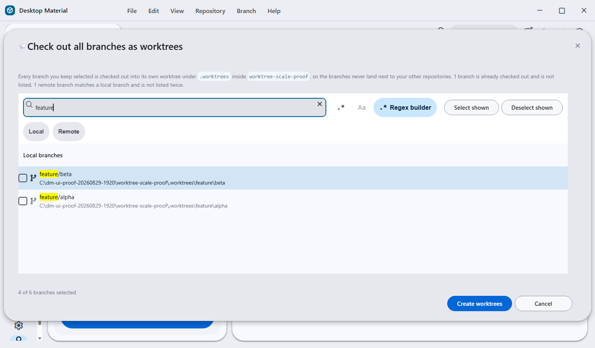

# UI bug audit closeout evidence

Date: **2026-08-29**

Source commit: `d0ce8b885e365893ccbce0135c596cf5b9569f61`

This directory records the real built-app acceptance for the **Check out all
branches as worktrees** dialog after WP4. The run used a disposable repository
with four local candidates, two remote-only candidates, and `main` already
checked out. The fixture carried no real account, provider, repository, or user
data.

## Build provenance

<!-- markdownlint-disable MD013 -->

| Field | Value |
| --- | --- |
| Required build | `npx --no-install cross-env RELEASE_CHANNEL=development DESKTOP_SKIP_PACKAGE=1 yarn build:prod` |
| Required build result | Exit 0, `client_ok: true`, no timeout, 354.52 seconds |
| Capture build | `npx --no-install cross-env RELEASE_CHANNEL=production DESKTOP_SKIP_PACKAGE=1 yarn build:prod` |
| Capture build result | Exit 0, `client_ok: true`, no timeout, 388.50 seconds |
| Capture `out/main.js` | 4,630,229 bytes, SHA-256 `ffebecdf23afbca48d5a6e0d162e5426c4275d6ec1d57ab02f78a364ca28dffa` |
| Electron executable | 226,577,920 bytes, SHA-256 `082d352efc6a9f5882354ee4096ae0b40b78bc6c8e52fc5084f3df9254c613ff` |
| Fixture commit | `8b4bf1647b2f445fc5b815d4d4479c954912b33d` |
| Theme and language | Light, English |

<!-- markdownlint-enable MD013 -->

The required development-channel build compiles `__DEV__=true`, so it
programmatically installs two DevTools extensions. Two candidate launches were
rejected before interaction because `/json/list` contained one page plus those
two service workers. The capture build uses the same source with the production
channel, which compiles out the development-only extension installer. Each
accepted run then exposed exactly one page target with the exact expected file
URL and a loopback WebSocket.

## Accepted captures

| File | State | CSS viewport | Physical pixels | Bytes | SHA-256 |
| --- | --- | ---: | ---: | ---: | --- |
| [`checkout-branches-unfiltered-100pct.png`](checkout-branches-unfiltered-100pct.png) | Six candidates selected, unfiltered actions | 1240×725 | 1240×725 | 70,935 | `383aabc8510ca85779a8146aec2822343057092e908fccd6dbdbfb2ce9ea4fad` |
| [`checkout-branches-filtered-100pct.png`](checkout-branches-filtered-100pct.png) | `feature` filter, shown rows cleared | 1240×725 | 1240×725 | 60,396 | `f8c71a89b1c6d3165ca8f0d276beb8612bec4e831f87ff17baacb79999e13b68` |
| [`checkout-branches-unfiltered-125pct.png`](checkout-branches-unfiltered-125pct.png) | Six candidates selected, unfiltered actions | 1240×726 | 1550×907 | 90,415 | `5f7bd1fcd08aaf8ebfbbd10e9bc1bf341a36bc40f704ad7394127a2b09cdae2c` |
| [`checkout-branches-filtered-125pct.png`](checkout-branches-filtered-125pct.png) | `feature` filter, shown rows cleared | 1240×726 | 1550×907 | 78,331 | `0c4951637a1fe3da60729fb88eecb8827da62c02ef4d3c72e32b5da9a42e449a` |

At 125%, a 725 CSS-pixel height maps to 906.25 physical pixels. The frameless
Windows client quantizes that to 907 physical pixels and reports 726 CSS pixels.
This one-pixel expansion is recorded rather than hidden. Width remains exactly
1240 CSS pixels, DPR is exactly 1.25, and renderer zoom is exactly 1.

100% scale

125% scale

## Behavioral proof

The verifier exercised the real dialog state rather than injecting a mock:

1. With no filter, **Select none** changed the footer to `0 of 6 branches
   selected`.
2. **Select all** restored `6 of 6 branches selected`.
3. Typing `feature` left exactly `feature/alpha` and `feature/beta` visible and
   changed the buttons to **Select shown** and **Deselect shown**.
4. **Deselect shown** cleared those two visible rows while retaining all four
   hidden selections, proven by `4 of 6 branches selected`.
5. **Select shown** restored the full `6 of 6 branches selected` state.

At both scales, the virtual-list slot is exactly 48 CSS pixels tall. The branch
name and destination path occupy separate lines inside that slot. The native
checkbox is 18×18 CSS pixels, sits in `.branch-worktree-checkbox`, and carries a
branch-specific accessible name such as `Check out feature/alpha as a worktree`.
The document, dialog, dialog content, and list have no horizontal overflow, and
the dialog remains inside the viewport.

The capture lifecycle used named off-screen Win32 desktops. Launch, physical
dimension checks, text entry, screenshots, process termination, and desktop
closure went through the cheap Lowlevel route. The renderer's direct page CDP
target supplied exact measurements. Two Chromium overlay operations used the
app-native hook after the background HWND route proved unable to activate that
overlay reliably. The public machine-readable details are in
[`receipt.json`](receipt.json).

## Related design check

The clone dialog was also inspected at 1240×725 against
`design/screenshots/07-clone.png`. The checked-in reference uses a historical
inline repository sheet, while the frozen production shell intentionally uses
the existing modal. Within that boundary, the History and Worktree option cards
match as sibling surfaces, their label and description hierarchy is intact, and
the shared checkbox remains accessible. No retired shell file or shell wiring
was restored for visual similarity.

## Baseline boundary

The broad unit and lint commands remain red for pre-existing source-contract
drift. The task introduced no new failure:

* `main`: 1,065 of 1,065 files, 9,138 tests reported, exit 1;
* task: 1,065 of 1,065 files, 9,141 tests reported, exit 1;
* the task's failures map to 55 unchanged test files;
* rerunning those 55 files on `main` reproduced the same 55 failing files, the
  same 91 failure locations apart from one diagnostic line offset, and the same
  151 normalized failure titles; and
* changed-path ESLint reports five existing diagnostics on the task and the same
  five plus one obsolete wrapping-label diagnostic on `main`.

The source type check, design-app tests, and all focused WP suites pass. Full
counts and exact commands remain in the task handoff and rolling Discussion.

## Cleanup

Both app process trees were terminated by their saved PIDs. Both named desktops
reported zero windows and were closed. The task-owned Lowlevel compatibility
server stopped. The disposable repository, profiles, debug captures, raw
receipts, and measurement images were removed after the four accepted PNGs were
hash-verified at their tracked destinations.
